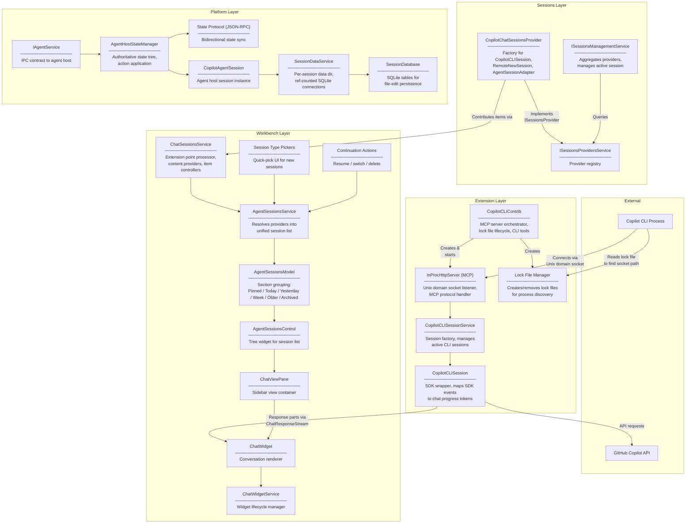
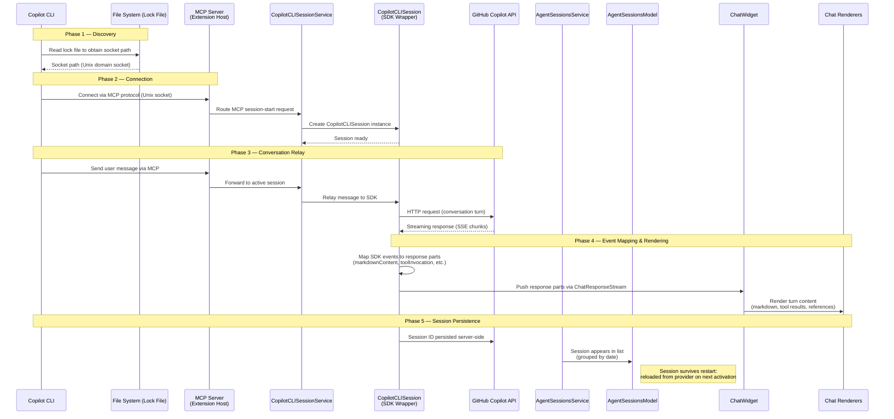
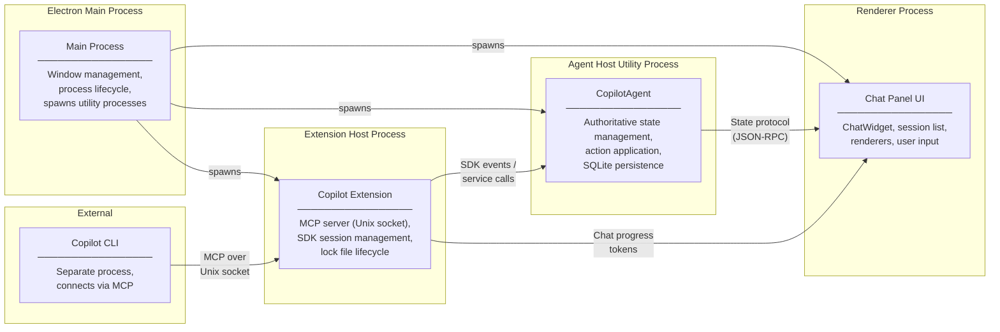

# System Architecture

## Overview

The system comprises four architectural layers and two external actors. Each layer has a distinct responsibility boundary, and communication between layers follows well-defined contracts.

- **Extension Layer** (`extensions/copilot/`) — Owns the Copilot-specific integration logic. Manages the MCP server that external processes connect to, wraps the Copilot SDK to conduct API conversations, and handles lock file lifecycle for cross-process discovery. This layer translates between the Copilot-specific world and the provider-agnostic contracts expected by the layers beneath it.

- **Sessions Layer** (`src/vs/sessions/`) — Owns cross-cutting session infrastructure. Defines the `ISessionsProvider` contract, hosts the provider registry (`ISessionsProvidersService`), aggregates providers into a unified management surface (`ISessionsManagementService`), and houses provider implementations such as `CopilotChatSessionsProvider`. This layer is the glue between extension-contributed providers and the workbench UI.

- **Workbench Layer** (`src/vs/workbench/contrib/chat/`) — Owns the user-facing session experience. Processes extension points to discover available session types, maintains the resolved session list (with temporal grouping), and renders chat conversations through a generic widget and renderer pipeline. This layer is deliberately ignorant of Copilot-specific details.

- **Platform Layer** (`src/vs/platform/agentHost/`) — Owns session state management and persistence. Runs in a dedicated utility process (the agent host), manages the authoritative state tree for each session, persists file-edit data via SQLite, and communicates with the renderer through a JSON-RPC state protocol.

The two **external actors** — the Copilot CLI process and the GitHub Copilot API — sit outside the VS Code process boundary. The CLI connects inward via MCP; the SDK connects outward to the API.

## Layer Diagram

## Service Hierarchy

| Service | Layer | Responsibility |
|---------|-------|----------------|
| `ISessionsManagementService` | Sessions (`vs/sessions`) | Aggregates all registered providers into a unified session management surface. Manages the active session reference and persists the last-selected session across restarts. |
| `ISessionsProvidersService` | Sessions (`vs/sessions`) | Registry for `ISessionsProvider` instances. Providers register here; consumers query here. Decouples provider implementation from consumer code. |
| `CopilotChatSessionsProvider` | Sessions (`vs/sessions`) | Copilot-specific provider implementation. Factory for three session subtypes: `CopilotCLISession` (external CLI handoff), `RemoteNewSession` (fresh cloud session), and `AgentSessionAdapter` (wraps agent-host sessions). |
| `IChatSessionsService` | Workbench (`contrib/chat`) | Extension point processor. Manages content providers (how session items produce content), item controllers (how items respond to actions), and session options (filtering, sorting, display). |
| `IAgentSessionsService` | Workbench (`contrib/chat`) | Manages `AgentSessionsModel` — the resolved, flattened, and sorted session list consumed by the UI. Coordinates between multiple providers to produce a single coherent list. |
| `AgentSessionsModel` | Workbench (`contrib/chat`) | Data model backing the session list tree widget. Groups sessions into temporal sections (Pinned, Today, Yesterday, Week, Older, Archived). Also supports capped grouping (More) and repository grouping. Emits change events for reactive UI updates. |
| `IAgentService` | Platform (`agentHost`) | IPC contract between the renderer/extension host and the agent host utility process. All state mutations and queries flow through this interface. |
| `ISessionDataService` | Platform (`agentHost`) | Manages per-session data directories and ref-counted SQLite database connections. Ensures database handles are shared when multiple consumers access the same session's data. |
| `SessionDatabase` | Platform (`agentHost`) | SQLite implementation for persisting file-edit operations within a session. Stores edit history (with before/after file content), and session metadata (custom titles, model info, working directory). |

## Data Flow

The following sequence diagram traces a complete flow: the CLI process connects to VS Code, a conversation is relayed to the GitHub API, and the response is rendered in the chat panel.

## Design Principles

### 1. Agent-Agnostic Protocol

The state protocol — the JSON-RPC contract between the agent host and the renderer — makes no reference to Copilot, CLI, or any specific agent implementation. It defines:

- A **state shape**: a typed, serializable tree describing session content, turn history, and pending operations.
- An **action vocabulary**: a finite set of typed mutations (append turn, update tool status, mark complete).
- **Reconciliation rules**: how optimistic updates in the renderer are confirmed or rolled back by the host.

Any agent that conforms to this protocol can participate in the session system. The Copilot extension is merely the first (and currently only) provider.

### 2. Extension Point Model for Session Types

Session types are not hard-coded. They are registered declaratively through the `ISessionsProvidersService` registry:

- A provider implements `ISessionsProvider` and registers itself at activation time.
- The workbench discovers available session types by querying the registry.
- New session types (e.g., a hypothetical local-LLM provider) require only a new provider registration — no workbench modifications.

This follows VS Code's established contribution-point pattern: the platform defines the shape; extensions fill it.

### 3. Redux-Like State Synchronization

Session state follows an immutable-state, action-stream model reminiscent of Redux:

- **Immutable state tree.** The authoritative state lives in the agent host process. The renderer holds a read-only projection.
- **Action streams.** All mutations are expressed as typed actions dispatched from the renderer to the host.
- **Write-ahead reconciliation.** The renderer applies actions optimistically for responsiveness. The host confirms or rejects each action. On rejection, the renderer rolls back to the last confirmed state.

This architecture permits a responsive UI (no round-trip latency for local interactions) without sacrificing consistency (the host remains authoritative).

### 4. Dual Communication Channels

Two channels serve distinct integration scenarios:

| Channel | Transport | Use Case |
|---------|-----------|----------|
| **In-process SDK** | Direct function calls within the extension host | Sessions originating inside VS Code (new chat, agent-initiated) |
| **MCP (Model Context Protocol)** | Unix domain socket, JSON-RPC framing | Sessions arriving from external processes (CLI, other editors) |

The MCP channel exists because the CLI runs in a separate process — possibly a separate machine over SSH. It uses the Model Context Protocol, which provides a standardized framing for tool/resource exchange between AI-capable processes.

Both channels converge at `CopilotCLISessionService`, which normalizes them into a single internal session representation.

### 5. File-System-Based Discovery

Cross-process discovery uses lock files rather than a service registry:

1. When VS Code starts, it writes a lock file to a well-known directory (`~/.copilot/ide/<uuid>.lock`, with mode `0o600`).
2. The lock file contains a JSON object with connection metadata: `socketPath` (Unix domain socket), `scheme`, `headers` (authentication), `pid`, `ideName`, `timestamp`, `workspaceFolders`, and `isTrusted`. The socket path is the primary discovery datum; the remaining fields allow the CLI to select among multiple instances and authenticate.
3. The CLI reads the lock file to discover where to connect.
4. When VS Code exits, the lock file is removed (or becomes stale and is garbage-collected).

This approach is deliberately simple:
- No daemon process required.
- No network ports to manage or conflict with.
- Graceful degradation: if VS Code is not running, no lock file exists, and the CLI knows immediately.
- Multiple VS Code windows produce multiple lock files; the CLI can choose which to connect to.

### 6. Provider-Agnostic Renderers

The chat rendering pipeline operates on abstract content types — `IChatMarkdownContent`, `IChatToolInvocation`, `IChatContentReference` — not on provider-specific data structures. The renderers:

- Receive typed content tokens from the session model.
- Render each token according to its type (markdown block, tool call card, file reference pill).
- Never inspect the *source* of a token (CLI vs. in-editor vs. agent host).

This means a CLI-originated session renders identically to an in-editor session, because the rendering layer cannot distinguish them.

### 7. State-Based Rendering (toolKind, displayName)

Tool invocations are rendered based on their declared metadata — specifically `toolKind` and `displayName` — rather than raw tool names or internal identifiers. This provides:

- **Stable rendering** across tool renames or version changes.
- **User-comprehensible labels** ("Search files" rather than `ripgrep_search_v2`).
- **Consistent iconography** (tool kind determines the icon family).

The `toolKind` is a coarse classifier (currently `terminal` or `subagent`) that controls visual treatment. The `displayName` is a human-readable label. Together they form a stable rendering contract that is independent of the tool's internal implementation.

## Process Architecture

Five distinct processes participate in the system. Understanding which code runs where is essential for reasoning about communication overhead, failure isolation, and debugging.

### Main Process (Electron)

The Electron main process is the lifecycle orchestrator. It:

- Manages window creation and destruction.
- Spawns the agent host as a **utility process** (a Chromium `UtilityProcess`, isolated from the renderer's event loop).
- Spawns extension host processes.
- Routes IPC between processes.

The main process does **not** run any Copilot-specific logic. It is purely infrastructure.

### Agent Host Utility Process

The agent host runs in a dedicated utility process, isolated from both the renderer and the extension host. It:

- Holds the **authoritative state tree** for all active sessions.
- Applies actions received from the renderer via the state protocol.
- Manages `SessionDataService` for per-session SQLite databases.
- Runs `CopilotAgentSession` instances that encapsulate session-level logic.

Running in a utility process ensures that SQLite I/O and state computation do not block the UI thread.

### Extension Host Process

The extension host runs the Copilot extension, which:

- Starts the **MCP server** on a Unix domain socket, listening for external CLI connections.
- Manages **lock files** that advertise the socket path to external processes.
- Creates and manages **SDK sessions** (`CopilotCLISession`) that wrap the Copilot SDK's conversation API.
- Translates SDK events into chat progress tokens that the renderer can consume.

The extension host is the bridge between the Copilot-specific world (SDK, API, CLI protocol) and the provider-agnostic workbench.

### Renderer Process

The renderer process runs the chat panel UI:

- `ChatViewPane` hosts the sidebar view.
- `AgentSessionsControl` renders the session list as a tree widget.
- `ChatWidget` renders the active conversation.
- Chat renderers transform abstract content tokens into DOM elements.

The renderer holds a **read-only projection** of session state. All mutations are dispatched as actions to the agent host; the renderer never modifies state directly.

### External CLI Process

The Copilot CLI is a fully independent process — it may be a different binary, a different language runtime, or running on a remote machine (connected via SSH). It:

- Discovers VS Code by reading lock files from the file system.
- Connects to the MCP server via Unix domain socket.
- Sends conversation context (user messages, tool results) using the MCP protocol.
- Receives acknowledgments and can monitor session progress.

The CLI has no direct access to VS Code internals. All interaction is mediated through the MCP protocol, which provides a clean integration boundary.
