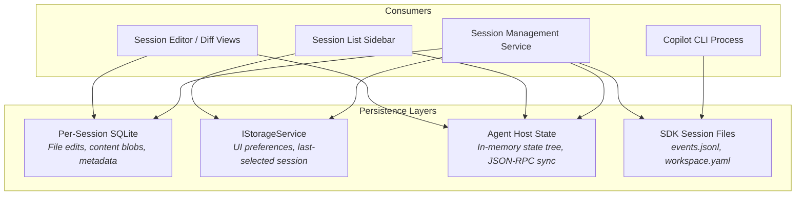
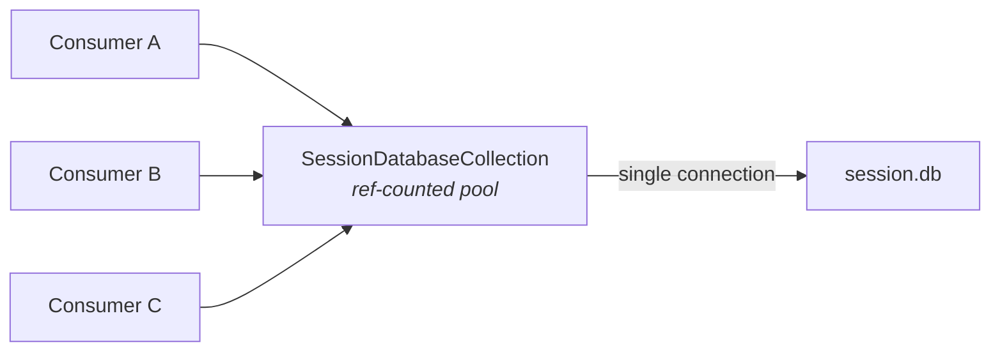
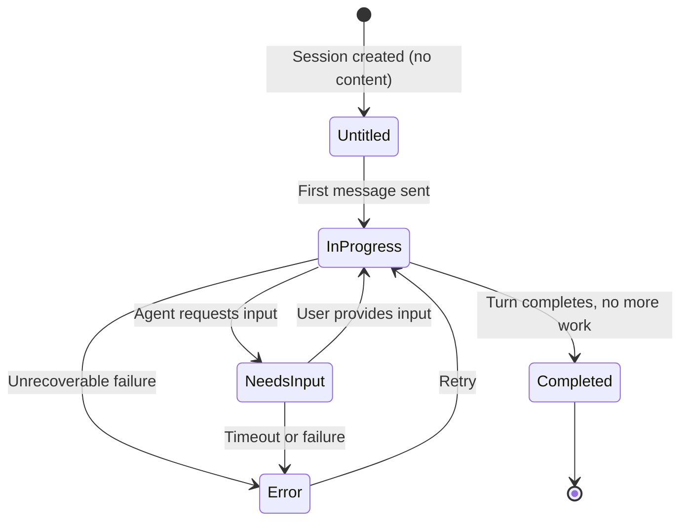
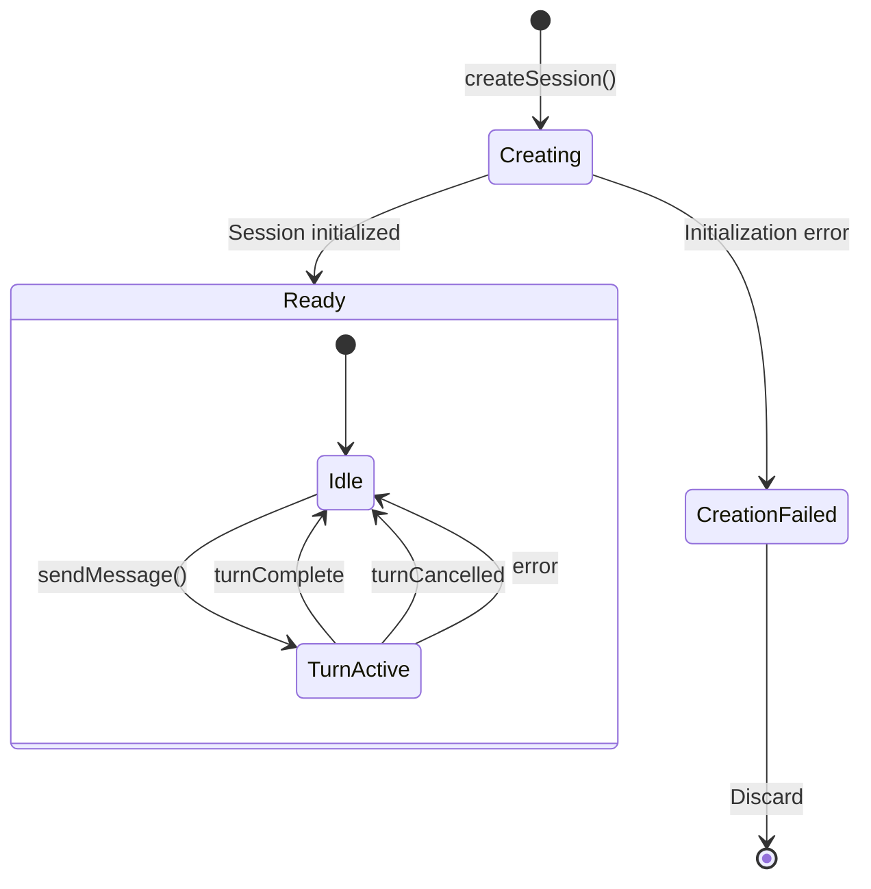
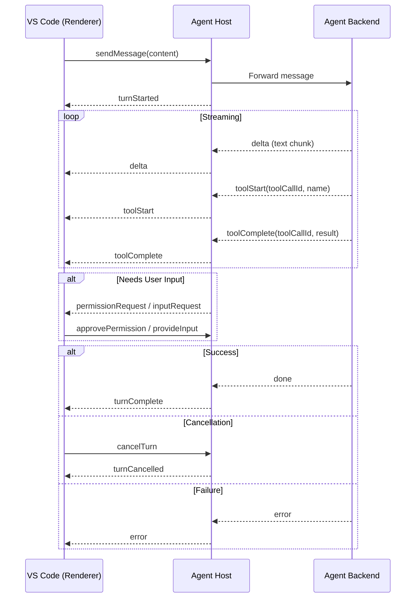
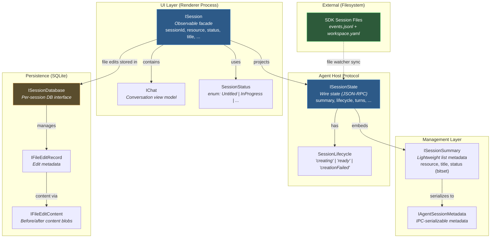

# Data Model and Persistence

This document catalogues the core types, persistence mechanisms, and session lifecycle that underpin Copilot CLI sessions within VS Code. The system employs a layered architecture: an observable UI facade (`ISession`), a wire-protocol state object (`ISessionState`), lightweight list metadata (`ISessionSummary`), and per-session SQLite storage (`ISessionDatabase`). Each layer serves a distinct consumer and carries different performance and consistency guarantees.

---

## Core Types

### SessionStatus (UI Layer)

**Source:** `src/vs/sessions/`

The UI-facing status enum. Governs visual indicators, badge rendering, and view-model branching logic throughout the sessions workbench.

```typescript
export const enum SessionStatus {
    Untitled = 0,
    InProgress = 1,
    NeedsInput = 2,
    Completed = 3,
    Error = 4,
}
```

The agent host protocol uses a **bitset** encoding for the same concept, which collapses into this enum at the UI boundary:

| Bit Value | Meaning       |
|-----------|---------------|
| 1         | Idle          |
| 2         | Error         |
| 8         | InProgress    |
| 24        | InputNeeded   |

The mapping is not a direct cast — the UI layer translates bitset values into the `SessionStatus` enum during state synchronization.

---

### ISession (Observable UI Facade)

**Source:** `src/vs/sessions/`

The top-level session object consumed by the workbench UI. Every mutable property is wrapped in `IObservable<T>`, enabling fine-grained reactive updates without polling. This is the type that views, tree items, and editor panes bind against.

```typescript
export interface ISession {
    readonly sessionId: string;         // Globally unique: `providerId:localId`
    readonly resource: URI;
    readonly providerId: string;
    readonly sessionType: string;       // e.g. 'copilotcli', 'copilot-cloud-agent'
    readonly icon: ThemeIcon;
    readonly createdAt: Date;
    readonly workspace: IObservable<ISessionWorkspace | undefined>;
    readonly title: IObservable<string>;
    readonly updatedAt: IObservable<Date>;
    readonly status: IObservable<SessionStatus>;
    readonly changes: IObservable<readonly IChatSessionFileChange[]>;
    readonly modelId: IObservable<string | undefined>;
    readonly mode: IObservable<{ readonly id: string; readonly kind: string } | undefined>;
    readonly loading: IObservable<boolean>;
    readonly isArchived: IObservable<boolean>;
    readonly isRead: IObservable<boolean>;
    readonly description: IObservable<IMarkdownString | undefined>;
    readonly lastTurnEnd: IObservable<Date | undefined>;
    readonly gitHubInfo: IObservable<IGitHubInfo | undefined>;
    readonly chats: IObservable<readonly IChat[]>;
    readonly mainChat: IChat;
}
```

Key design decisions:

- **`sessionId` format:** `<providerId>:<localId>` — the provider prefix ensures global uniqueness across session providers (CLI, cloud agent, etc.) without a centralized ID allocator.
- **`resource`:** The canonical URI for the session. Determines the URI scheme (`copilotcli://`, etc.) and is the primary key for storage lookups.
- **Immutable identity, mutable state:** The six identity fields (`sessionId`, `resource`, `providerId`, `sessionType`, `icon`, `createdAt`) are fixed at creation. Everything else — except `mainChat`, which is a non-observable convenience accessor — is observable and may change over the session's lifetime.
- **`mainChat`:** A non-optional convenience accessor. Every session has at least one chat; `chats` may grow for multi-chat scenarios.

---

### ISessionState (Agent Host Protocol — Wire State)

**Source:** Agent host protocol definitions

The canonical state object transmitted over JSON-RPC between the agent host process and the VS Code renderer. This is the "source of truth" for session content — the UI facade (`ISession`) is a projection of this data through observable wrappers.

```typescript
export interface ISessionState {
    summary: ISessionSummary;
    lifecycle: SessionLifecycle;  // 'creating' | 'ready' | 'creationFailed'
    creationError?: IErrorInfo;
    serverTools?: IToolDefinition[];
    activeClient?: ISessionActiveClient;
    workingDirectory?: URI;
    turns: ITurn[];
    activeTurn?: IActiveTurn;
    steeringMessage?: IPendingMessage;
    queuedMessages?: IPendingMessage[];
    inputRequests?: ISessionInputRequest[];
    customizations?: ISessionCustomization[];
}
```

Notable properties:

| Property | Purpose |
|----------|---------|
| `lifecycle` | Agent host's own state machine — distinct from the UI `SessionStatus` |
| `serverTools` | Tool definitions registered by the agent for the current session |
| `activeClient` | Tracks which client (tab/window) is actively interacting |
| `turns` | The complete conversation history — immutable once completed |
| `activeTurn` | The in-flight turn, if any — carries partial deltas |
| `steeringMessage` | A system-level message injected before user input |
| `queuedMessages` | Messages waiting to be sent (queued while a turn is active) |
| `inputRequests` | Outstanding requests for user input (confirmation dialogs, etc.) |
| `customizations` | Session-scoped overrides (instructions, tool selections) |

---

### ISessionSummary (Lightweight List Metadata)

**Source:** Session management layer

A deliberately minimal projection of session state, designed for rendering the session list sidebar without loading full session content. The session management service maintains an array of these and synchronizes them with the agent host.

```typescript
export interface ISessionSummary {
    resource: URI;
    provider: string;
    title: string;
    status: SessionStatus;      // Bitset: Idle=1, Error=2, InProgress=8, InputNeeded=24
    createdAt: number;
    modifiedAt: number;
    model?: string;
    workingDirectory?: URI;
    isRead?: boolean;
    isDone?: boolean;
    diffs?: ISessionFileDiff[];
}
```

The `status` field here uses the **bitset** encoding (not the UI enum), as summaries originate from the agent host protocol layer. The `diffs` array provides a condensed view of file modifications for badge/indicator rendering without requiring the full file edit database.

---

### ISessionDatabase (Per-Session SQLite Interface)

**Source:** Session data service

The persistence contract for per-session file edit storage. Each session gets its own SQLite database, accessed through a ref-counted connection pool.

```typescript
export interface ISessionDatabase extends IDisposable {
    createTurn(turnId: string): Promise<void>;
    deleteTurn(turnId: string): Promise<void>;
    storeFileEdit(edit: IFileEditRecord & IFileEditContent): Promise<void>;
    getFileEdits(toolCallIds: string[]): Promise<IFileEditRecord[]>;
    getAllFileEdits(): Promise<IFileEditRecord[]>;
    getFileEditsByTurn(turnId: string): Promise<IFileEditRecord[]>;
    readFileEditContent(toolCallId: string, filePath: string): Promise<IFileEditContent | undefined>;
    getMetadata(key: string): Promise<string | undefined>;
    getMetadataObject<T extends Record<string, unknown>>(obj: T): Promise<{ [K in keyof T]: string | undefined }>;
    setMetadata(key: string, value: string): Promise<void>;
    close(): Promise<void>;
}
```

The interface extends `IDisposable` — callers must manage the lifecycle. In practice, `SessionDatabaseCollection` handles reference counting, ensuring a single open connection per session regardless of how many consumers hold a reference.

---

### IFileEditRecord

```typescript
export interface IFileEditRecord {
    turnId: string;
    toolCallId: string;
    filePath: string;
    kind: FileEditKind;             // 'edit' | 'create' | 'delete' | 'rename'
    originalPath?: string;
    addedLines: number | undefined;
    removedLines: number | undefined;
}
```

- **`toolCallId`:** The identifier of the tool invocation that produced this edit. Links back to the turn's tool call sequence.
- **`kind`:** Introduced in schema migration v3. Earlier records default to `'edit'`.
- **`originalPath`:** Populated only for `'rename'` operations.
- **Line counts:** `undefined` when the edit has not yet been analyzed (content stored but diff not computed).

---

### IAgentSessionMetadata (IPC Metadata)

**Source:** Agent session management IPC layer

The metadata structure passed across IPC boundaries (main process to renderer, extension host to renderer). A serialization-friendly projection — URIs are sometimes represented as strings rather than full `URI` objects.

```typescript
export interface IAgentSessionMetadata {
    readonly session: URI;
    readonly startTime: number;
    readonly modifiedTime: number;
    readonly summary?: string;
    readonly status?: SessionStatus;
    readonly workingDirectory?: URI;
    readonly isRead?: boolean;
    readonly isDone?: boolean;
    readonly diffs?: readonly {
        readonly uri: string;
        readonly added?: number;
        readonly removed?: number;
    }[];
}
```

Note the `diffs` array uses `uri: string` rather than `URI` — a deliberate choice for IPC serialization efficiency.

---

## Persistence Mechanisms

Session data is distributed across three persistence layers, plus an external filesystem contract with the Copilot CLI SDK. Each layer serves a different access pattern and consistency requirement.



### Per-Session SQLite Database

**Location:** `{userDataPath}/agentSessionData/{sanitizedSessionId}/session.db`

**Technology:** `@vscode/sqlite3` — a native Node.js binding for SQLite. Chosen for its zero-configuration, single-file, transactional properties.

#### Schema (3 Migrations)

**Migration v1 — Core Tables:**

```sql
CREATE TABLE IF NOT EXISTS turns (
    id TEXT PRIMARY KEY NOT NULL
);

CREATE TABLE IF NOT EXISTS file_edits (
    turn_id        TEXT    NOT NULL REFERENCES turns(id) ON DELETE CASCADE,
    tool_call_id   TEXT    NOT NULL,
    file_path      TEXT    NOT NULL,
    before_content BLOB    NOT NULL,
    after_content  BLOB    NOT NULL,
    added_lines    INTEGER,
    removed_lines  INTEGER,
    PRIMARY KEY (tool_call_id, file_path)
);
```

Note: `before_content` and `after_content` are `NOT NULL` in v1. They become nullable in v3, which enables recording edit metadata before content is available.

**Migration v2 — Metadata Store:**

```sql
CREATE TABLE IF NOT EXISTS session_metadata (
    key   TEXT PRIMARY KEY NOT NULL,
    value TEXT NOT NULL
);
```

A generic key-value store for session-level metadata that does not warrant its own table. Used for storing provider-specific state, feature flags, and diagnostic information.

**Migration v3 — Extended Edit Tracking (Table Recreation):**

SQLite does not support `ALTER COLUMN`, so this migration recreates the table with the new schema and migrates data:

```sql
CREATE TABLE file_edits_v3 (
    turn_id        TEXT    NOT NULL REFERENCES turns(id) ON DELETE CASCADE,
    tool_call_id   TEXT    NOT NULL,
    file_path      TEXT    NOT NULL,
    edit_type      TEXT    NOT NULL DEFAULT 'edit',
    original_path  TEXT,
    before_content BLOB,
    after_content  BLOB,
    added_lines    INTEGER,
    removed_lines  INTEGER,
    PRIMARY KEY (tool_call_id, file_path)
);

INSERT INTO file_edits_v3 (turn_id, tool_call_id, file_path, edit_type,
                           before_content, after_content, added_lines, removed_lines)
    SELECT turn_id, tool_call_id, file_path, 'edit',
           before_content, after_content, added_lines, removed_lines
    FROM file_edits;

DROP TABLE file_edits;
ALTER TABLE file_edits_v3 RENAME TO file_edits;
```

This migration introduced support for `create`, `delete`, and `rename` operations via the `edit_type` column. The `original_path` column captures the source path for renames. The table recreation makes `before_content` and `after_content` nullable (they were `NOT NULL` in v1), enabling recording of edit metadata before content is available — a requirement for streaming file edits during active turns.

#### Access Pattern



`SessionDatabaseCollection` manages a ref-counted pool of database connections. Multiple callers (diff views, the session editor, the management service) share a single open connection per session. The connection is closed when the last reference is released.

#### Cleanup

`SessionDataService.cleanupOrphanedData()` runs at startup. It enumerates directories under `agentSessionData/` and deletes any that do not correspond to a known session. This prevents unbounded disk growth from sessions that were created but never properly registered, or whose metadata was lost.

---

### IStorageService (VS Code Storage)

VS Code's built-in storage service persists UI preferences and lightweight state. These values survive window reloads and are scoped to the appropriate level (workspace, profile, or global).

| Key | Scope | Data | Purpose |
|-----|-------|------|---------|
| `agentSessions.lastSelectedSession` | Workspace | `URI` (serialized) | Restores the last-opened session when reopening a workspace |
| `sessions.activeProviderId` | Profile | `string` | Remembers which session provider was active |
| `sessions.localModelPicker.selectedModelId` | Profile | `string` | Persists the user's model selection across sessions |
| `sessions.groups` | Profile | `ISerializedSessionGroup[]` (JSON) | Serialized session grouping/ordering for the sidebar |

These are deliberately minimal — bulk session data lives in SQLite or the agent host, not in the storage service.

---

### Agent Host State (In-Memory, Synchronized)

The agent host process maintains a Redux-like in-memory state tree that serves as the authoritative representation of all active sessions. This state is **not persisted to disk** — it is reconstructed from the agent backend on startup.

**Synchronization protocol:**

1. **Initial subscription:** When a renderer subscribes to a session, it receives a full `ISessionState` snapshot.
2. **Incremental updates:** Subsequent mutations are delivered as `ActionEnvelope` objects over JSON-RPC — each envelope describes a single state transition (turn started, delta received, tool completed, etc.).
3. **Session listing:** The session list is fetched imperatively via `listSessions()` RPC, which returns an array of `ISessionSummary` objects.

This design avoids the complexity of persistent event sourcing while still providing efficient incremental updates during active use.

---

### SDK Session Files (Copilot CLI Shared Filesystem)

**Location:** `~/.copilot/session-state/<sessionId>/`

The Copilot CLI process (running outside VS Code) writes session state to the filesystem. VS Code monitors these files via a file watcher for cross-process synchronization.

| File | Format | Purpose |
|------|--------|---------|
| `events.jsonl` | Append-only JSON Lines | Immutable event log — each line is a discrete session event |
| `workspace.yaml` | YAML | Workspace context (working directory, project metadata) |

The `events.jsonl` file is append-only by design — events are never modified or deleted, only appended. This simplifies the file-watching logic: VS Code only needs to read new bytes from the end of the file, rather than diffing the entire contents.

---

## Session Lifecycle

### UI Layer State Machine

The UI-facing lifecycle governs what the user sees — status badges, enabled/disabled actions, and view transitions.



**Status transitions are driven by the agent host protocol** — the UI layer does not independently decide when a session moves between states. The `SessionStatus` enum is set by translating the agent host's bitset status during state synchronization.

---

### Agent Host Protocol State Machine

The agent host operates with its own lifecycle model, which is coarser-grained than the UI layer. The `SessionLifecycle` type governs the session's existence, while turn-level state manages conversation flow.



#### Turn Lifecycle

Within the `Ready` state, individual turns follow a well-defined event sequence:



Events during a turn:

| Event | Description |
|-------|-------------|
| `turnStarted` | A new turn has begun processing |
| `delta` | Incremental text content from the agent |
| `toolStart` | Agent has invoked a tool (file edit, terminal command, etc.) |
| `toolComplete` | Tool invocation finished, result available |
| `permissionRequest` | Agent requires user approval before proceeding |
| `turnComplete` | Turn finished successfully |
| `turnCancelled` | Turn was cancelled by the user |
| `error` | Unrecoverable error during the turn |

---

### Session Archival

Sessions support soft deletion via the `isArchived` observable flag. Archival does not delete data — it removes the session from the default list view.

Behavioral contract:
- When the **active session** is archived, the session management service automatically switches to a new-session view.
- Archived sessions remain accessible through a filtered view or search.
- The SQLite database and agent host state are retained until explicit cleanup.

---

## URI Scheme

Sessions are identified by URIs, with the scheme encoding the session provider type.

| Scheme | Provider | Example |
|--------|----------|---------|
| `copilotcli://` | Copilot CLI | `copilotcli:///untitled-a1b2c3d4` |
| `copilot:/` | Agent Host (cloud) | `copilot:/a1b2c3d4-e5f6-...` |
| `agenthost:` | Agent Host (root) | `agenthost:/root` |

**URI conventions:**

- **New (untitled) sessions:** `copilotcli:///untitled-<uuid>` — the `untitled-` prefix signals that the session has no persisted content yet.
- **Session type extraction:** `getChatSessionType(resource: URI)` derives the session type string from the URI scheme. This avoids storing redundant type metadata.
- **Provider-scoped IDs:** The `sessionId` field on `ISession` uses the format `<providerId>:<localId>`. The provider prefix guarantees uniqueness across providers without requiring a centralized ID registry.
- **Agent host root:** The special URI `agenthost:/root` identifies the root state container in the agent host process — not a session per se, but the parent of all sessions managed by that host.

---

## Type Relationships



**Reading the diagram:**

- **`ISession` projects `ISessionState`:** The observable facade is a reactive projection of the wire state. Changes to `ISessionState` (delivered via `ActionEnvelope`) are reflected in the corresponding `IObservable` properties on `ISession`.
- **`ISessionState` embeds `ISessionSummary`:** The summary is a sub-object of the full state, extracted for list rendering without loading the complete turn history.
- **`ISessionSummary` serializes to `IAgentSessionMetadata`:** When session metadata crosses IPC boundaries, it is mapped to the `IAgentSessionMetadata` shape for serialization efficiency.
- **`ISessionDatabase` is independent:** The SQLite database is accessed directly by the session data service — it does not flow through the agent host protocol. File edit content is too large for JSON-RPC transmission and is read on demand.
- **SDK session files sync via file watcher:** The external filesystem state is ingested into the agent host's state tree through file system monitoring, not direct API calls.
