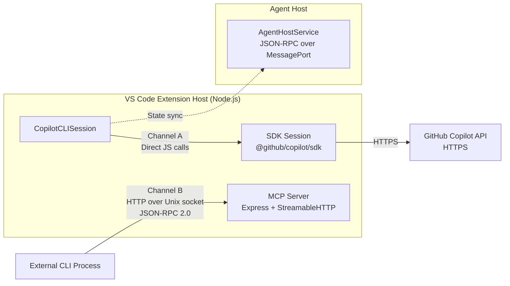
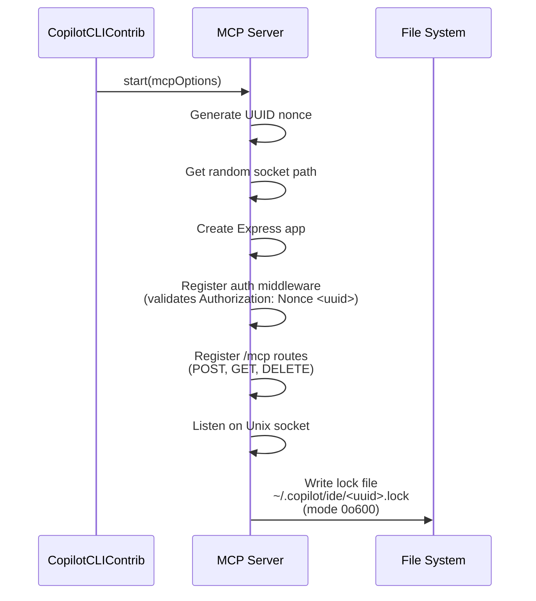
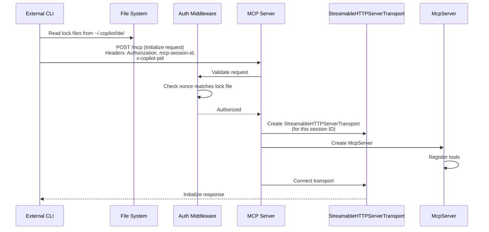
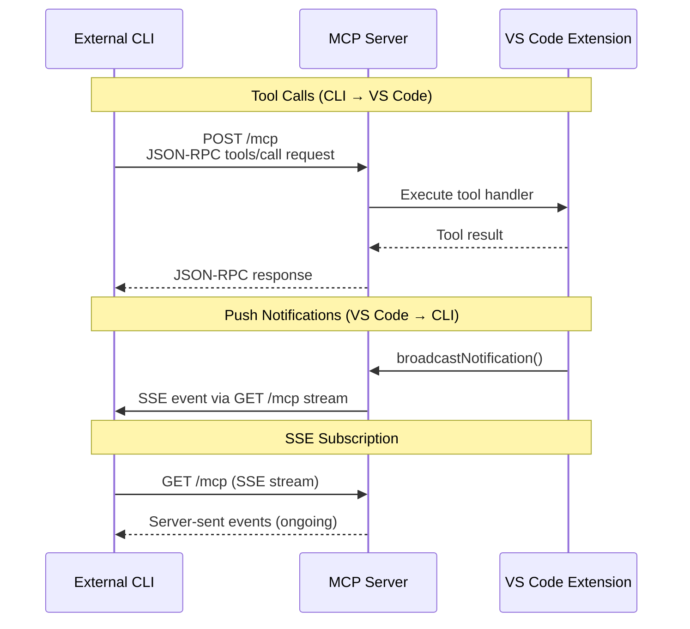
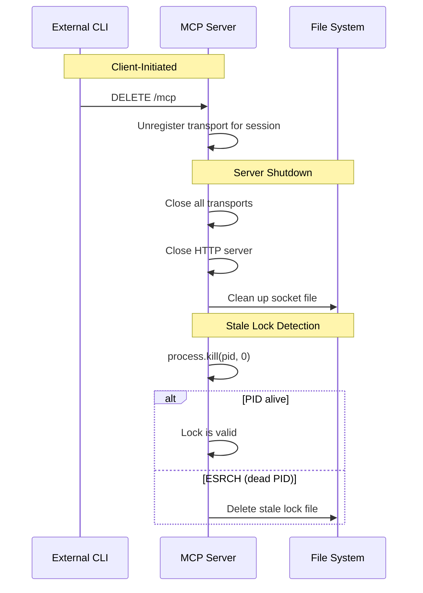
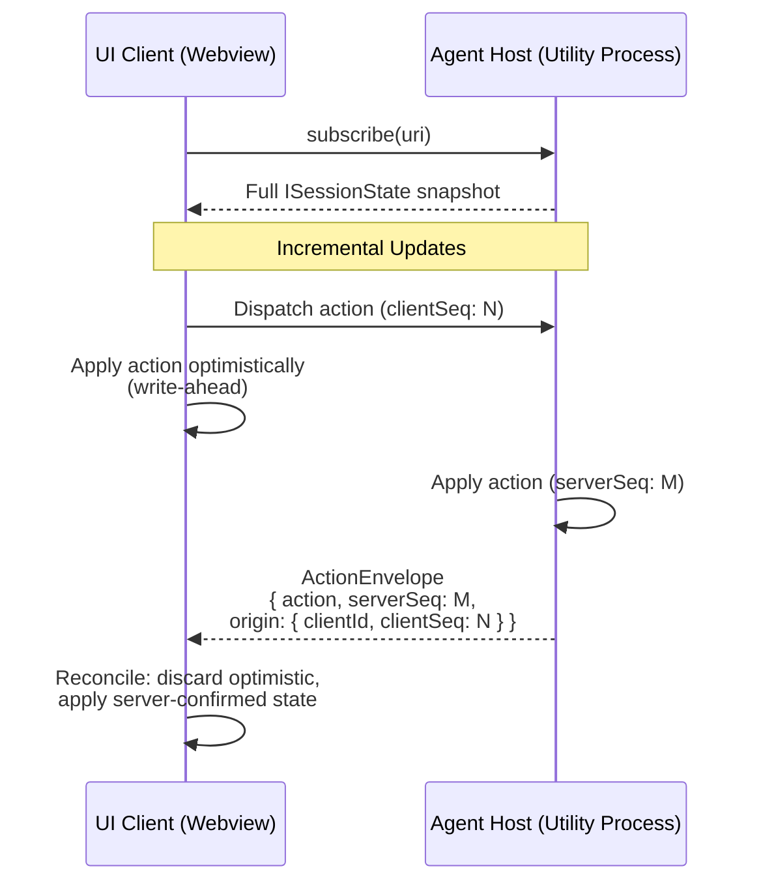

# Protocol and Communication

## Two-Channel Architecture

Two distinct communication channels operate between VS Code and its Copilot CLI infrastructure:

| Channel | Parties | Transport | Purpose |
|---------|---------|-----------|---------|
| **A: In-Process SDK** | Extension host ↔ Copilot API | Direct JS calls (same Node.js process) | AI conversation, tool orchestration, streaming |
| **B: MCP Server** | External CLI process ↔ VS Code | HTTP over Unix domain socket | IDE integration (selection, diagnostics, diffs) |



---

## Channel A: In-Process SDK

### Architecture

`CopilotCLISession` wraps the SDK `Session` object from `@github/copilot/sdk`. Communication is via direct JavaScript function calls — no network transport is involved between the extension and the SDK. The SDK session itself communicates with the GitHub Copilot API over HTTPS.

Events flow from the SDK to VS Code via an EventEmitter pattern. Each event carries a typed payload and is consumed synchronously by registered listeners within the extension host process.

### SDK Events

| Event | Direction | Purpose |
|-------|-----------|---------|
| `permission.requested` | SDK → VS Code | Permission for tool execution. Resolved via `session.respondToPermission(requestId, response)` where response is `{ kind: 'approved' }` or `{ kind: 'denied-interactively-by-user' }` |
| `exit_plan_mode.requested` | SDK → VS Code | Transition out of plan mode |
| `user_input.requested` | SDK → VS Code | Agent solicits additional user input |
| `session.title_changed` | SDK → VS Code | Auto-generated or updated session title |
| `user.message` | SDK → VS Code | User message logged |
| `assistant.message_delta` | SDK → VS Code | Streaming token delta |
| `assistant.message` | SDK → VS Code | Complete assistant message (`messageId`, full content) |
| `assistant.usage` | SDK → VS Code | Token usage metrics |
| `tool.execution_start` | SDK → VS Code | Tool invocation beginning |
| `tool.execution_complete` | SDK → VS Code | Tool invocation finished (`result`, `success`, `error`) |
| `session.error` | SDK → VS Code | Unrecoverable session error |
| `session.idle` | SDK → VS Code | Session finished processing |
| `subagent.started` | SDK → VS Code | Sub-agent spawned |
| `subagent.completed` | SDK → VS Code | Sub-agent finished |
| `subagent.failed` | SDK → VS Code | Sub-agent failed |
| `hook.start` | SDK → VS Code | Hook execution beginning |
| `hook.end` | SDK → VS Code | Hook execution finished |

### Send Options

Messages are dispatched to the SDK session via `send()` with typed options:

```typescript
interface SendOptions {
    prompt: string;
    attachments: Attachment[];
    agentMode: 'interactive' | 'autopilot' | 'plan';
    mode?: 'immediate';  // Steering: inject into running conversation
}
```

The `mode: 'immediate'` variant permits mid-conversation steering — injecting a message into an already-running exchange rather than queuing it.

### Session Management

- **Shared ownership:** `RefCountedSession` wraps the SDK session, enabling multiple consumers to hold references. The underlying session is disposed only when all references are released.
- **Idle timeout:** 300 seconds (`SESSION_SHUTDOWN_TIMEOUT_MS = 300 * 1000`). A session that receives no activity within this window is automatically shut down.
- **Event persistence:** Events are serialized to `~/.copilot/session-state/<sessionId>/events.jsonl` — one JSON object per line — enabling cross-process history reconstruction.

---

## Channel B: MCP Server (External CLI → VS Code)

### Transport

| Property | Value |
|----------|-------|
| Transport | HTTP over Unix domain socket (macOS/Linux) or Windows named pipe |
| Protocol | MCP (Model Context Protocol) — JSON-RPC 2.0 |
| Library | `@modelcontextprotocol/sdk` — `StreamableHTTPServerTransport` |
| Endpoints | `POST /mcp` (requests), `GET /mcp` (SSE stream), `DELETE /mcp` (session close) |
| Multiplexing | One transport instance per MCP session ID |
| Body limit | 10 MB |

### Server Startup



### Client Connection



### Ongoing Communication



### Teardown



### MCP Tools

| Tool Name | Input | Output |
|-----------|-------|--------|
| `get_vscode_info` | none | `version`, `appName`, `appRoot`, `language`, `machineId`, `sessionId`, `uriScheme`, `shell` |
| `get_selection` | none | `text`, `filePath`, `fileUrl`, selection range, `current` boolean |
| `get_diagnostics` | `{ uri?: string }` | Array of diagnostics per file |
| `open_diff` | `{ original_file_path, new_file_contents, tab_name }` | `success`, `result`: `SAVED` or `REJECTED`, `trigger`, `tab_name`, `message` (blocks until user action) |
| `close_diff` | `{ tab_name }` | `success`, `already_closed`, `tab_name`, `message` |
| `update_session_name` | `{ name }` | `success: true` |

`open_diff` is notably blocking — it suspends the JSON-RPC response until the user explicitly saves or rejects the diff in the VS Code UI.

### Push Notifications (VS Code → CLI)

| Method | Trigger | Payload |
|--------|---------|---------|
| `selection_changed` | Editor selection change (debounced 200ms) | `SelectionInfo` (always non-null; `null` values only occur in the `get_selection` tool response, not in push notifications) |
| `diagnostics_changed` | Language diagnostics change (debounced 200ms) | `{ uris: DiagnosticInfo[] }` — each entry contains `uri` and `diagnostics` array |

These are broadcast to all connected MCP transports via `broadcastNotification()`.

---

## Agent Host State Protocol (JSON-RPC)

### Transport

JSON-RPC 2.0 over `MessagePort` (desktop) or WebSocket (remote/web).

This is a third communication axis — distinct from both Channel A and Channel B — responsible for synchronizing session state between the agent host (server-authoritative) and the webview/UI layer (client).

### State Synchronization Model

The server maintains an immutable state tree. Clients never mutate state directly; they dispatch actions that the server applies and echoes back.



**Key properties:**

- **Server-authoritative:** The agent host is the single source of truth for all session state.
- **Subscription-based:** Clients subscribe by URI (`subscribe(uri)` / `unsubscribe(uri)`). A full `ISessionState` snapshot is delivered on subscribe.
- **Incremental updates:** After the initial snapshot, changes arrive as `ActionEnvelope` objects:
  ```typescript
  interface IActionEnvelope {
      action: IStateAction;       // Discriminated union on `type` string
      serverSeq: number;
      origin?: {
          clientId: string;
          clientSeq: number;
      };
      rejectionReason?: string;   // Present when server rejects an action
  }
  ```
- **Write-ahead reconciliation:** Clients apply their own actions optimistically. On receiving the server echo (identified by matching `origin.clientId` and `origin.clientSeq`), they reconcile local state with the authoritative server sequence.

### Key RPC Commands

| Command | Type | Purpose |
|---------|------|---------|
| `createSession` | Command | Create a new session with configuration |
| `listSessions` | Command | Fetch session list (imperative, not subscription-based) |
| `subscribe(uri)` | Command | Subscribe to state updates for a URI; returns initial snapshot |
| `unsubscribe(uri)` | Notification | Unsubscribe from state updates (fire-and-forget, no response) |
| `dispatchAction` | Notification | Client sends a state mutation action |
| `fetchTurns` | Command | Fetch turn history for a session |
| `resourceRead(uri)` | Command | Fetch large content by ContentRef |

### Content References

Large content (e.g., tool output, file contents) is not inlined in action payloads. Instead, a `ContentRef` placeholder is used:

- Contains a URI, optional size hint, and MIME type
- Resolved separately via the `resourceRead(uri)` RPC command
- Prevents action payloads from bloating, keeping the subscription stream lean

---

## Session Synchronization Mechanisms

Four mechanisms work in concert to maintain coherent session state across process boundaries.

### 1. Primary: In-Process (Real-Time)

`CopilotCLISession` wraps the SDK `Session` object directly. All state changes propagate via typed EventEmitter events within the extension host process. This is the lowest-latency path.

**Status transitions:**

```
undefined → InProgress → Completed
                       → Failed
                       → NeedsInput (agent solicits user input)
```

### 2. File System Watcher (Cross-Process)

For state that must be visible across process boundaries (e.g., when a CLI process writes events that the extension host must observe):

| Property | Value |
|----------|-------|
| Watch path | `~/.copilot/session-state/**/*.jsonl` |
| Events | `onDidCreate`, `onDidChange` (throttled 500ms), `onDidDelete` |
| Path parsing | `extractSessionIdFromEventPath()` extracts session ID from file path |

The 500ms throttle on `onDidChange` prevents excessive re-reads during rapid event bursts.

### 3. History Reconstruction

When a session's state must be rebuilt from its persisted event log:

- **`buildChatHistoryFromEvents()`** — Replays `SessionEvent[]` into structured chat turns.
- **`readSessionEventsFile()`** — Streams `events.jsonl` line-by-line using `createReadStream` piped through `createInterface` (readline).
- **Early termination:** The optional `findFirstEventType` parameter allows the reader to stop after encountering a specific event type, avoiding full-file reads when only a prefix is needed.

### 4. Workspace Tracking

Session identity is tracked at two scopes:

| Scope | Storage |
|-------|---------|
| Per-workspace | `copilot.cli.workspaceSessions.<uuid>.json` |
| Global (legacy) | `copilot.cli.oldGlobalSessions.json` |

---

## Lock File Discovery

### Location

```
~/.copilot/ide/<uuid>.lock
```

### Schema

```typescript
interface LockFileInfo {
    socketPath: string;
    scheme: string;                    // 'unix' or 'pipe'
    headers: Record<string, string>;   // { Authorization: "Nonce <uuid>" }
    pid: number;
    ideName: string;
    timestamp: number;
    workspaceFolders: string[];
    isTrusted: boolean;
}
```

### Permissions

| Target | Mode |
|--------|------|
| Lock file | `0o600` (owner read/write only) |
| Temp directory | `0o700` (owner read/write/execute only) |

### Stale Detection

```
process.kill(pid, 0)
├── Success → process alive → lock is valid
└── ESRCH  → process dead  → delete lock file
```

The signal `0` does not terminate the process — it merely tests for existence.

---

## Security Model

| Mechanism | Detail |
|-----------|--------|
| **Authentication** | Nonce-based: UUID generated at server startup, stored in lock file. Clients must present `Authorization: Nonce <uuid>` header. |
| **Socket permissions** | Owner-only temp directory (`0o700`), owner-only lock file (`0o600`). |
| **DNS rebinding protection** | Requests validated against allowed origins. |
| **Allowed hosts** | Localhost only. No remote connections accepted. |
| **TLS** | Not used. Traffic is confined to Unix domain sockets, which are inaccessible from the network. |
| **PID tracking** | `x-copilot-pid` and `x-copilot-parent-pid` headers identify the connecting process. |
| **Workspace trust** | `isTrusted` flag in lock file reflects VS Code's workspace trust state. |

The security model relies on the OS-level isolation provided by Unix domain sockets and file permissions rather than cryptographic transport security. This is appropriate because both endpoints are on the same machine and communication never traverses a network boundary.

---

## Error Handling

| Layer | Condition | Response |
|-------|-----------|----------|
| MCP | Missing or invalid `Authorization` header | HTTP 401 |
| MCP | Missing or invalid session ID | HTTP 400, JSON-RPC error `-32000` |
| MCP | Duplicate `initialize` request | HTTP 409, JSON-RPC error `-32000` |
| SDK | `session.error` event | Logged; session status set to `Failed` |
| SDK | Abort failure | Fire-and-forget in session context (not awaited, not logged); caught and logged in service cleanup path. Not thrown in either case (prevents cascading failures) |
| Lock | Stale lock (dead PID) | Lock file deleted |
| Lock | Write failure | Logged and propagated to caller |
| Watcher | `events.jsonl` parse error | Caller-level isolation: `readSessionEventsFile()` throws on malformed JSON; callers (e.g., `tryGetPartialSesionHistory`) catch and degrade gracefully |

The error isolation in the file watcher operates at the caller level — a malformed `events.jsonl` aborts the read, but higher-level callers (e.g., `tryGetPartialSesionHistory`) catch and handle the failure gracefully without crashing the extension.
