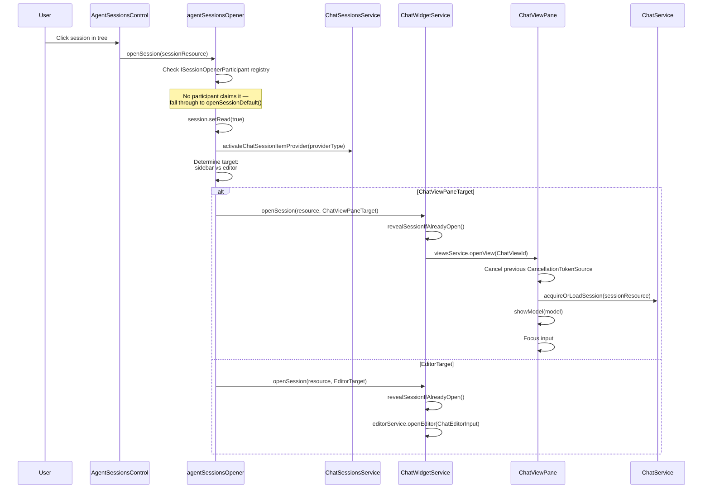
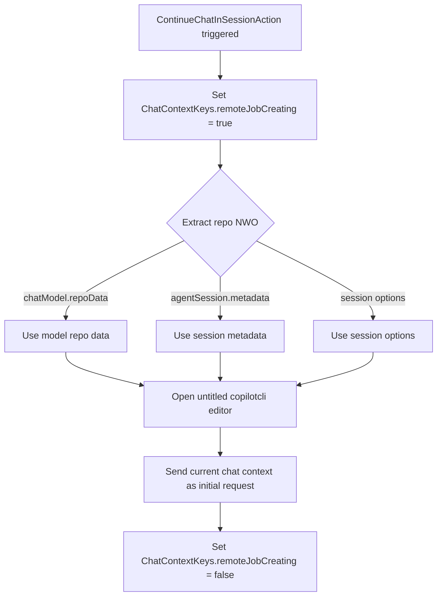

# UI Integration

> Last updated: 2026-04-21

How Copilot CLI (Background Agent) sessions surface in the VS Code UI — from declarative registration through session discovery, loading, continuation, rendering, and the full command/menu taxonomy.

---

## Extension Point Registration

The `chatSessions` contribution point in `extensions/copilot/package.json` is the declarative mechanism for registering session types. The Copilot extension contributes the following for `copilotcli`:

```json
{
  "type": "copilotcli",
  "name": "cli",
  "displayName": "Copilot CLI",
  "icon": "$(copilot)",
  "welcomeTitle": "Copilot CLI",
  "welcomeMessage": "Run tasks in the background with the Copilot CLI",
  "inputPlaceholder": "Run tasks in the background with the Copilot CLI, type `#` for adding context",
  "order": 1,
  "canDelegate": true,
  "description": "%github.copilot.session.providerDescription.background%",
  "when": "config.github.copilot.chat.backgroundAgent.enabled",
  "capabilities": {
    "supportsFileAttachments": true,
    "supportsProblemAttachments": true,
    "supportsToolAttachments": false,
    "supportsImageAttachments": true,
    "supportsSymbolAttachments": true,
    "supportsSearchResultAttachments": true,
    "supportsSourceControlAttachments": true,
    "supportsPromptAttachments": true,
    "supportsHandOffs": true
  },
  "commands": [
    { "name": "delegate", "description": "Delegate chat session to cloud agent and create associated PR", "when": "config.github.copilot.chat.cloudAgent.enabled" },
    { "name": "compact", "description": "%github.copilot.command.cli.compact.description%" },
    { "name": "plan", "description": "%github.copilot.command.cli.plan.description%", "when": "false" },
    { "name": "fleet", "description": "%github.copilot.command.cli.fleet.description%", "when": "false" }
  ],
  "customAgentTarget": "github-copilot",
  "requiresCustomModels": true,
  "autoAttachReferences": true,
  "useRequestToPopulateBuiltInPickers": true
}
```

When processed by `ChatSessionsService`, two workbench actions are registered per session type:

| Generated Action ID | Purpose |
|---------------------|---------|
| `workbench.action.chat.openNewChatSessionInPlace.copilotcli` | Open new CLI session in sidebar or editor |
| `workbench.action.chat.openNewChatSessionExternal.copilotcli` | Open new CLI session via extension command |

Additional contribution fields of note:

- **`canDelegate: true`** — enables the "Continue In..." flow from other session types.
- **`customAgentTarget`** — binds to the `github-copilot` agent target for custom agent resolution.
- **`requiresCustomModels`** — signals that model selection is handled server-side.
- **`autoAttachReferences`** — automatically attaches workspace context.
- **`commands`** — `plan` and `fleet` are registered but hidden (`when: "false"`); `delegate` is gated on the cloud agent feature flag.

---

## Session Discovery UI

CLI sessions surface on four discovery surfaces within VS Code.

### Session List Sidebar

**Component:** `AgentSessionsControl` — a `Disposable` that wraps a `WorkbenchCompressibleAsyncDataTree`, embedded in `ChatViewPane`.

- Renders **all** session types in a unified tree with temporal section grouping: Pinned, Today, Yesterday, Last 7 days, Older, Archived, More (capped grouping), Other (repository grouping).
- CLI sessions display with `Codicon.copilot` icon.
- Status-only icon mode (`useStatusOnlyIcons = true`) suppresses the provider icon for background sessions — the status indicator alone suffices.
- File changes badge follows a distinct code path for Background/Cloud sessions.
- `ToggleShowAgentSessionsAction` controls sidebar visibility.

### Session Type Picker

**Component:** `SessionTypePickerActionItem` — dropdown in the chat input toolbar.

- Iterates `chatSessionsService.getAllChatSessionContributions()` to enumerate available types.
- For `copilotcli`: resolves metadata via `getAgentSessionProviderName()` and `getAgentSessionProviderIcon()` (hardcoded values).
- Selection triggers `workbench.action.chat.openNewChatSessionInPlace.copilotcli`.

### Quick Access

**Component:** `AgentSessionsQuickAccessProvider` (prefix: `agent `).

- Provides fuzzy search across all agent sessions.
- No CLI-specific filtering — all session types are searched uniformly.

### Agent Sessions Picker

**Component:** `AgentSessionsPicker` — quick pick dialog for selecting from existing sessions.

---

## Session Loading Flow

The complete path from user click to rendered session:



### Step-by-Step Breakdown

1. **User click** — `AgentSessionsControl` fires the open event with the session resource URI.
2. **`openSession()`** (`agentSessionsOpener.ts`) — checks the `ISessionOpenerParticipant` registry (plugin pattern). If no participant claims the session, falls through to `openSessionDefault()`.
3. **`openSessionDefault()`**:
   - Marks the session as read: `session.setRead(true)`.
   - Activates the provider: `chatSessionsService.activateChatSessionItemProvider(session.providerType)`.
   - Determines target location (sidebar vs. editor) based on resolvability and preferred target.
   - Dispatches to `ChatWidgetService.openSession()`.
4. **`ChatWidgetService.openSession()`**:
   - Calls `revealSessionIfAlreadyOpen()` — checks both the view pane and open editors.
   - If `ChatViewPaneTarget`: opens via `viewsService.openView(ChatViewId)` into `ChatViewPane`.
   - If editor target: opens via `editorService.openEditor(ChatEditorInput)`.
5. **`ChatViewPane.loadSession(sessionResource)`**:
   - Cancels any previous `CancellationTokenSource`.
   - Calls `chatService.acquireOrLoadSession(sessionResource)`.
   - Renders the model via `showModel(model)`.
   - Focuses the input widget.

### New Session URI Creation

```typescript
URI.from({
  scheme: 'copilotcli',
  path: `/untitled-${generateUuid()}`
});
// Result: copilotcli:///untitled-<uuid>
```

`getChatSessionType()` extracts the session type from the URI scheme — for Background sessions, it returns `'copilotcli'`.

### Cross-Window Opening

The Electron main process sends session URIs to renderer windows via IPC:

```
// electron-main/app.ts
window.sendWhenReady('vscode:openChatSession', CancellationToken.None, session);

// electron-browser/chat.contribution.ts
ipcRenderer.on('vscode:openChatSession', (_, ...args) => {
    // Parse URI → chatWidgetService.openSession(resource, ChatViewPaneTarget)
});
```

This enables cross-window session hand-off — a session initiated in one window can be opened in another (e.g., the dedicated Agents window).

---

## Session Continuation ("Continue In..." Flow)

The continuation mechanism allows users to hand off a local chat session to a Background Agent session.

### Entry Point

**`ContinueChatInSessionAction`** (ID: `workbench.action.chat.continueChatInSession`):

- Registered in `MenuId.ChatExecute`.
- `ChatContinueInSessionActionItem` builds a dropdown of eligible session targets.
- For Background Agent: `getAgentCanContinueIn()` returns `true`, so `copilotcli` appears in the dropdown.

### CreateRemoteAgentJobAction.run()



1. Sets `ChatContextKeys.remoteJobCreating = true`.
2. Extracts the repository NWO (name-with-owner) from multiple sources: `chatModel.repoData`, `agentSession.metadata`, or session options.
3. Opens an untitled `copilotcli` editor.
4. Sends the current chat context as the initial request to the new session.

### Delegation Rules

| Context | Delegation FROM | Delegation TO Background | Notes |
|---------|----------------|--------------------------|-------|
| Core VS Code | Local sessions | Yes | Standard flow |
| Sessions window | Background sessions | No | Cannot delegate from Background to Background |
| Sessions window | Cloud sessions | Requires git repo | `sessions.hasGitRepository` must be true |

`getAgentCanContinueIn(type)` controls which targets appear in the continuation picker.

### Editing Session Auto-Accept

Background sessions automatically accept streaming edits — no user confirmation required:

```typescript
if (getChatSessionType(this.chatSessionResource) === AgentSessionProviders.Background) {
    await entry.accept();
}
```

This is a fundamental behavioral difference from local sessions, where edits present a diff for manual review.

---

## Rendering Specifics

### File Changes Summary Suppression

Background sessions suppress the local file changes summary. The rendering logic:

```typescript
private shouldShowFileChangesSummary(element: IChatResponseViewModel): boolean {
    const sessionType = getChatSessionType(element.sessionResource);
    const isLocalSession = sessionType === localChatSessionType || isAgentHostTarget(sessionType);
    return element.isComplete && isLocalSession && this.configService.getValue<boolean>('chat.checkpoints.showFileChanges');
}
```

Background sessions are neither `localChatSessionType` nor `isAgentHostTarget`, so the summary is suppressed. File changes are rendered server-side at the session level instead.

### Working Set Entries

Background sessions return empty `modifiedEntries` — file changes are tracked and rendered at the session level, not at the individual editing-session level. This reflects the architectural boundary: the CLI agent manages its own worktree, and the VS Code client renders a summary view.

### Session List Item Rendering

- **Icon:** When `useStatusOnlyIcons = true`, the provider icon is suppressed for Background sessions. The status indicator (running, completed, failed) serves as the sole visual cue.
- **File changes action:** Background and Cloud sessions use a distinct code path for "View All Changes" visibility — separate from the local session path.

### Debug Home View

- Bootstrap filtering: `copilotcli` untitled sessions are filtered out of the debug home view to avoid cluttering it with transient sessions.
- Title format: `"Copilot CLI: {shortId}"` — uses a truncated session identifier.

### Status Dashboard

Background sessions display with the label **"Background Agent"** in the status dashboard.

---

## Commands and Menus

### Core Workbench Commands

| Command ID | Title | Purpose |
|-----------|-------|---------|
| `workbench.action.chat.openNewChatSessionInPlace.copilotcli` | *(generated)* | Open new CLI session in sidebar/editor |
| `workbench.action.chat.openNewChatSessionExternal.copilotcli` | *(generated)* | Open new CLI session via extension command |
| `workbench.action.chat.continueChatInSession` | Continue Chat in... | Hand off to Background Agent |

### Extension Commands (Session Management)

| Command ID | Title | Icon |
|-----------|-------|------|
| `github.copilot.cli.sessions.delete` | Delete... | `$(close)` |
| `github.copilot.cli.sessions.rename` | Rename... | `$(edit)` |
| `github.copilot.cli.sessions.setTitle` | Set Title | — |
| `github.copilot.cli.sessions.resumeInTerminal` | Resume in Terminal | `$(terminal)` |
| `github.copilot.cli.sessions.openRepository` | Open Repository | `$(folder-opened)` |
| `github.copilot.cli.sessions.openWorktreeInNewWindow` | Open Session in New Window | `$(folder-opened)` |
| `github.copilot.cli.sessions.openWorktreeInTerminal` | Open Session in Terminal | `$(terminal)` |
| `github.copilot.cli.sessions.copyWorktreeBranchName` | Copy Session Branch Name | `$(copy)` |
| `github.copilot.cli.sessions.commitToWorktree` | Commit File to Worktree | `$(git-commit)` |
| `github.copilot.cli.sessions.commitToRepository` | Commit File to Repository | `$(git-commit)` |

### Extension Commands (Apply/Merge/PR)

| Command ID | Title | Icon |
|-----------|-------|------|
| `github.copilot.chat.applyCopilotCLIAgentSessionChanges` | Apply Changes to Workspace | — |
| `github.copilot.chat.applyCopilotCLIAgentSessionChanges.apply` | Apply | `$(git-stash-pop)` |
| `github.copilot.chat.mergeCopilotCLIAgentSessionChanges.merge` | Merge Changes | `$(git-merge)` |
| `github.copilot.chat.mergeCopilotCLIAgentSessionChanges.mergeAndSync` | Merge Changes & Sync | `$(sync)` |
| `github.copilot.chat.createPullRequestCopilotCLIAgentSession.createPR` | Create Pull Request | `$(git-pull-request-create)` |
| `github.copilot.chat.createPullRequestCopilotCLIAgentSession.updatePR` | Sync Pull Request | `$(sync)` |
| `github.copilot.chat.createDraftPullRequestCopilotCLIAgentSession.createDraftPR` | Create Draft Pull Request | `$(git-pull-request-draft)` |

### Extension Commands (Workspace-Mode Git)

| Command ID | Title | Icon |
|-----------|-------|------|
| `github.copilot.sessions.initializeRepository` | Initialize Repository | `$(repo)` |
| `github.copilot.sessions.commit` | Commit | `$(git-commit)` |
| `github.copilot.sessions.commitAndSync` | Commit and Sync | `$(sync)` |
| `github.copilot.sessions.sync` | Sync Changes | `$(sync)` |
| `github.copilot.sessions.refreshChanges` | Refresh | `$(refresh)` |
| `github.copilot.sessions.discardChanges` | Discard Changes | `$(discard)` |

### Menu Registrations

#### `chat/chatSessions` (Session Context Menu)

| Command | When Condition | Group |
|---------|---------------|-------|
| `...cli.sessions.rename` | `chatSessionType == copilotcli` | `1_edit@4` |
| `...cli.sessions.delete` | `chatSessionType == copilotcli` | `1_edit@10` |
| `...cli.sessions.openWorktreeInNewWindow` | `chatSessionType == copilotcli && !isSessionsWindow` | `2_open@1` |
| `...cli.sessions.openWorktreeInTerminal` | `chatSessionType == copilotcli` | `2_open@2` |
| `...cli.sessions.copyWorktreeBranchName` | `chatSessionType == copilotcli` | `2_open@3` |
| `...cli.sessions.resumeInTerminal` | `chatSessionType == copilotcli` | `2_open@4` |
| `...applyCopilotCLIAgentSessionChanges` | `chatSessionType == copilotcli && workbenchState != empty && !isSessionsWindow` | `3_apply@0` |

#### `chat/input/editing/sessionToolbar`

| Command | When Condition | Group |
|---------|---------------|-------|
| `...applyCopilotCLIAgentSessionChanges.apply` | `chatSessionType == copilotcli && workbenchState != empty && !isSessionsWindow` | `navigation@0` |

#### `chat/input/editing/sessionApplyActions`

| Command | When Condition | Group |
|---------|---------------|-------|
| `...sessions.initializeRepository` | `chatSessionType == copilotcli && isSessionsWindow && sessions.isolationMode == workspace && !sessions.hasGitRepository` | `init@1` |
| `...sessions.commit` | `chatSessionType == copilotcli && isSessionsWindow && sessions.isolationMode == workspace && sessions.hasGitRepository && sessions.hasUncommittedChanges` | `commit@1` |
| `...sessions.commitAndSync` | `chatSessionType == copilotcli && isSessionsWindow && sessions.isolationMode == workspace && sessions.hasGitRepository && sessions.hasUncommittedChanges && sessions.hasUpstream` | `commit@2` |
| `...sessions.sync` | `chatSessionType == copilotcli && isSessionsWindow && sessions.isolationMode == workspace && sessions.hasGitRepository && !sessions.hasUncommittedChanges && sessions.hasUpstream` | `sync@1` |
| `...mergeCopilotCLIAgentSessionChanges.merge` | `chatSessionType == copilotcli && isSessionsWindow && sessions.isolationMode == worktree && sessions.hasGitRepository && !sessions.isMergeBaseBranchProtected && !sessions.hasPullRequest && (sessions.hasUncommittedChanges \|\| sessions.hasOutgoingChanges)` | `merge@1` |
| `...mergeCopilotCLIAgentSessionChanges.mergeAndSync` | *(same as merge)* | `merge@2` |
| `...createPullRequestCopilotCLIAgentSession.createPR` | `chatSessionType == copilotcli && isSessionsWindow && sessions.isolationMode == worktree && sessions.hasGitRepository && sessions.hasGitHubRemote && !sessions.hasPullRequest && (sessions.hasUncommittedChanges \|\| sessions.hasOutgoingChanges)` | `pull_request@1` |
| `...createDraftPullRequestCopilotCLIAgentSession.createDraftPR` | *(same as createPR)* | `pull_request@2` |
| `...createPullRequestCopilotCLIAgentSession.updatePR` | `chatSessionType == copilotcli && isSessionsWindow && sessions.isolationMode == worktree && sessions.hasGitRepository && sessions.hasGitHubRemote && sessions.hasPullRequest && sessions.hasOpenPullRequest` | `pull_request@1` |

#### `chat/input/editing/sessionTitleToolbar`

| Command | When Condition | Group |
|---------|---------------|-------|
| `...sessions.refreshChanges` | `chatSessionType == copilotcli && isSessionsWindow` | `9_refresh@1` |

#### `chat/input/editing/sessionChangeToolbar`

| Command | When Condition | Group |
|---------|---------------|-------|
| `...sessions.discardChanges` | `chatSessionType == copilotcli && isSessionsWindow && sessions.hasGitRepository && sessions.changesVersionMode == branchChanges` | `navigation@1` |

#### `multiDiffEditor/content`

| Command | When Condition | Group |
|---------|---------------|-------|
| `...applyCopilotCLIAgentSessionChanges` | `resourceScheme == copilotcli-worktree-changes && workbenchState != empty && !isSessionsWindow` | *(default)* |

---

## Context Keys

| Key | Type | Purpose |
|-----|------|---------|
| `chatSessionType` | `string` | Primary discriminator — value is `'copilotcli'` for CLI sessions |
| `isSessionsWindow` | `boolean` | Whether running in the dedicated Agents window |
| `sessions.isolationMode` | `string` | `'workspace'` or `'worktree'` — determines which apply actions are available |
| `sessions.hasGitRepository` | `boolean` | Git repository available in the session worktree |
| `sessions.hasUncommittedChanges` | `boolean` | Uncommitted changes present |
| `sessions.hasOutgoingChanges` | `boolean` | Outgoing changes present (used in merge/PR conditions) |
| `sessions.hasUpstream` | `boolean` | Upstream remote configured |
| `sessions.hasGitHubRemote` | `boolean` | GitHub remote available (required for PR operations) |
| `sessions.hasPullRequest` | `boolean` | Associated pull request exists |
| `sessions.hasOpenPullRequest` | `boolean` | Associated PR is in open state |
| `sessions.isMergeBaseBranchProtected` | `boolean` | Merge base branch is protected (suppresses direct merge) |
| `sessions.changesVersionMode` | `string` | Version mode for change display (e.g., `'branchChanges'`) |
| `config.github.copilot.chat.backgroundAgent.enabled` | `boolean` | Feature gate — entire copilotcli contribution is hidden when false |
| `github.copilot.chat.copilotCLI.hasSession` | `boolean` | At least one CLI session is connected |
| `ChatContextKeys.lockedCodingAgentId` | `string` | When set to `AgentSessionProviders.Background`, conditions execute actions <!-- Unverified: inferred from VS Code source; may be internal and subject to change --> |
| `ChatContextKeys.remoteJobCreating` | `boolean` | True during "Continue In..." handoff <!-- Unverified: inferred from VS Code source; may be internal and subject to change --> |

---

## Classification Predicates

These predicates determine how the platform treats `copilotcli` sessions:

| Predicate | Result for Background | Significance |
|-----------|----------------------|--------------|
| `isFirstPartyAgentSessionProvider()` | `true` | Treated as a Microsoft-owned session type |
| `isBuiltInAgentSessionProvider()` | `true` | Part of the core agent session set |
| `getAgentCanContinueIn()` | `true` | Appears as a "Continue In..." target |
| `isAgentHostTarget()` | `false` | Not a local host target — affects file changes rendering |
| `getAgentSessionProvider('copilotcli')` | `AgentSessionProviders.Background` | Maps to the Background variant of the agent session enum |

---

## Behavioral Divergences from Local Sessions

Ten ways `copilotcli` sessions differ from default local (`chat`) sessions:

| # | Divergence | Mechanism |
|---|-----------|-----------|
| 1 | **URI scheme `copilotcli://`** | `getChatSessionType()` extracts type from URI scheme; all routing decisions branch on this |
| 2 | **File changes summary suppressed** | `shouldShowFileChangesSummary()` returns `false` — `isAgentHostTarget()` is `false` for Background |
| 3 | **Working set entries emptied** | `modifiedEntries` returns empty — file changes are tracked at session level, not editing-session level |
| 4 | **Streaming edits auto-accepted** | `getChatSessionType() === AgentSessionProviders.Background` triggers `entry.accept()` without user confirmation |
| 5 | **Provider icon conditionally hidden** | `useStatusOnlyIcons = true` suppresses the provider icon; status indicator is the sole visual cue |
| 6 | **Bootstrap sessions filtered from debug view** | Untitled `copilotcli` sessions excluded from the debug home view |
| 7 | **Dedicated context menu commands** | Full suite of worktree, commit, merge, and PR operations registered in `chat/chatSessions` and `sessionApplyActions` menus |
| 8 | **`canDelegate: true` enables continuation** | "Continue In..." flow hands off local sessions to Background Agent |
| 9 | **Feature-gated behind `backgroundAgent.enabled`** | Entire contribution hidden when `config.github.copilot.chat.backgroundAgent.enabled` is false |
| 10 | **Execute actions conditioned on `lockedCodingAgentId`** | `ChatContextKeys.lockedCodingAgentId.isEqualTo(AgentSessionProviders.Background)` gates certain execute actions |
