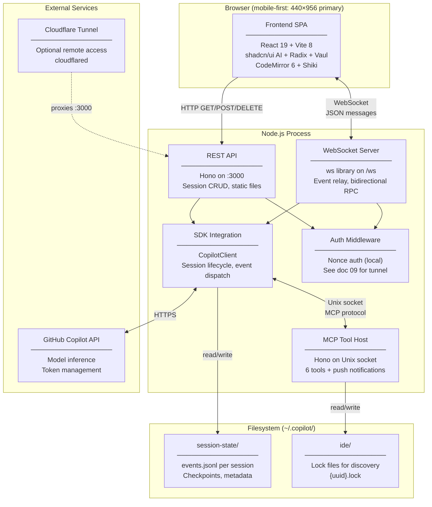
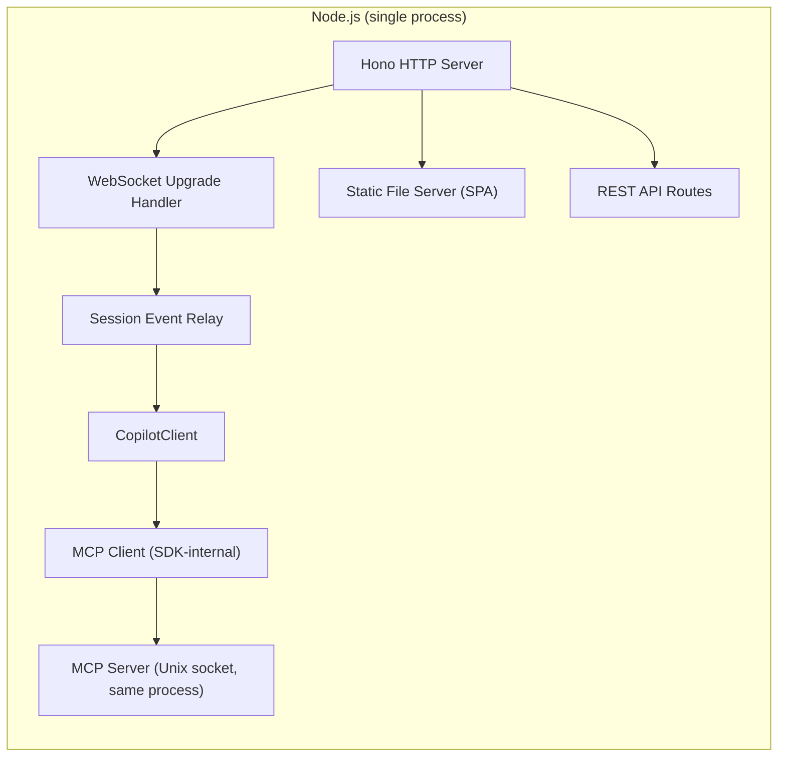
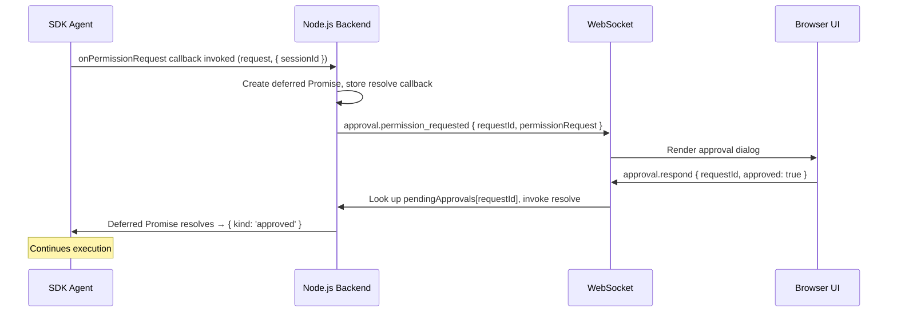
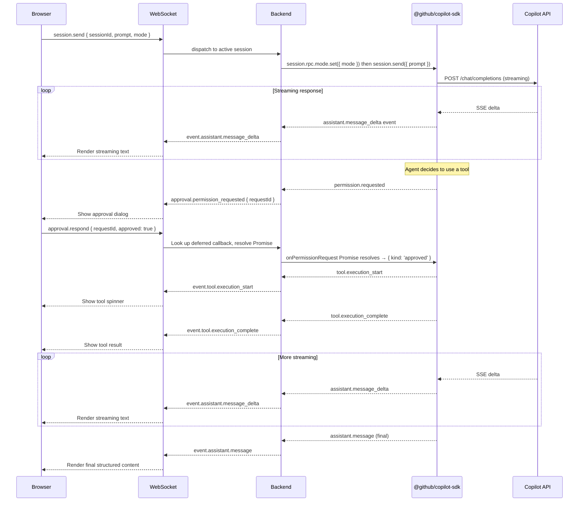
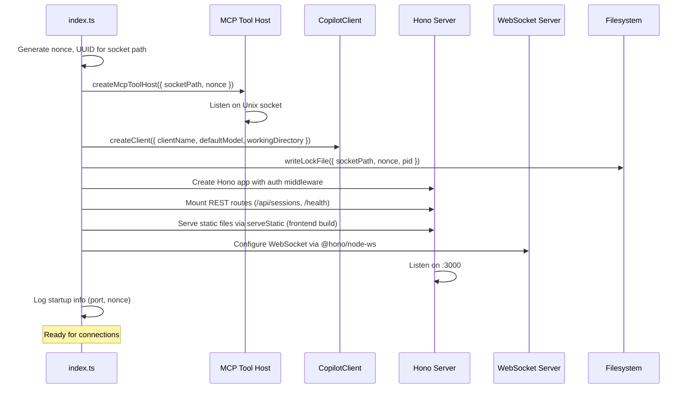

# 06 — Standalone Webapp Extraction Guide

> Last updated: 2026-04-21

A design document for building a **mobile-first** standalone web application (Node.js backend + browser frontend) that provides full **Copilot CLI** session management — creating, viewing, continuing, and streaming sessions — independent of VS Code. The primary viewport target is iPhone 16 Pro Max (440×956 CSS pixels, 3× retina); desktop is a supported secondary layout. The webapp runs on the same machine as the Copilot CLI and may optionally be exposed to the network via `cloudflared tunnel`.

> **Scope:** This webapp connects to, resumes, and creates **Copilot CLI sessions only**. It does not integrate with GitHub cloud agents or the remote Copilot agent service. All session data is local to the machine running the Node.js process.

> **Prerequisite reading:** [01-architecture.md](01-architecture.md) for the four-layer model, [03-protocol.md](03-protocol.md) for the wire protocol, [05-implementation-guide.md](05-implementation-guide.md) for session data model definitions. See [07-ui-specification.md](./07-ui-specification.md) for component-level layout, design tokens, and interaction patterns.

> **Companion reference:** For the complete constraints catalog, performance budgets, and degradation thresholds, see [08-constraints-and-requirements.md](./08-constraints-and-requirements.md).

> **Naming convention:** Type names in this document drop the `I` prefix used in VS Code's internal convention (e.g., `SessionSummary` here corresponds to VS Code's `ISessionSummary` in docs 01–05).

---

## Table of Contents

1. [Executive Summary](#1-executive-summary)
2. [Architecture Overview](#2-architecture-overview)
3. [Backend Design](#3-backend-design)
4. [Frontend Design](#4-frontend-design)
5. [Security Design](#5-security-design)
6. [Communication Protocol](#6-communication-protocol)
7. [Implementation Roadmap](#7-implementation-roadmap)
8. [Key Differences from VS Code](#8-key-differences-from-vs-code)
9. [Gotchas and Pitfalls](#9-gotchas-and-pitfalls)
10. [Dependencies](#10-dependencies)

---

## 1. Executive Summary

### What We Are Building

A self-contained Node.js application that replaces VS Code as the host environment for Copilot CLI sessions. The webapp provides:

- **Session lifecycle management** — create, list, load, continue, fork, and delete sessions.
- **Real-time streaming** — relay SDK events (message deltas, tool executions, permission requests) to a browser frontend over WebSocket.
- **Tool hosting** — an MCP server exposing webapp-specific tool implementations that the SDK's agent can invoke during a session.
- **Session persistence** — read/write the SDK's native `events.jsonl` format and optionally maintain a SQLite database for file-edit tracking.
- **Remote access** — optional `cloudflared tunnel` exposure with a proper authentication layer.

### Why

VS Code's Copilot session integration is deeply coupled to the Extension Layer and Workbench Layer (see [01-architecture.md](01-architecture.md)). A standalone webapp decouples the session runtime from VS Code's process model, enabling:

1. **Mobile-first session management** — native-feeling experience on phones and tablets, with touch-optimized layouts and viewport-aware chrome.
2. Headless environments (SSH servers, CI machines) with browser-based interaction.
3. Mobile device access via tunnel — the primary intended use case.
4. Lightweight session management without VS Code's resource footprint (~15-20× lighter than Monaco-based alternatives).
5. Custom UX experimentation unconstrained by VS Code's extension API.

### High-Level Architecture

A single Node.js process hosts three concerns:

| Concern | Responsibility |
|---------|---------------|
| **HTTP/WS Server** | Serves the frontend SPA, exposes REST endpoints, manages WebSocket connections |
| **SDK Integration** | Drives `@github/copilot-sdk` via `CopilotClient`, relays events |
| **MCP Tool Host** | Runs an MCP server (Hono on Unix socket) that the SDK connects to for tool invocations |

---

<!-- ARC-01 -->
## 2. Architecture Overview

### System Diagram



### Process Model

Unlike VS Code's multi-process architecture (main process, renderer, extension host; simplified — see Doc 01 §6 for the full five-process model including Agent Host and External CLI), the webapp uses a **single Node.js process**. This simplifies IPC at the cost of requiring careful async management.



### Relationship to VS Code's Architecture

The webapp collapses VS Code's four-layer architecture into two layers:

| VS Code Layer | Webapp Equivalent |
|---------------|-------------------|
| **Extension Layer** — SDK bridge in extension host; **Sessions Layer** — `CopilotChatSessionsProvider` | **SDK Integration** — direct `CopilotClient` usage in the main process |
| **Sessions Layer** — `ISessionsManagementService`, `ISessionsProvidersService` | **REST/WS API** — HTTP endpoints and WebSocket relay replace service injection |
| **Workbench Layer** — chat widget, diff editor, approval dialogs | **Frontend SPA** — React 19 + shadcn/ui AI + Radix + Vaul reimplementing the UI (mobile-first) |
| **Platform Layer** — file service, configuration, telemetry | **Node.js stdlib** — `fs`, `path`, `os` directly; no abstraction needed |

### Hybrid VS Code Alignment Strategy

The webapp does not fork or wrap VS Code source. VS Code's rendering layer depends on a deep dependency-injection graph (dozens of services per widget), making direct code reuse impossible. Instead, the webapp adopts a **copy-and-reimplement** strategy:

| What to copy verbatim | What to reimplement in React |
|------------------------|------------------------------|
| Enums and constants from `chat/common/constants.ts` | All rendering components — VS Code's DI graph is too deep to extract |
| CSS custom-property token values (color, spacing, font) | Component composition and state management |
| Animation `@keyframes` (pure CSS, no dependencies) | Event handling, streaming, and lifecycle |
| File naming conventions for content part renderers | Touch interactions and responsive layouts |

**File naming convention:** Frontend component files mirror VS Code's content part renderer names 1:1. For example, `ChatMarkdownContentPart.tsx` corresponds to VS Code's `chatMarkdownContentPart.ts`. This makes upstream change tracking mechanical rather than archaeological.

**Drift detection:** Maintain a [`VS_CODE_ALIGNMENT.md`](./VS_CODE_ALIGNMENT.md) *(created during Phase 1 implementation)* mapping file in the project root. This file records:
- Each copied constant/enum with its source path and last-synced VS Code commit SHA.
- Each CSS token value with its origin in VS Code's theme definitions.
- Each mirrored file name with its VS Code counterpart.

This mapping enables automated drift detection: a CI script can diff the declared source paths against the current VS Code main branch and flag divergence.

---

<!-- ARC-02 -->
## 3. Backend Design

### 3.1 Technology Stack

| Component | Package | Purpose |
|-----------|---------|---------|
| HTTP server | `hono` ^4.12.12 + `@hono/node-server` ^1.19.13 | REST endpoints, static file serving, MCP host |
| WebSocket | `@hono/node-ws` ^1.3.0 | Bidirectional event relay (integrated with Hono) |
| WebSocket (peer dep) | `ws` ^8.20.0 | Underlying WebSocket implementation required by `@hono/node-ws` |
| SDK | `@github/copilot-sdk` ^0.2.2 | Copilot SDK for session management (depends on `@github/copilot` CLI binary internally) |
| Schema validation | `zod` ^4.3.6 | Parameter schemas for `defineTool()` (v4 required for `toJSONSchema()`) |
| MCP | `@modelcontextprotocol/sdk` ^1.29.0 + `@hono/mcp` ^0.2.5 | Tool hosting via Hono MCP integration |
| UUID | `crypto.randomUUID()` | Nonce generation, session IDs |
| SQLite | `better-sqlite3` ^12.8.0 | Optional file-edit persistence |
| Markdown | `marked` ^18.0.0 | Server-side markdown→HTML for REST responses (optional) |
| TypeScript execution | `tsx` ^4.21.0 (dev) | Development: watch mode with full syntax support including enums |

> **TypeScript execution strategy:** In development, `tsx` provides watch mode and full TypeScript support (including enums and decorators) without a compilation step. For production, compile via `tsc` to JavaScript then run with `node`. Type checking is a separate concern: run `tsc --noEmit` independently — it does not participate in the execution pipeline. Environment variables are loaded via Node's native `--env-file=.env` flag; no `dotenv` dependency is required.

> **SDK architecture note:** `@github/copilot-sdk` is the public standalone SDK. It depends on `@github/copilot` internally (the full CLI binary, ~129 MB, is still pulled in as a transitive dependency — no need to list both in `package.json`). The SDK communicates with the CLI process via JSON-RPC over stdio, not in-process like VS Code's extension host. This is the recommended approach for standalone applications outside VS Code.

### 3.2 SDK Integration Layer

#### CopilotClient Setup

```typescript
import { CopilotClient, defineTool } from '@github/copilot-sdk';
import type {
  CopilotSession,
  SessionConfig,
  SessionEvent,
  PermissionRequestResult,
} from '@github/copilot-sdk';
import { z } from 'zod';

interface CopilotClientConfig {
  readonly clientName: string;
  readonly defaultModel: string;
  readonly workingDirectory: string;
}

async function createClient(config: CopilotClientConfig): Promise<CopilotClient> {
  const client = new CopilotClient();
  await client.start();
  return client;
}
```

#### Provider Interface

The SDK integration is accessed through a lightweight provider interface. The current implementation has a single concrete provider (`@github/copilot-sdk` via `CopilotClient`), but the interface boundary enables future extensibility without a full registry pattern.

```typescript
interface SessionProvider {
  name: string;
  createSession(options: CreateSessionOptions): Promise<CopilotSession>;
  loadSession(sessionId: string): Promise<CopilotSession>;
  listSessions(): Promise<SessionSummary[]>;
}

interface CreateSessionOptions {
  workingDirectory: string;
  model?: string;
  instructions?: string;
}

interface SessionSummary {
  id: string;
  title: string;
  lastActiveAt: Date;
  messageCount: number;
}
```

> **Note:** This shows the minimal session lifecycle methods. The full provider contract including `sendMessage()`, `abort()`, and event subscription is defined in [08-constraints-and-requirements.md](./08-constraints-and-requirements.md) §3.2.

The webapp instantiates a single `CopilotCLIProvider` that wraps `CopilotClient`. All backend route handlers interact with this interface rather than the SDK types directly, keeping the coupling surface narrow.

#### Session CRUD Operations

```typescript
// ── Session registry ─────────────────────────────────────────────
// Maps sessionId → active CopilotSession instance.
// The SDK owns persistence; this map tracks in-memory handles only.
const activeSessions = new Map<string, CopilotSession>();

// ── Create ───────────────────────────────────────────────────────
async function createSession(
  client: CopilotClient,
  opts: {
    workingDirectory: string;
    model?: string;
    mode?: 'interactive' | 'autopilot' | 'plan';
  },
): Promise<CopilotSession> {
  const session = await client.createSession({
    clientName: 'copilot-webapp',
    workingDirectory: opts.workingDirectory,
    model: opts.model ?? 'claude-sonnet-4',
    streaming: true,
    tools: webappTools,  // defined via defineTool() — see §3.3
    // Capabilities (plan-mode, ask-user, etc.) are negotiated server-side
    // based on the client's declared callbacks — no explicit capability set.
    onPermissionRequest: handlePermissionRequest,
    onUserInputRequest: handleUserInputRequest,
  });

  activeSessions.set(session.sessionId, session);
  wireSessionEvents(session);
  return session;
}

// ── Load (restore from disk) ─────────────────────────────────────
async function loadSession(
  client: CopilotClient,
  sessionId: string,
): Promise<CopilotSession> {
  if (activeSessions.has(sessionId)) {
    return activeSessions.get(sessionId)!;
  }

  const session = await client.resumeSession(sessionId, {
    clientName: 'copilot-webapp',
    tools: webappTools,
    onPermissionRequest: handlePermissionRequest,
    onUserInputRequest: handleUserInputRequest,
  });

  activeSessions.set(session.sessionId, session);
  wireSessionEvents(session);
  return session;
}

// ── Send message ─────────────────────────────────────────────────
async function sendMessage(
  session: CopilotSession,
  prompt: string,
  mode: 'interactive' | 'autopilot' | 'plan' = 'interactive',
  attachments?: Array<{ type: string; content: string }>,
): Promise<void> {
  // Mode is set via a separate RPC call, not passed to session.send()
  await session.rpc.mode.set({ mode });
  await session.send({
    prompt,
    attachments: attachments ?? [],
  });
}

// ── Abort ────────────────────────────────────────────────────────
async function abortSession(session: CopilotSession): Promise<void> {
  await session.abort();
}

// ── Close & cleanup ──────────────────────────────────────────────
async function closeSession(
  client: CopilotClient,
  sessionId: string,
): Promise<void> {
  const session = activeSessions.get(sessionId);
  if (session) {
    await session.disconnect();
    activeSessions.delete(sessionId);
  }
}
```

#### Event Relay to Frontend

Every SDK event is forwarded to all connected WebSocket clients that have subscribed to that session.

```typescript
type WebSocketClient = {
  readonly ws: WebSocket;
  readonly subscribedSessions: Set<string>;
};

const clients = new Set<WebSocketClient>();

function wireSessionEvents(session: CopilotSession): void {
  // Only generic relay events belong here. Approval events (permissions,
  // user input) are handled via onPermissionRequest / onUserInputRequest
  // callbacks in SessionConfig — see "Permission and Approval Handling" below.
  const events = [
    'assistant.message_delta',
    'assistant.message',
    'tool.execution_start',
    'tool.execution_complete',
    'session.title_changed',
    'session.error',
    'assistant.usage',
  ] as const;

  for (const eventName of events) {
    session.on(eventName, (data: unknown) => {
      const payload = JSON.stringify({
        type: `event.${eventName}`,
        sessionId: session.sessionId,
        data,
        timestamp: Date.now(),
      });

      for (const client of clients) {
        if (
          client.subscribedSessions.has(session.sessionId) &&
          client.ws.readyState === WebSocket.OPEN
        ) {
          client.ws.send(payload);
        }
      }
    });
  }
}
```

#### Permission and Approval Handling

The SDK uses a **callback-based pattern** for permissions and user input. The `onPermissionRequest` and `onUserInputRequest` callbacks are passed to `createSession` / `resumeSession` via `SessionConfig`. Each callback returns a `Promise` that resolves when the user responds via the frontend — a deferred-promise pattern.

```typescript
// Maps for pending callbacks — keyed by a webapp-generated correlation ID
const pendingApprovals = new Map<string, (approved: boolean) => void>();
const pendingInputRequests = new Map<string, (input: string) => void>();

// Passed as `onPermissionRequest` in SessionConfig.
// The SDK invokes this callback and blocks until the returned Promise resolves.
async function handlePermissionRequest(
  request: unknown,
  { sessionId }: { sessionId: string },
): Promise<PermissionRequestResult> {
  const correlationId = crypto.randomUUID();
  return new Promise<PermissionRequestResult>((resolve) => {
    pendingApprovals.set(correlationId, (approved: boolean) => {
      resolve(approved
        ? { kind: 'approved' }
        : { kind: 'denied-interactively-by-user' });
    });
    broadcast(sessionId, {
      type: 'approval.permission_requested',
      requestId: correlationId,
      permissionRequest: request,
    });
  });
}

// Passed as `onUserInputRequest` in SessionConfig.
async function handleUserInputRequest(
  request: { question: string; choices?: string[]; allowFreeform?: boolean },
  { sessionId }: { sessionId: string },
): Promise<UserInputResponse> {
  const correlationId = crypto.randomUUID();
  return new Promise<UserInputResponse>((resolve) => {
    pendingInputRequests.set(correlationId, (input: string) => {
      resolve({ answer: input, wasFreeform: true });
    });
    broadcast(sessionId, {
      type: 'approval.user_input_requested',
      requestId: correlationId,
      prompt: request.question,
    });
  });
}
```

### 3.3 MCP Server (Tool Host)

#### Why the Webapp Needs Its Own MCP Server

The `@github/copilot-sdk` expects tools to be registered via `defineTool()` when creating a session. In VS Code, the extension host exposes VS Code-specific tools (`get_selection`, `open_diff`, etc.) through its own mechanism. The webapp must provide equivalent tools — or the agent will lack situational awareness and file-editing capability.

#### Setup

```typescript
import { Hono } from 'hono';
import { serve } from '@hono/node-server';
import { McpServer } from '@modelcontextprotocol/sdk/server/mcp.js';
import { createMcpHandler } from '@hono/mcp';
import { mkdirSync, unlinkSync, existsSync, chmodSync } from 'node:fs';
import { dirname } from 'node:path';

interface McpConfig {
  readonly socketPath: string;
  readonly nonce: string;
  readonly workingDirectory: string;
}

function createMcpToolHost(config: McpConfig): { start: () => void; stop: () => void } {
  const app = new Hono();

  // ── Security middleware ──────────────────────────────────
  app.use('*', async (c, next) => {
    const auth = c.req.header('authorization');
    if (auth !== `Nonce ${config.nonce}`) {
      return c.json({ error: 'Invalid nonce' }, 401);
    }

    // DNS rebinding protection
    const host = c.req.header('host') ?? '';
    if (!host.startsWith('localhost') && !host.startsWith('127.0.0.1') && !host.includes('unix')) {
      return c.json({ error: 'Host not allowed' }, 403);
    }

    await next();
  });

  // ── MCP server instance ─────────────────────────────────
  const mcpServer = new McpServer({
    name: 'copilot-webapp-tools',
    version: '1.0.0',
  });

  registerTools(mcpServer, config);

  // ── Route binding via @hono/mcp middleware ──────────────
  app.all('/mcp', createMcpHandler(mcpServer));

  // ── Unix socket lifecycle ───────────────────────────────
  const socketDir = dirname(config.socketPath);
  mkdirSync(socketDir, { recursive: true, mode: 0o700 });

  if (existsSync(config.socketPath)) {
    unlinkSync(config.socketPath);
  }

  let server: ReturnType<typeof serve>;

  return {
    start: () => {
      server = serve({
        fetch: app.fetch,
        hostname: config.socketPath, // Unix socket path
      }, () => {
        // Set socket permissions
        chmodSync(config.socketPath, 0o600);
      });
    },
    stop: () => {
      server?.close();
      if (existsSync(config.socketPath)) {
        unlinkSync(config.socketPath);
      }
    },
  };
}
```

#### Tool Implementations

The six tools must provide webapp equivalents of VS Code's functionality:

```typescript
function registerTools(server: McpServer, config: McpConfig): void {
  // ── 1. get_vscode_info → get_webapp_info ──────────────
  // Returns environment metadata so the agent knows its host.
  server.tool(
    'get_webapp_info',
    'Returns information about the webapp host environment.',
    async () => ({
      content: [
        {
          type: 'text',
          text: JSON.stringify({
            hostName: 'copilot-webapp',
            version: '1.0.0',
            platform: process.platform,
            workingDirectory: config.workingDirectory,
            nodeVersion: process.version,
          }),
        },
      ],
    }),
  );

  // ── 2. get_selection → no-op / workspace context ──────
  // The webapp has no editor. Return empty or the last user-highlighted
  // text from the frontend (if the frontend tracks it).
  server.tool(
    'get_selection',
    'Returns the currently selected text in the webapp (if any).',
    async () => {
      const selection = currentFrontendSelection; // populated via WS from frontend
      return {
        content: [
          {
            type: 'text',
            text: selection
              ? JSON.stringify({ text: selection.text, filePath: selection.filePath })
              : JSON.stringify({ text: '', filePath: '' }),
          },
        ],
      };
    },
  );

  // ── 3. open_diff ──────────────────────────────────────
  // Instead of opening a VS Code diff editor, pushes the diff to the
  // frontend and blocks until the user accepts or rejects.
  server.tool(
    'open_diff',
    'Opens a diff view in the webapp for user approval.',
    {
      filePath: { type: 'string', description: 'Absolute path of the file' },
      originalContent: { type: 'string', description: 'Original file content' },
      modifiedContent: { type: 'string', description: 'Proposed file content' },
      description: { type: 'string', description: 'Description of the change' },
    },
    async (params) => {
      // Push diff to frontend, await user decision
      const decision = await requestDiffApproval({
        filePath: params.filePath as string,
        original: params.originalContent as string,
        modified: params.modifiedContent as string,
        description: (params.description as string) ?? '',
      });

      return {
        content: [
          {
            type: 'text',
            text: JSON.stringify({
              accepted: decision.accepted,
              filePath: params.filePath,
            }),
          },
        ],
      };
    },
  );

  // ── 4. close_diff ─────────────────────────────────────
  server.tool(
    'close_diff',
    'Closes an open diff view in the webapp.',
    {
      filePath: { type: 'string', description: 'Path of the diff to close' },
    },
    async (params) => {
      broadcast('*', {
        type: 'diff.close',
        filePath: params.filePath,
      });

      return { content: [{ type: 'text', text: 'Diff closed.' }] };
    },
  );

  // ── 5. get_diagnostics ────────────────────────────────
  // Runs a linter or language server against the workspace and returns
  // diagnostics. Alternatively, delegates to the frontend if it hosts
  // a CodeMirror 6 editor with lint extensions.
  server.tool(
    'get_diagnostics',
    'Returns diagnostics (errors/warnings) for files in the workspace.',
    {
      filePath: { type: 'string', description: 'File to diagnose (optional, all files if omitted)' },
    },
    async (params) => {
      // Minimal implementation: run tsc --noEmit or eslint and parse output.
      // A full implementation would integrate a language server.
      const diagnostics = await runDiagnostics(params.filePath as string | undefined);
      return {
        content: [{ type: 'text', text: JSON.stringify(diagnostics) }],
      };
    },
  );

  // ── 6. update_session_name ────────────────────────────
  server.tool(
    'update_session_name',
    'Updates the display name of the current session.',
    {
      name: { type: 'string', description: 'New session name' },
    },
    async (params) => {
      broadcast('*', {
        type: 'session.name_updated',
        name: params.name,
      });
      return { content: [{ type: 'text', text: 'Session name updated.' }] };
    },
  );
}
```

#### Push Notifications

The MCP server should forward context changes to the SDK. Two push notifications mirror VS Code's behavior:

```typescript
// Debounced push notifications (200ms) — called when the frontend
// reports a change via WebSocket.

import { debounce } from './util.js';

const notifySelectionChanged = debounce((selection: { text: string; filePath: string }) => {
  mcpServer.notification({
    method: 'notifications/resources/updated',
    params: { uri: 'webapp://selection' },
  });
}, 200);

const notifyDiagnosticsChanged = debounce((filePath: string) => {
  mcpServer.notification({
    method: 'notifications/resources/updated',
    params: { uri: `webapp://diagnostics/${encodeURIComponent(filePath)}` },
  });
}, 200);
```

### 3.4 Session Discovery

#### Reading Existing Lock Files

The webapp can discover active VS Code instances (or other Copilot CLI hosts) by scanning lock files:

```typescript
import { readdirSync, readFileSync, statSync } from 'node:fs';
import { join } from 'node:path';
import { homedir } from 'node:os';

interface LockFileEntry {
  readonly socketPath: string;
  readonly scheme: string;
  readonly headers: Record<string, string>;
  readonly pid: number;
  readonly ideName: string;
  readonly timestamp: number;
  readonly workspaceFolders: string[];
  readonly isTrusted: boolean;
}

function discoverActiveHosts(): LockFileEntry[] {
  const lockDir = join(homedir(), '.copilot', 'ide');
  const entries: LockFileEntry[] = [];

  let files: string[];
  try {
    files = readdirSync(lockDir).filter((f) => f.endsWith('.lock'));
  } catch {
    return []; // Directory may not exist yet
  }

  for (const file of files) {
    try {
      const content = readFileSync(join(lockDir, file), 'utf-8');
      const entry = JSON.parse(content) as LockFileEntry;

      // Stale detection: check if the PID is still alive
      try {
        process.kill(entry.pid, 0); // signal 0 = existence check
        entries.push(entry);
      } catch {
        // Process is dead — lock file is stale. Optionally clean up.
      }
    } catch {
      // Corrupt or unreadable lock file — skip
    }
  }

  return entries;
}
```

#### Writing a Lock File for the Webapp

The webapp writes its own lock file so CLI processes can discover it:

```typescript
import { writeFileSync, mkdirSync } from 'node:fs';

function writeLockFile(config: {
  socketPath: string;
  nonce: string;
  workingDirectory: string;
}): string {
  const lockDir = join(homedir(), '.copilot', 'ide');
  mkdirSync(lockDir, { recursive: true, mode: 0o700 });

  const lockId = crypto.randomUUID();
  const lockPath = join(lockDir, `${lockId}.lock`);

  const entry: LockFileEntry = {
    socketPath: config.socketPath,
    scheme: 'http',
    headers: { Authorization: `Nonce ${config.nonce}` },
    pid: process.pid,
    ideName: 'copilot-webapp',
    timestamp: Date.now(),
    workspaceFolders: [config.workingDirectory],
    isTrusted: true,
  };

  writeFileSync(lockPath, JSON.stringify(entry, null, 2), { mode: 0o600 });
  return lockPath;
}
```

### 3.5 Session Persistence

#### events.jsonl

The SDK manages `~/.copilot/session-state/{sessionId}/events.jsonl` automatically. Each line is a JSON object:

```jsonc
{"type":"assistant.message_delta","data":{"deltaContent":"Hello"},"id":"evt_001","timestamp":"2026-06-21T12:00:00.000Z","parentId":null}
{"type":"assistant.message","data":{"content":"Hello, how can I help?"},"id":"evt_002","timestamp":"2026-06-21T12:00:01.000Z","parentId":"evt_001"}
```

The webapp should **not** write to `events.jsonl` directly — the SDK handles persistence. For listing sessions, prefer `client.listSessions()` which returns `SessionMetadata[]` (the SDK's native type); the webapp maps these to its own `SessionSummary[]` interface (see §2.1). The filesystem scan below is a fallback for discovering sessions the SDK hasn't loaded:

```typescript
function listSessionsFromDisk(): Array<{ id: string; modifiedAt: number }> {
  const sessionDir = join(homedir(), '.copilot', 'session-state');
  const sessions: Array<{ id: string; modifiedAt: number }> = [];

  let dirs: string[];
  try {
    dirs = readdirSync(sessionDir);
  } catch {
    return [];
  }

  for (const dir of dirs) {
    const eventsPath = join(sessionDir, dir, 'events.jsonl');
    try {
      const stat = statSync(eventsPath);
      sessions.push({ id: dir, modifiedAt: stat.mtimeMs });
    } catch {
      // No events.jsonl — skip
    }
  }

  // Sort by most recently modified
  sessions.sort((a, b) => b.modifiedAt - a.modifiedAt);
  return sessions;
}
```

#### Optional SQLite for File Edits

For tracking file edits (matching VS Code's `session.db` schema from [02-data-model.md](02-data-model.md)), create a local database:

```sql
-- file: schema.sql
CREATE TABLE IF NOT EXISTS turns (
    id          TEXT PRIMARY KEY,
    session_id  TEXT NOT NULL,
    role        TEXT NOT NULL CHECK (role IN ('user', 'assistant')),
    content     TEXT NOT NULL,  -- JSON array of TurnContent parts
    timestamp   INTEGER NOT NULL,
    parent_id   TEXT
);

CREATE TABLE IF NOT EXISTS file_edits (
    id          TEXT PRIMARY KEY,
    session_id  TEXT NOT NULL,
    turn_id     TEXT NOT NULL,
    file_path   TEXT NOT NULL,
    original    TEXT,
    modified    TEXT,
    status      TEXT NOT NULL CHECK (status IN ('pending', 'accepted', 'rejected')),
    timestamp   INTEGER NOT NULL,
    FOREIGN KEY (turn_id) REFERENCES turns(id)
);

CREATE TABLE IF NOT EXISTS session_metadata (
    session_id  TEXT PRIMARY KEY,
    title       TEXT,
    model       TEXT,
    created_at  INTEGER NOT NULL,
    updated_at  INTEGER NOT NULL,
    working_dir TEXT
);

CREATE INDEX IF NOT EXISTS idx_turns_session ON turns(session_id);
CREATE INDEX IF NOT EXISTS idx_file_edits_session ON file_edits(session_id);
```

### 3.6 API Design

#### REST Endpoints

| Method | Path | Description | Request Body | Response |
|--------|------|-------------|-------------|----------|
| `GET` | `/api/sessions` | List all sessions | — | `{ sessions: SessionSummary[] }` |
| `GET` | `/api/sessions/:id` | Session details + history | — | `{ session: SessionDetail }` |
| `POST` | `/api/sessions` | Create a new session | `{ workingDirectory, model?, mode? }` | `{ session: SessionSummary }` |
| `DELETE` | `/api/sessions/:id` | Delete a session | — | `204 No Content` |
| `GET` | `/api/hosts` | List active IDE hosts | — | `{ hosts: LockFileEntry[] }` |
| `GET` | `/health` | Health check | — | `{ status: 'ok', uptime: number }` |

#### REST Type Definitions

```typescript
interface SessionSummary {
  readonly id: string;
  readonly title: string | null;
  readonly model: string;
  readonly createdAt: number;
  readonly updatedAt: number;
  readonly workingDirectory: string;
  readonly turnCount: number;
}

interface SessionDetail extends SessionSummary {
  readonly turns: Turn[];
  readonly fileEdits: FileEditRecord[];
}

interface Turn {
  readonly id: string;
  readonly role: 'user' | 'assistant';
  readonly content: TurnContent[];
  readonly timestamp: number;
}

// TurnContent types — webapp-defined wire format (see §6.1 below for variants)
type TurnContent =
  | { type: 'markdownContent'; content: string }
  | { type: 'thinking'; content: string; collapsed?: boolean }
  | { type: 'toolInvocation'; toolName: string; parameters: unknown; state: ToolCallState; result?: unknown }
  | { type: 'textEdit'; filePath: string; description: string }
  | { type: 'reference'; uri: string; label: string }
  | { type: 'usage'; inputTokens: number; outputTokens: number }
  | { type: 'progressMessage'; message: string }
  | { type: 'confirmation'; title: string; message: string; accepted?: boolean };

type ToolCallState = 'streaming' | 'pending-confirmation' | 'running' | 'pending-result-confirmation' | 'completed' | 'cancelled';

interface FileEditRecord {
  readonly id: string;
  readonly turnId: string;
  readonly filePath: string;
  readonly status: 'pending' | 'accepted' | 'rejected';
  readonly timestamp: number;
}
```

#### WebSocket Protocol

The WebSocket connection at `/ws` uses a JSON-based message protocol. See [Section 6](#6-communication-protocol) for the complete message catalog.

---

## 4. Frontend Design

### 4.1 Technology Stack

| Concern | Package(s) | Rationale |
|---------|-----------|-----------|
| Framework | React 19 + TypeScript | Component model fits session/chat UI well; hooks-first API |
| Build tool | Vite 8 + `@vitejs/plugin-react` | Fast HMR, native TS support, trivial SSR-less SPA config |
| Styling | Tailwind CSS v4 + `@tailwindcss/vite` + `tw-animate-css` | Utility classes; no CSS-in-JS runtime overhead; v4 uses CSS-first config |
| Chat UI base | **shadcn/ui AI components** (copy-paste, not dependency) | Streaming markdown, thinking blocks, tool call cards — pre-built patterns for LLM chat UX |
| Interactive primitives | **Radix Primitives** (`@radix-ui/react-dialog`, `react-dropdown-menu`, `react-tooltip`, `react-scroll-area`, `react-separator`, `react-collapsible`, `react-toggle`, `react-visually-hidden`) | Accessible, unstyled, composable — no design system lock-in |
| Mobile drawer | **Vaul** `^1.1.2` | Touch-friendly bottom sheet for session list on mobile; spring physics, drag-to-dismiss |
| Command palette | **cmdk** `^1.1.1` | Fast fuzzy search for sessions, commands, model switching |
| Markdown | `react-markdown` + `remark-gfm` + `rehype-raw` | Render assistant markdown with GFM tables, task lists, raw HTML blocks |
| Syntax highlighting (read-only) | **Shiki** `^4.0.2` | High-fidelity, theme-accurate highlighting in code blocks (VS Code-compatible themes) |
| Code editor (editable/diff) | **CodeMirror 6** (`@codemirror/view`, `@codemirror/state`, `@codemirror/merge`, `@uiw/react-codemirror`) | 15-20× lighter than Monaco; mobile-friendly touch handling; tree-shakable; diff views via `MergeView` from `@codemirror/merge` |
| Virtualized lists | **@tanstack/react-virtual** `^3.13.23` | Renders only visible items in long session message lists; constant memory regardless of list length |
| State | **Zustand** `^5.0.12` | Single store composed of 7 typed slices: sessions, chat, streaming, connection, theme, input, UI — exposed via selector hooks |
| Icons | `lucide-react` | Clean, consistent iconography |
| Utilities | `clsx` + `tailwind-merge` | Conditional class composition without conflicts |

#### Responsive Layout Strategy

The webapp uses a **mobile-first** responsive architecture. All base styles target the narrowest viewport; wider layouts are additive via `min-width` breakpoints.

| Breakpoint | Range | Layout |
|------------|-------|--------|
| **Mobile** | `< 640px` | Single column. Session list in Vaul bottom drawer. Full-width chat. |
| **Tablet** | `640px – 1024px` | Optional slim sidebar (240px) + chat. Drawer available as fallback. |
| **Desktop** | `> 1024px` | Persistent sidebar (280px) + chat + optional detail panel. |

**Viewport and safe area handling:**

```html
<!-- index.html <meta> tags -->
<meta name="viewport" content="width=device-width, initial-scale=1, interactive-widget=resizes-content" />
<meta name="theme-color" media="(prefers-color-scheme: light)" content="#ffffff" />
<meta name="theme-color" media="(prefers-color-scheme: dark)" content="#1e1e1e" />
```

```css
/* Root layout — respects dynamic viewport and safe areas */
:root {
  --app-height: 100dvh;
}

.app-shell {
  height: var(--app-height);
  padding-top: env(safe-area-inset-top);
  padding-bottom: env(safe-area-inset-bottom);
  padding-left: env(safe-area-inset-left);
  padding-right: env(safe-area-inset-right);
  display: flex;
  flex-direction: column;
  overflow: hidden;
}
```

> **`interactive-widget=resizes-content`** ensures the virtual keyboard shrinks the layout rather than overlaying content — critical for the chat input box to remain visible when typing on mobile.

#### Theme System

Both dark and light themes are supported, matching VS Code's **Dark Modern** and **Light Modern** color schemes. Theme selection follows the OS preference by default (`prefers-color-scheme`) with a manual toggle.

Shiki and CodeMirror 6 both support VS Code-compatible themes, enabling consistent syntax highlighting across read-only blocks and editable regions.

#### Performance Architecture

Sessions can span days, weeks, or months, accumulating thousands of messages. The frontend must remain responsive under sustained load. The performance architecture assigns each concern to the technology best suited for it:

**Rendering ownership:**

| Concern | Owner | Rationale |
|---------|-------|-----------|
| Layout, composition, controls, chat UI | **React 19** | Component model, state management, declarative rendering |
| Code editing and diff views | **CodeMirror 6** | Owns its own DOM subtree — React only mounts and controls it via refs |
| Virtualized lists (messages, file trees) | **@tanstack/react-virtual** | Renders only visible items; constant memory regardless of list length |

**Off-main-thread processing (Web Workers):**

| Task | Worker strategy |
|------|----------------|
| Diff computation | Dedicated worker — avoids blocking UI during large file comparisons |
| Markdown parsing (remark/rehype) | Shared worker — parse in background, post rendered AST to main thread |
| Syntax highlighting | **Shiki worker mode** — tokenization runs off-thread; main thread receives pre-highlighted HTML |
| File tree indexing | Dedicated worker — index construction and fuzzy search off main thread |

**Streaming delta rendering:**

Incoming message deltas are buffered in a `ref` (not state) and flushed to the DOM on each `requestAnimationFrame` tick. This coalesces rapid delta bursts into 30–60 fps visual updates. Only the active (streaming) message re-renders; all prior messages are stable React nodes that do not participate in reconciliation.

**Long session strategy:**

Virtualization and pagination are non-negotiable for long-lived sessions. The message list uses `@tanstack/react-virtual` to render only the visible viewport (~10–15 messages). Older messages are fetched on demand via scroll-triggered pagination (see §9.8). The `events.jsonl` file is never loaded in full on the client; the server provides paginated slices.

### 4.2 Session List View

On **desktop** (>1024px), the session list is a persistent sidebar. On **mobile** (<640px), it lives inside a **Vaul bottom drawer** that the user swipes up from a grab handle or taps a floating button to open. The drawer supports drag-to-dismiss and spring physics for native-feeling interaction.

```typescript
// Mobile: Vaul drawer wrapping the session list
import { Drawer } from 'vaul';

function SessionDrawer({ children }: { children: React.ReactNode }) {
  return (
    <Drawer.Root>
      <Drawer.Trigger asChild>
        <button className="fixed bottom-20 left-4 z-50 rounded-full bg-primary p-3 shadow-lg sm:hidden">
          <ListIcon className="h-5 w-5" />
        </button>
      </Drawer.Trigger>
      <Drawer.Portal>
        <Drawer.Overlay className="fixed inset-0 bg-black/40" />
        <Drawer.Content className="fixed bottom-0 left-0 right-0 max-h-[85dvh] rounded-t-2xl bg-background">
          <div className="mx-auto mt-2 h-1.5 w-12 rounded-full bg-muted" />
          <div className="overflow-y-auto p-4">{children}</div>
        </Drawer.Content>
      </Drawer.Portal>
    </Drawer.Root>
  );
}
```

#### Desktop Layout

```
┌─────────────────────────────────────────┐
│  Copilot Sessions                  [+]  │
├─────────────────────────────────────────┤
│  Today                                  │
│  ┌─────────────────────────────────┐    │
│  │ ▸ Fix auth middleware            │    │
│  │   claude-sonnet-4 · 14 turns     │    │
│  │   ~/projects/api · 2 min ago     │    │
│  └─────────────────────────────────┘    │
│  ┌─────────────────────────────────┐    │
│  │ ▸ Add user search endpoint       │    │
│  │   claude-sonnet-4 · 8 turns      │    │
│  │   ~/projects/api · 1 hour ago    │    │
│  └─────────────────────────────────┘    │
│                                         │
│  Yesterday                              │
│  ┌─────────────────────────────────┐    │
│  │ ▸ Refactor database layer        │    │
│  │   claude-sonnet-4 · 23 turns     │    │
│  │   ~/projects/api · yesterday     │    │
│  └─────────────────────────────────┘    │
│                                         │
│  Last 7 Days                            │
│  ...                                    │
└─────────────────────────────────────────┘
```

**Temporal grouping logic:**

```typescript
function groupByTime(sessions: SessionSummary[]): Map<string, SessionSummary[]> {
  const now = Date.now();
  const groups = new Map<string, SessionSummary[]>();

  const DAY = 86_400_000;
  const todayStart = new Date().setHours(0, 0, 0, 0);

  for (const session of sessions) {
    const age = now - session.updatedAt;
    let group: string;

    if (session.updatedAt >= todayStart) {
      group = 'Today';
    } else if (session.updatedAt >= todayStart - DAY) {
      group = 'Yesterday';
    } else if (age < 7 * DAY) {
      group = 'Last 7 Days';
    } else if (age < 30 * DAY) {
      group = 'Last 30 Days';
    } else {
      group = 'Older';
    }

    if (!groups.has(group)) groups.set(group, []);
    groups.get(group)!.push(session);
  }

  return groups;
}
```

### 4.3 Chat View

#### Message Rendering Pipeline

The renderer uses **shadcn/ui AI component patterns** as the architectural base. Each turn's `content` array contains typed parts, dispatched by `type`:

| Content Type | Component Pattern | Source |
|-------------|------------------|--------|
| `markdownContent` | **Streaming markdown** — renders incrementally as deltas arrive; Shiki for fenced code blocks | shadcn/ui AI `<Markdown>` |
| `thinking` | **Thinking block** — collapsible Radix `<Collapsible>` with animated expand; dimmed text | shadcn/ui AI thinking pattern |
| `toolInvocation` | **Tool card** — shows tool name, parameters (collapsed JSON), spinner/result state | shadcn/ui AI tool invocation card |
| `textEdit` | File edit badge — links to diff viewer | Custom |
| `confirmation` | Approval card with accept/reject actions | Radix `<Dialog>` |
| `usage` | Token usage badge (compact) | Custom |
| `reference` | Inline link chip | Custom |
| `progressMessage` | Animated progress indicator | Custom |

```typescript
function renderTurnContent(part: TurnContent): React.ReactNode {
  switch (part.type) {
    case 'markdownContent':
      return <MarkdownRenderer content={part.content} />;

    case 'thinking':
      return (
        <CollapsibleSection title="Thinking" defaultOpen={!part.collapsed}>
          <MarkdownRenderer content={part.content} />
        </CollapsibleSection>
      );

    case 'toolInvocation':
      return (
        <ToolInvocation
          toolName={part.toolName}
          parameters={part.parameters}
          state={part.state}
          result={part.result}
        />
      );

    case 'textEdit':
      return (
        <FileEditBadge filePath={part.filePath} description={part.description} />
      );

    case 'progressMessage':
      return <ProgressIndicator message={part.message} />;

    case 'confirmation':
      return (
        <ConfirmationCard
          title={part.title}
          message={part.message}
          accepted={part.accepted}
        />
      );

    case 'usage':
      return (
        <UsageBadge inputTokens={part.inputTokens} outputTokens={part.outputTokens} />
      );

    case 'reference':
      return <ReferenceLink uri={part.uri} label={part.label} />;

    default:
      return null;
  }
}
```

#### Streaming Display

Message deltas arrive via WebSocket. The frontend accumulates them in a mutable buffer and renders on each frame:

```typescript
// stores/streamingSlice.ts — Zustand slice for streaming state
interface StreamingState {
  activeDeltas: Map<string, string>; // sessionId → accumulated text
  appendDelta: (sessionId: string, text: string) => void;
  clearDelta: (sessionId: string) => void;
}

// In WebSocket handler:
function handleEvent(msg: WebSocketMessage): void {
  if (msg.type === 'event.assistant.message_delta') {
    useStreamingStore.getState().appendDelta(msg.sessionId, msg.data.deltaContent);
  }
  if (msg.type === 'event.assistant.message') {
    // Final message — replace delta buffer with structured content
    useStreamingStore.getState().clearDelta(msg.sessionId);
    useChatStore.getState().appendTurn(msg.sessionId, msg.data);
  }
}
```

#### Input Box

```
┌──────────────────────────────────────────────────────────────┐
│  [Interactive ▾]  Ask Copilot...                      [Send] │
│                                                    [Ctrl+↵]  │
│  [@ Attach file]  [# Add context]                            │
└──────────────────────────────────────────────────────────────┘
```

The mode selector switches between `interactive`, `autopilot`, and `plan`. The choice is sent with every `session.send` message.

### 4.4 Approval Dialogs

Three approval flows, each triggered by a WebSocket event:

#### Permission Request (tool execution)

```
┌──────────────────────────────────────────────┐
│  ⚠ Permission Required                       │
│                                              │
│  Tool: edit_file                             │
│  File: src/auth/middleware.ts                │
│                                              │
│  The agent wants to modify this file.        │
│  Review the changes below before approving.  │
│                                              │
│  [View Diff]                                 │
│                                              │
│           [Deny]            [Approve]        │
└──────────────────────────────────────────────┘
```

#### Plan Mode Exit

```
┌──────────────────────────────────────────────┐
│  📋 Plan Complete                             │
│                                              │
│  The agent has created a plan and wants to   │
│  begin execution. Review the plan above.     │
│                                              │
│           [Stay in Plan]    [Execute]        │
└──────────────────────────────────────────────┘
```

#### User Input Request

```
┌──────────────────────────────────────────────┐
│  💬 Agent Question                            │
│                                              │
│  "Which database driver should I use:        │
│   pg or mysql2?"                             │
│                                              │
│  ┌────────────────────────────────────┐      │
│  │ Type your response...              │      │
│  └────────────────────────────────────┘      │
│                                    [Submit]  │
└──────────────────────────────────────────────┘
```

#### Approval Response Flow



### 4.5 Diff Viewer

When the `open_diff` MCP tool fires, the frontend displays a diff view using **CodeMirror 6's merge extension** (`@codemirror/merge` (`MergeView`, mounted via React ref)). On desktop, this renders as a side-by-side diff; on mobile (<640px), it collapses to a unified inline diff to conserve horizontal space.

```
Desktop (>1024px):
┌──────────────────────────────────────────────────────────────┐
│  src/auth/middleware.ts                          [×]         │
├────────────────────────────┬─────────────────────────────────┤
│  Original                  │  Modified                       │
│  ─────────                 │  ─────────                      │
│  import { verify } from... │  import { verify } from...     │
│  import { config } from... │  import { config } from...     │
│                            │                                 │
│  export function auth() {  │  export function auth() {      │
│-   const token = req...    │+   const token = extractTok... │
│    ...                     │    ...                          │
├────────────────────────────┴─────────────────────────────────┤
│                    [Reject]              [Accept]             │
└──────────────────────────────────────────────────────────────┘

Mobile (<640px):
┌────────────────────────────────┐
│ src/auth/middleware.ts     [×] │
├────────────────────────────────┤
│  import { verify } from...     │
│  import { config } from...     │
│                                │
│  export function auth() {      │
│-   const token = req...        │
│+   const token = extractTok... │
│    ...                         │
├────────────────────────────────┤
│     [Reject]       [Accept]    │
└────────────────────────────────┘
```

**Implementation:** CodeMirror 6's `MergeView` from `@codemirror/merge` provides syntax-highlighted, editable diff views at a fraction of Monaco's bundle size. For read-only code blocks within chat messages, **Shiki** handles static syntax highlighting with zero runtime overhead.

```typescript
import { MergeView } from '@codemirror/merge';
import { javascript } from '@codemirror/lang-javascript';
import { EditorView } from '@codemirror/view';
import { useMediaQuery } from '@/hooks/useMediaQuery';
import { useRef, useEffect } from 'react';

function DiffView({ original, modified, filePath, onRespond }: DiffViewProps) {
  const isMobile = useMediaQuery('(max-width: 639px)');
  const containerRef = useRef<HTMLDivElement>(null);

  useEffect(() => {
    if (!containerRef.current) return;
    const view = new MergeView({
      a: { doc: original, extensions: [javascript(), EditorView.editable.of(false)] },
      b: { doc: modified, extensions: [javascript(), EditorView.editable.of(false)] },
      parent: containerRef.current,
      orientation: isMobile ? 'a-b' : 'b-a',  // 'a-b' = vertical stacking (mobile), 'b-a' = side-by-side (desktop)
      collapseUnchanged: { margin: 3 },
    });
    return () => view.destroy();
  }, [original, modified, isMobile]);

  return (
    <div className="flex flex-col rounded-lg border bg-background">
      <div className="flex items-center justify-between border-b px-3 py-2 text-sm">
        <span className="font-mono text-muted-foreground">{filePath}</span>
      </div>
      <div ref={containerRef} />
      <div className="flex justify-end gap-2 border-t px-3 py-2">
        <button onClick={() => onRespond(false)} className="btn-secondary">Reject</button>
        <button onClick={() => onRespond(true)} className="btn-primary">Accept</button>
      </div>
    </div>
  );
}
```

---

<!-- SEC-01 -->
## 5. Security Design

### 5.1 Local Mode (No Tunnel)

When running locally, the threat model is identical to VS Code's — only local processes can connect.

| Control | Implementation |
|---------|---------------|
| **Binding** | `127.0.0.1:3000` — reject non-loopback |
| **Nonce auth** | Generate `crypto.randomUUID()` at startup; require `Authorization: Nonce {uuid}` on all HTTP/WS requests |
| **MCP socket** | Unix socket at `$XDG_RUNTIME_DIR/copilot/mcp-{uuid}/mcp.sock` (fallback: `/tmp/copilot/mcp-{uuid}/mcp.sock`) with `0o700` directory permissions |
| **Host validation** | Reject requests where `Host` header is not `localhost` or `127.0.0.1` (DNS rebinding protection) |
| **CORS** | `Access-Control-Allow-Origin: http://localhost:3000` — no wildcards |

The nonce is printed to stdout on startup (same pattern as VS Code):

```
Copilot Webapp running at http://localhost:3000
Nonce: a1b2c3d4-e5f6-7890-abcd-ef1234567890
```

#### Nonce Delivery to the Frontend

Static assets (HTML, JS, CSS) are served **without** nonce validation — the auth middleware must exempt the static file routes. The nonce is injected into the served `index.html` at startup so the SPA can attach it to all subsequent API and WebSocket requests:

```typescript
// In the Hono static file handler — inject nonce into the HTML shell
app.get('/', async (c) => {
  const html = readFileSync(resolve(__dirname, 'frontend/index.html'), 'utf-8')
    .replace('__NONCE_PLACEHOLDER__', config.nonce);
  return c.html(html);
});

// In index.html:
// <script>window.__COPILOT_NONCE__ = "__NONCE_PLACEHOLDER__";</script>
```

The frontend reads `window.__COPILOT_NONCE__` and includes it as `Authorization: Nonce {value}` on every `fetch()` call and as a query parameter (`?nonce={value}`) on the WebSocket upgrade request (since the `WebSocket` constructor does not support custom headers).

> **Remote Access:** For tunnel mode, JWT authentication, and cloudflared setup, see [09-deployment.md](./09-deployment.md).

---

## 6. Communication Protocol

### 6.1 WebSocket Message Types

All messages are JSON objects with a mandatory `type` field. Messages from the client include an optional `requestId` for correlation.

#### Client → Server Messages

```typescript
// ── Session management ──────────────────────────────────────
type ClientMessage =
  | {
      type: 'session.list';
      requestId?: string;
    }
  | {
      type: 'session.create';
      requestId?: string;
      workingDirectory: string;
      model?: string;
      mode?: 'interactive' | 'autopilot' | 'plan';
    }
  | {
      type: 'session.load';
      requestId?: string;
      sessionId: string;
    }
  | {
      type: 'session.send';
      sessionId: string;
      prompt: string;
      mode?: 'interactive' | 'autopilot' | 'plan';
      attachments?: Array<{ type: string; content: string }>;
    }
  | {
      type: 'session.abort';
      sessionId: string;
    }
  | {
      type: 'session.delete';
      requestId?: string;
      sessionId: string;
    }
  | {
      type: 'session.subscribe';
      sessionId: string;
    }
  | {
      type: 'session.unsubscribe';
      sessionId: string;
    }
  // ── Approval responses ──────────────────────────────────
  | {
      type: 'approval.respond';
      requestId: string; // matches the requestId from the approval event
      approved: boolean;
    }
  | {
      type: 'approval.plan_mode_respond';
      requestId: string;
      shouldExecute: boolean;
    }
  | {
      type: 'approval.user_input_respond';
      requestId: string;
      input: string;
    }
  // ── Diff responses ──────────────────────────────────────
  | {
      type: 'diff.respond';
      requestId: string;
      accepted: boolean;
    }
  // ── Frontend context ────────────────────────────────────
  | {
      type: 'context.selection_changed';
      sessionId: string;
      text: string;
      filePath: string;
    };
```

#### Server → Client Messages

```typescript
type ServerMessage =
  // ── Response to requests ────────────────────────────────
  | {
      type: 'response.session.list';
      requestId?: string;
      sessions: SessionSummary[];
    }
  | {
      type: 'response.session.created';
      requestId?: string;
      session: SessionSummary;
    }
  | {
      type: 'response.session.loaded';
      requestId?: string;
      session: SessionDetail;
    }
  | {
      type: 'response.session.deleted';
      requestId?: string;
      sessionId: string;
    }
  | {
      type: 'response.error';
      requestId?: string;
      error: string;
      code?: string;
    }
  // ── SDK event relay ─────────────────────────────────────
  | {
      type: 'event.assistant.message_delta';
      sessionId: string;
      data: { deltaContent: string };
      timestamp: number;
    }
  | {
      type: 'event.assistant.message';
      sessionId: string;
      data: { content: TurnContent[] };
      timestamp: number;
    }
  | {
      type: 'event.tool.execution_start';
      sessionId: string;
      data: { toolName: string; parameters: unknown };
      timestamp: number;
    }
  | {
      type: 'event.tool.execution_complete';
      sessionId: string;
      data: { toolName: string; result: unknown; success: boolean };
      timestamp: number;
    }
  | {
      type: 'event.session.title_changed';
      sessionId: string;
      data: { title: string };
      timestamp: number;
    }
  | {
      type: 'event.session.error';
      sessionId: string;
      data: { message: string; code?: string };
      timestamp: number;
    }
  | {
      type: 'event.assistant.usage';
      sessionId: string;
      data: { inputTokens: number; outputTokens: number };
      timestamp: number;
    }
  // ── Approval requests ───────────────────────────────────
  | {
      type: 'approval.permission_requested';
      sessionId: string;
      requestId: string;
      toolName: string;
      parameters: unknown;
    }
  | {
      type: 'approval.plan_mode_exit_requested';
      sessionId: string;
      requestId: string;
    }
  | {
      type: 'approval.user_input_requested';
      sessionId: string;
      requestId: string;
      prompt: string;
    }
  // ── Diff requests ───────────────────────────────────────
  | {
      type: 'diff.open';
      requestId: string;
      filePath: string;
      original: string;
      modified: string;
      description: string;
    }
  | {
      type: 'diff.close';
      filePath: string;
    }
  // ── Session name updates ────────────────────────────────
  | {
      type: 'session.name_updated';
      name: string;
    };
```

> **Why two title-change events?** The SDK emits `event.session.title_changed` when the AI auto-generates a conversation title during a turn. `session.name_updated` is a webapp-defined event fired when the user manually renames a session. Both are unified on the frontend — Doc 07 merges them into a single `session.title_changed` handler — but keeping them distinct at the transport layer lets the UI differentiate feedback: a subtle in-place update for auto-titles vs. a confirmation toast for explicit renames.

### 6.2 Message Sequence: Full Conversation Turn



### 6.3 REST Endpoints (Full Specification)

```typescript
// ── GET /api/sessions ─────────────────────────────────────────
// Returns all known sessions, sorted by updatedAt descending.
// Sources: in-memory active sessions + filesystem scan of ~/.copilot/session-state/
//
// Response 200:
// {
//   sessions: SessionSummary[]
// }

// ── GET /api/sessions/:id ─────────────────────────────────────
// Returns full session detail including turn history.
// Loads from disk if not already in memory.
//
// Response 200:
// {
//   session: SessionDetail
// }
//
// Response 404:
// {
//   error: "Session not found"
// }

// ── POST /api/sessions ────────────────────────────────────────
// Creates a new session. Does not send a message — use WebSocket for that.
//
// Request body:
// {
//   workingDirectory: string;   // required
//   model?: string;             // default: "claude-sonnet-4"
//   title?: string;             // optional initial title
// }
//
// Response 201:
// {
//   session: SessionSummary
// }

// ── DELETE /api/sessions/:id ──────────────────────────────────
// Aborts if active, removes from memory, deletes session-state directory.
//
// Response 204: (no body)
// Response 404: { error: "Session not found" }

// ── GET /api/hosts ────────────────────────────────────────────
// Lists active IDE lock files (VS Code instances, other webapps, CLI).
//
// Response 200:
// {
//   hosts: LockFileEntry[]
// }

// ── GET /health ───────────────────────────────────────────────
// Response 200:
// {
//   status: "ok",
//   uptime: number,           // seconds
//   activeSessions: number,
//   connectedClients: number
// }
```

---

> 📋 **Testing Strategy:** See [10-testing-strategy.md](./10-testing-strategy.md) for the complete testing approach including unit, component, integration, E2E, and AI-agent testing workflows.

## 7. Implementation Roadmap

### Phase 1: Backend Core + SDK Integration

**Goal:** Node.js server that creates sessions and relays events to a WebSocket.

| Task | Deliverable |
|------|-------------|
| Project scaffolding | `npm init`, TypeScript config, Hono + `@hono/node-ws` setup |
| SDK integration | `CopilotClient` creation, `createSession`, `loadSession` |
| Event relay | Wire all SDK events to WebSocket broadcast |
| REST endpoints | `GET /api/sessions`, `POST /api/sessions`, `DELETE /api/sessions/:id` |
| Session list | Filesystem scan of `~/.copilot/session-state/` |
| Health endpoint | `GET /health` |

**Validation:** Use `wscat` or a simple HTML page to send a `session.create` message and observe streaming deltas.

### Phase 2: Minimal Frontend

**Goal:** Browser UI with session list and basic chat.

| Task | Deliverable |
|------|-------------|
| Vite + React scaffold | SPA with routing (`/`, `/session/:id`) |
| Session list component | Temporal grouping, click to load |
| Chat view | Markdown rendering, streaming deltas |
| Input box | Text input with mode selector, send on Enter |
| WebSocket hook | `useWebSocket` custom hook with reconnection |

**Validation:** Create a session, send messages, see streaming responses.

### Phase 3: MCP Tool Host

**Goal:** Agent can invoke tools during a session.

| Task | Deliverable |
|------|-------------|
| MCP server setup | Hono on Unix socket with nonce auth |
| Tool registration | All 6 tools implemented |
| Lock file management | Write on startup, clean up on exit |
| Push notifications | Selection and diagnostics change forwarding |

**Validation:** Agent invokes `get_webapp_info` and `open_diff` during a session; tool results appear in chat.

### Phase 4: Approval UI + Diff Viewer

**Goal:** Full approval flow for permissions, plan mode, and user input.

| Task | Deliverable |
|------|-------------|
| Permission dialog | Modal with tool name, parameters, approve/deny |
| Plan mode dialog | Exit-plan approval |
| User input dialog | Text input for agent questions |
| Diff viewer | Side-by-side diff with accept/reject |
| Pending callback management | `pendingApprovals` map with timeout cleanup |

**Validation:** Run an autopilot session that edits files; approve/reject diffs via the UI.

### Phase 5: Remote Access

**Goal:** Secure access via `cloudflared tunnel`. See [09-deployment.md](./09-deployment.md) for full details.

**Validation:** Access the webapp from a phone over a Cloudflare tunnel.

### Phase 6: Polish

**Goal:** Production-quality UX.

| Task | Deliverable |
|------|-------------|
| Dark/light theme | VS Code Dark Modern + Light Modern via CSS variables; Shiki + CM6 theme sync |
| Keyboard shortcuts | `Cmd+Enter` send, `Cmd+K` new session, `Escape` cancel |
| Touch optimization | Vaul drawer spring tuning, touch target sizing (44×44pt minimum), haptic-like feedback |
| Session search | cmdk command palette for fuzzy session search |
| Error recovery | Reconnection UI, stale session handling |
| File edit tracking | SQLite persistence, edit history view |

---

## 8. Key Differences from VS Code

| Subsystem | VS Code | Webapp | Notes |
|-----------|---------|--------|-------|
| **Design philosophy** | Desktop-first; Electron window fills screen | **Mobile-first**; 440×956 (iPhone 16 Pro Max) primary viewport; desktop secondary | All base styles target mobile; wider layouts additive |
| **Process model** | Multi-process (main, renderer, extension host) | Single Node.js process | Simpler IPC; no Electron |
| **SDK hosting** | Sessions Layer via `CopilotChatSessionsProvider`; extension host bridges SDK | Direct `CopilotClient` in main process | No provider registry needed |
| **Session scope** | Copilot CLI sessions + cloud agents + remote copilot | **Copilot CLI sessions only** | No cloud agent or remote copilot integration |
| **MCP transport** | Unix socket, extension host manages lifecycle | Unix socket, same process hosts both client (SDK) and server | Loopback within one process |
| **UI framework** | VS Code workbench (custom web components) | React 19 SPA + shadcn/ui AI + Radix Primitives | Full control over rendering; touch-optimized |
| **Code editor** | Monaco Editor (full IDE features, ~4 MB) | **CodeMirror 6** (~200-300 KB tree-shaken) | 15-20× lighter; native mobile touch support; tree-shakable |
| **Diff viewer** | Monaco diff editor (native integration) | **CodeMirror 6 `@codemirror/merge`** — side-by-side on desktop, unified on mobile | Responsive diff layout by viewport width |
| **Syntax highlighting** | Monaco tokenizer + TextMate grammars | **Shiki** (read-only blocks) + CodeMirror 6 (editable) | Shiki uses VS Code-compatible themes for visual parity |
| **Session list** | VS Code sidebar panel | **Vaul bottom drawer** (mobile) / persistent sidebar (desktop) | Drawer provides native-feeling mobile interaction |
| **Approval flow** | VS Code notification API + inline chat buttons | WebSocket → Radix dialog / Vaul sheet | Must implement blocking semantics manually |
| **File system** | VS Code file service (abstracted, supports remote) | `node:fs` directly | Local only; no remote filesystem |
| **Diagnostics** | Language server protocol via extensions | External linter invocation (tsc, eslint) or embedded language server | Degraded capability without a language server |
| **Session persistence** | `events.jsonl` (SDK) + SQLite (VS Code layer) | `events.jsonl` (SDK) + optional SQLite | SDK handles the critical path |
| **Lock files** | Written by VS Code extension on activation | Written by webapp on startup | Same format, different `ideName` |
| **Auth model** | Nonce (local only; VS Code is always local) | Nonce (local) or JWT/Cloudflare Access (tunnel) | Tunnel mode requires additional auth |
| **Selection context** | Editor selection piped to MCP `get_selection` | Frontend reports selection via WebSocket; MCP reads from in-memory cache | Degraded unless frontend has a code editor |
| **Streaming** | Extension host → renderer via VS Code IPC | SDK → WebSocket → browser | Direct; no IPC abstraction layer |
| **Theming** | Full VS Code theme engine (JSON tokenization themes) | Dark Modern + Light Modern via CSS variables; Shiki + CM6 theme sync | Two themes, not arbitrary; sufficient for the use case |

---

## 9. Gotchas and Pitfalls

### 9.1 SDK Filesystem Sharing

The SDK reads and writes `~/.copilot/session-state/` — the same directory used by the CLI. Two implications:

1. **Concurrent access:** If the CLI and webapp both load the same session simultaneously, `events.jsonl` may be written by both. The SDK does not use file locking. Mitigate by treating session ownership as exclusive — only one host should have a session loaded at a time.
2. **Session list staleness:** Sessions created by the CLI will appear in the webapp's filesystem scan, but may be in an inconsistent state if the CLI is actively writing.

**Recommendation:** Display a warning when a session's lock file indicates another host owns it.

### 9.2 Blocking Tools

`open_diff` in VS Code opens a diff editor and returns when the user closes it. The webapp equivalent must:

1. Push the diff to the frontend via WebSocket.
2. Block the MCP tool handler (return a `Promise` that resolves when the user responds).
3. Handle the case where the user disconnects before responding — use a timeout (e.g., 5 minutes) and reject.

```typescript
function requestDiffApproval(diff: DiffRequest): Promise<{ accepted: boolean }> {
  return new Promise((resolve, reject) => {
    const requestId = crypto.randomUUID();
    const timeout = setTimeout(() => {
      pendingDiffs.delete(requestId);
      reject(new Error('Diff approval timed out'));
    }, 5 * 60 * 1000);

    pendingDiffs.set(requestId, { resolve, timeout });

    broadcast('*', {
      type: 'diff.open',
      requestId,
      ...diff,
    });
  });
}

// Called when the frontend sends diff.respond
function handleDiffResponse(requestId: string, accepted: boolean): void {
  const pending = pendingDiffs.get(requestId);
  if (pending) {
    clearTimeout(pending.timeout);
    pendingDiffs.delete(requestId);
    pending.resolve({ accepted });
  }
}
```

### 9.3 Event Streaming vs MCP SSE

Two distinct streaming mechanisms are in play — do not conflate them:

| Mechanism | Purpose | Transport |
|-----------|---------|-----------|
| **SDK event streaming** | `assistant.message_delta`, tool events, etc. — the agent's responses | Node.js EventEmitter → WebSocket to browser |
| **MCP SSE** | Server-Sent Events for long-running MCP tool responses and push notifications | HTTP SSE on the Unix socket (SDK ↔ MCP server, internal) |

The frontend never interacts with MCP SSE directly. The backend translates MCP events into WebSocket messages.

### 9.4 Session Modes and Tool Approval

Agent mode affects whether tools require explicit approval:

| Mode | Behavior |
|------|----------|
| `interactive` | Every tool invocation requires user approval |
| `autopilot` | Low-risk tools run automatically; high-risk tools require approval |
| `plan` | Agent proposes a plan; user approves execution; then tools run per autopilot rules |

The webapp must respect these semantics. Providing `onPermissionRequest` and `onUserInputRequest` callbacks in `SessionConfig` signals to the SDK that the webapp can handle approval dialogs and user input requests. Without these callbacks, the agent may refuse to invoke tools or ask questions.

### 9.5 300-Second Idle Timeout

The SDK closes sessions after 300 seconds of inactivity. The webapp must:

1. **Track idle time** per session.
2. **Send keepalive pings** if the user has a session open in the UI (optional; debatable whether this is desirable).
3. **Handle session expiry gracefully** — reload from disk if the user returns after timeout.

### 9.6 Concurrent Session Access

Multiple browser tabs (or users, in tunnel mode) may attempt to interact with the same session. The SDK is not thread-safe for concurrent `send()` calls.

**Solution:** Implement a per-session mutex in the backend:

```typescript
class SessionMutex {
  private readonly locks = new Map<string, Promise<void>>();

  async acquire(sessionId: string): Promise<() => void> {
    while (this.locks.has(sessionId)) {
      await this.locks.get(sessionId);
    }

    let release!: () => void;
    const lock = new Promise<void>((resolve) => {
      release = () => {
        this.locks.delete(sessionId);
        resolve();
      };
    });
    this.locks.set(sessionId, lock);
    return release;
  }
}

const sessionMutex = new SessionMutex();

// Usage in message handler:
async function handleSendMessage(sessionId: string, prompt: string, mode: string): Promise<void> {
  const release = await sessionMutex.acquire(sessionId);
  try {
    const session = activeSessions.get(sessionId);
    if (!session) throw new Error('Session not found');
    await sendMessage(session, prompt, mode as 'interactive' | 'autopilot' | 'plan');
  } finally {
    release();
  }
}
```

### 9.7 WebSocket Reconnection

If the browser's WebSocket connection drops (network hiccup, laptop sleep), the frontend must:

1. Detect disconnection (`onclose` event).
2. Show a "Reconnecting..." banner.
3. Attempt reconnection with exponential backoff (1s, 2s, 4s, 8s, max 30s).
4. On reconnect, re-subscribe to active sessions and request a state sync.

```typescript
function createReconnectingWebSocket(url: string): { get ws(): WebSocket; close(): void } {
  let ws: WebSocket;
  let reconnectDelay = 1000;
  let closed = false;

  function connect() {
    ws = new WebSocket(url);

    ws.onopen = () => {
      reconnectDelay = 1000; // Reset on success
      // Re-subscribe to sessions
      for (const sessionId of subscribedSessions) {
        ws.send(JSON.stringify({ type: 'session.subscribe', sessionId }));
      }
    };

    ws.onclose = () => {
      if (closed) return;
      setTimeout(() => {
        reconnectDelay = Math.min(reconnectDelay * 2, 30_000);
        connect();
      }, reconnectDelay);
    };
  }

  connect();

  // Return a wrapper so callers always access the current ws instance
  return {
    get ws() { return ws; },
    close() {
      closed = true;
      ws?.close();
    },
  };
}
```

### 9.8 Large Message Payloads

`events.jsonl` for long sessions can be several megabytes. Loading a session via `GET /api/sessions/:id` should support pagination or lazy loading of turns to avoid blocking the frontend.

Consider: return the last N turns by default, with a `?before={turnId}` query parameter for older history.

#### Degradation Thresholds

When content exceeds the limits of interactive rendering, the frontend degrades gracefully rather than attempting to render everything:

| Condition | Threshold | Behavior |
|-----------|-----------|----------|
| Code block | >50,000 lines | Disable syntax highlighting; render as plain monospaced text |
| Diff view | >10,000 lines | Hunk-by-hunk rendering — collapse non-visible hunks; expand on click |
| Diff view | >100,000 lines | Summary only — file list with change stats; no inline diff |
| Session messages | >500 messages | Paginate — load newest 50 messages; fetch older batches on scroll-up |
| `events.jsonl` | >5 MB | Server-side pagination only; no full client-side load |

These thresholds are defined as constants in `chat/common/constants.ts` and shared between frontend and backend. The frontend checks payload size headers before committing to a rendering strategy.

---

<!-- ARC-03 -->
## 10. Dependencies

### Frontend npm Packages

```jsonc
{
  "dependencies": {
    "react": "^19.2.5",
    "react-dom": "^19.2.5",
    "@codemirror/view": "^6.41.0",
    "@codemirror/state": "^6.6.0",
    "@codemirror/language": "^6.12.3",
    "@codemirror/commands": "^6.10.3",
    "@codemirror/search": "^6.6.0",
    "@codemirror/autocomplete": "^6.20.1",
    "@codemirror/lang-javascript": "^6.2.5",
    "@codemirror/lang-python": "^6.2.1",
    "@codemirror/lang-html": "^6.4.11",
    "@codemirror/lang-css": "^6.3.1",
    "@codemirror/lang-json": "^6.0.2",
    "@codemirror/lang-markdown": "^6.5.0",
    "@codemirror/merge": "^6.12.1",
    "@uiw/react-codemirror": "^4.25.9",
    "@radix-ui/react-dialog": "^1.1.15",
    "@radix-ui/react-dropdown-menu": "^2.1.16",
    "@radix-ui/react-tooltip": "^1.2.8",
    "@radix-ui/react-scroll-area": "^1.2.10",
    "@radix-ui/react-separator": "^1.1.8",
    "@radix-ui/react-collapsible": "^1.1.12",
    "@radix-ui/react-toggle": "^1.1.10",
    "@radix-ui/react-visually-hidden": "^1.2.4",
    "@tanstack/react-virtual": "^3.13.23",
    "vaul": "^1.1.2",
    "cmdk": "^1.1.1",
    "react-markdown": "^10.1.0",
    "remark-gfm": "^4.0.1",
    "rehype-raw": "^7.0.0",
    "shiki": "^4.0.2",
    "lucide-react": "^1.8.0",
    "clsx": "^2.1.1",
    "tailwind-merge": "^3.5.0",
    "zustand": "^5.0.12"
  },
  "devDependencies": {
    "vite": "^8.0.8",
    "@vitejs/plugin-react": "^6.0.1",
    "typescript": "^6.0.2",
    "tailwindcss": "^4.2.2",
    "@tailwindcss/vite": "^4.2.2",
    "tw-animate-css": "^1.4.0",
    "@types/react": "^19.2.14",
    "@types/react-dom": "^19.2.3"
  }
}
```

### Backend npm Packages

```jsonc
{
  "engines": {
    "node": ">=24.0.0"
  },
  "dependencies": {
    "@github/copilot-sdk":           "^0.2.2",
    "@modelcontextprotocol/sdk":     "^1.29.0",
    "hono":                          "^4.12.12",
    "@hono/node-server":             "^1.19.13",
    "@hono/node-ws":                 "^1.3.0",
    "@hono/mcp":                     "^0.2.5",
    "ws":                            "^8.20.0",
    "better-sqlite3":                "^12.8.0",
    "marked":                        "^18.0.0",
    "zod":                           "^4.3.6"
  },
  "devDependencies": {
    "@types/node":                   "^24.0.0",
    "@types/ws":                     "^8.5.0",
    "@types/better-sqlite3":         "^7.6.0",
    "tsx":                           "^4.21.0",
    "typescript":                    "^6.0.2",
    "eslint":                        "^10.2.0",
    "prettier":                      "^3.8.0"
  }
}
```

### System Requirements

| Requirement | Minimum | Recommended |
|-------------|---------|-------------|
| **Node.js** | 24.x LTS | 24.x LTS (latest point release) |
| **OS** | macOS 14+, Ubuntu 22.04+, Windows 11 (WSL2) | macOS 14+ (native Unix socket support) |
| **RAM** | 512 MB (backend only) | 1 GB (with frontend build) |
| **Disk** | 100 MB (node_modules) + session data | 500 MB |
| **GitHub** | Active Copilot subscription | Copilot Business/Enterprise (for extended features) |
| **cloudflared** | v2026.1+ (tunnel mode only — see [09-deployment.md](./09-deployment.md)) | Latest stable |

### Project Structure

```
copilot-webapp/
├── VS_CODE_ALIGNMENT.md          # Upstream mapping: copied constants, CSS tokens, file name parity
├── package.json
├── tsconfig.json
├── tsconfig.backend.json
├── tsconfig.frontend.json
├── vite.config.ts
├── .env                         # COPILOT_WEBAPP_PORT, AUTH_MODE, etc. (loaded via node --env-file=.env)
├── src/
│   ├── backend/
│   │   ├── index.ts             # Entry point: Hono + @hono/node-ws + SDK setup
│   │   ├── sdk.ts               # CopilotClient wrapper
│   │   ├── mcp.ts               # MCP tool host
│   │   ├── ws.ts                # WebSocket handler + event relay
│   │   ├── routes.ts            # REST API routes
│   │   ├── auth.ts              # Auth middleware (nonce authentication)
│   │   ├── discovery.ts         # Lock file read/write
│   │   ├── persistence.ts       # SQLite + filesystem session scanning
│   │   ├── mutex.ts             # Per-session mutex
│   │   └── types.ts             # Shared type definitions
│   └── frontend/
│       ├── index.html           # <meta viewport> with interactive-widget
│       ├── main.tsx             # React entry
│       ├── App.tsx              # Router + responsive shell
│       ├── stores/
│       │   ├── index.ts              # Composed store — single create() call
│       │   ├── sessionSlice.ts       # Session list, active session
│       │   ├── chatSlice.ts          # Messages, turns
│       │   ├── streamingSlice.ts     # Delta buffering, rAF flush
│       │   ├── connectionSlice.ts    # WS status, backoff
│       │   ├── themeSlice.ts         # Light/dark themes
│       │   ├── inputSlice.ts         # Input value, agent mode
│       │   └── uiSlice.ts            # Sidebar, drawer, scroll
│       ├── hooks/
│       │   ├── useWebSocket.ts  # Reconnecting WebSocket hook
│       │   └── useMediaQuery.ts # Responsive breakpoint detection
│       ├── components/
│       │   ├── ui/              # shadcn/ui components (copy-pasted)
│       │   │   ├── button.tsx
│       │   │   ├── dialog.tsx   # Radix Dialog wrapper
│       │   │   ├── collapsible.tsx
│       │   │   ├── dropdown-menu.tsx
│       │   │   ├── scroll-area.tsx
│       │   │   ├── tooltip.tsx
│       │   │   └── command.tsx  # cmdk wrapper
│       │   ├── SessionList.tsx
│       │   ├── SessionDrawer.tsx  # Vaul drawer for mobile
│       │   ├── ChatView.tsx
│       │   ├── MessageRenderer.tsx  # shadcn/ui AI streaming markdown
│       │   ├── ThinkingBlock.tsx    # Collapsible thinking display
│       │   ├── ToolInvocation.tsx    # Tool invocation card
│       │   ├── ChatInput.tsx
│       │   ├── DiffView.tsx          # CodeMirror 6 merge view
│       │   ├── CodeBlock.tsx        # Shiki-highlighted read-only code
│       │   ├── PermissionCard.tsx
│       │   └── UserInputRequest.tsx
│       ├── lib/
│       │   └── utils.ts         # cn() helper (clsx + tailwind-merge)
│       └── styles/
│           └── globals.css      # Tailwind v4 + CSS variables + safe areas
├── scripts/
│   ├── dev.sh                   # Start backend + Vite dev server
│   └── tunnel.sh                # Start cloudflared tunnel
└── README.md
```

---

## Appendix A: Startup Sequence



## Appendix B: Shutdown Sequence

```typescript
async function gracefulShutdown(
  client: CopilotClient,
  mcpHost: { stop: () => void },
  lockFilePath: string,
  server: ReturnType<typeof import('@hono/node-server').serve>,
): Promise<void> {
  console.log('Shutting down...');

  // 1. Close all WebSocket connections
  for (const wsClient of clients) {
    wsClient.ws.close(1001, 'Server shutting down');
  }
  clients.clear();

  // 2. Abort and close all active sessions
  for (const [sessionId] of activeSessions) {
    try {
      await closeSession(client, sessionId);
    } catch {
      // Best effort
    }
  }

  // 3. Stop the CopilotClient (graceful shutdown of CLI process)
  await client.stop();

  // 4. Stop MCP tool host
  mcpHost.stop();

  // 5. Remove lock file
  try {
    unlinkSync(lockFilePath);
  } catch {
    // May already be removed
  }

  // 6. Close HTTP server
  server.close();

  process.exit(0);
}

// Wire to process signals
process.on('SIGTERM', () => gracefulShutdown(client, mcpHost, lockFilePath, server));
process.on('SIGINT', () => gracefulShutdown(client, mcpHost, lockFilePath, server));
```
