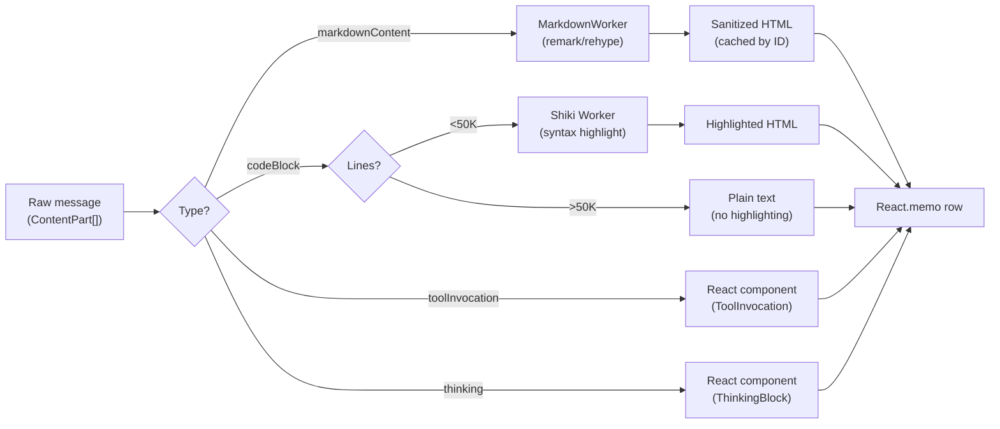
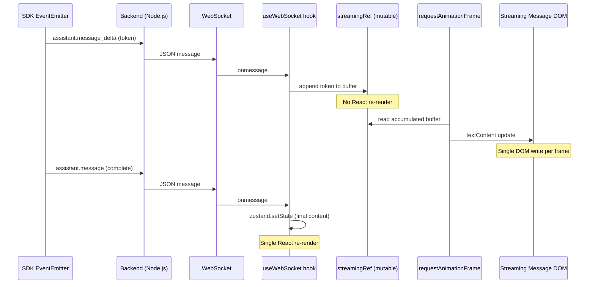
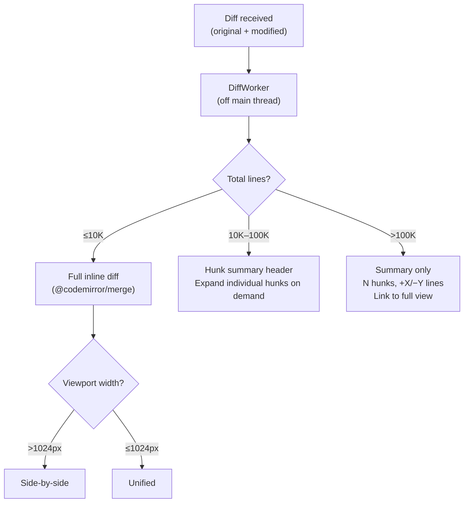
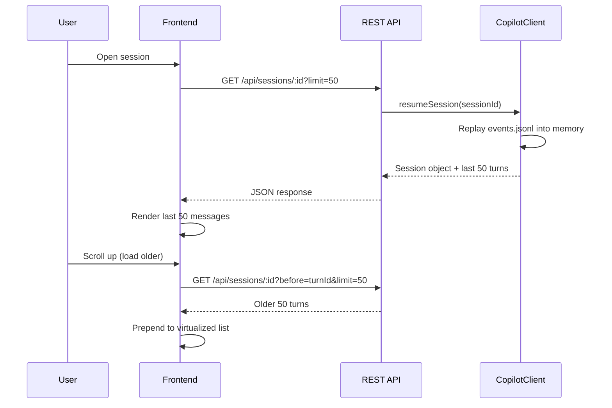
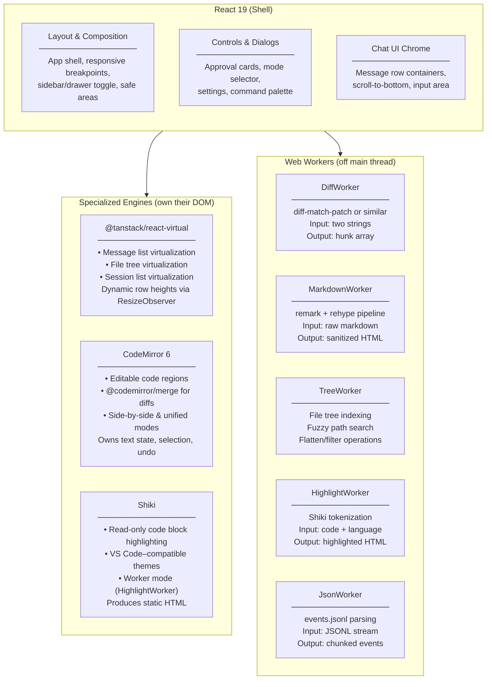
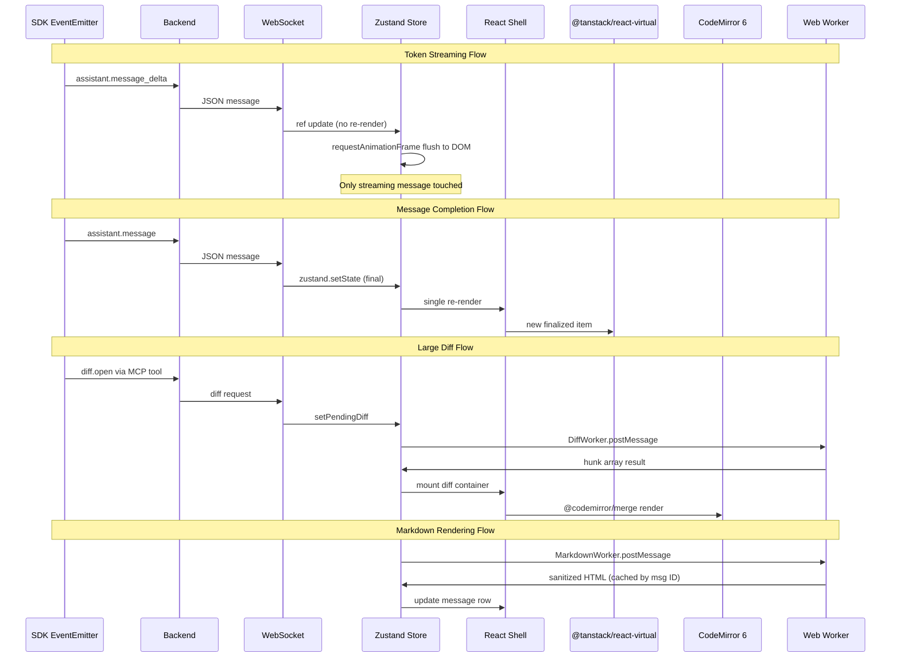
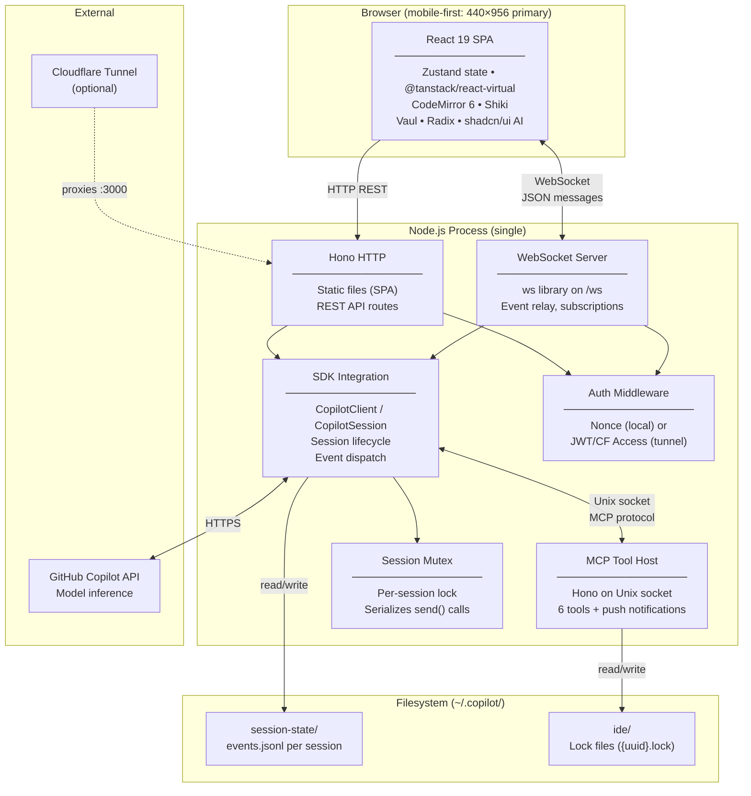

# 08 — Constraints and Requirements

> **Status:** Authoritative reference — consolidates all constraints, requirements, and architectural decisions.
> **Sources:** [03-protocol.md](03-protocol.md), [06-webapp-extraction-guide.md](06-webapp-extraction-guide.md), [07-ui-specification.md](07-ui-specification.md), plus in-session architectural decisions.
> **Last updated:** 2026-04-21

This document defines what the Copilot CLI Session webapp **must do**, **cannot do**, and **why**. It is the single canonical source for project constraints. When in doubt, this document governs.

> **Cross-reference:** For complete system requirements including Node.js, OS versions, and tooling, see [06-webapp-extraction-guide.md](./06-webapp-extraction-guide.md#system-requirements).

> 📋 **Test Coverage:** Every constraint in this document maps to at least one test. See [10-testing-strategy.md §11](./10-testing-strategy.md#11-constraint-verification-matrix) for the full constraint-to-test mapping.

### How to Use This Document

- **Before implementing a feature:** Check Sections 4–9 for applicable constraints. Use the constraint IDs (e.g., `SDK-06`, `TCH-03`) in code comments and PR descriptions.
- **During code review:** Verify that new code does not violate any Hard Blocker (Section 10.1). Flag Functional Degradation violations (Section 10.2) for immediate remediation.
- **When planning a phase:** Consult Appendix A for which constraints must be satisfied in each implementation phase.
- **When making an architectural decision:** Check Section 3 and Appendix C for prior decisions and their rationale.
- **When a constraint seems wrong:** Propose an amendment with rationale. Constraints are not immutable — but they require explicit revision, not silent violation.

### Constraint ID Scheme

| Prefix | Category | Count |
|--------|----------|-------|
| `SDK-` | SDK/Platform constraints | 12 |
| `ARC-` | Architecture constraints | 9 |
| `SCP-` | Scope constraints | 6 |
| `SEC-` | Security constraints | 11 |
| `TCH-` | Technical constraints | 22 |
| `OPS-` | Operational constraints | 12 |
| **Total** | | **72** |

---

## Table of Contents

1. [Project Vision](#1-project-vision)
2. [Performance Architecture](#2-performance-architecture)
3. [Architectural Decisions](#3-architectural-decisions)
4. [SDK/Platform Constraints](#4-sdkplatform-constraints)
5. [Architecture Constraints](#5-architecture-constraints)
6. [Scope Constraints](#6-scope-constraints)
7. [Security Constraints](#7-security-constraints)
8. [Technical Constraints](#8-technical-constraints)
9. [Operational Constraints](#9-operational-constraints)
10. [Severity Classification](#10-severity-classification)
- [Appendix A: Constraint-to-Phase Mapping](#appendix-a-constraint-to-phase-mapping)
- [Appendix B: Constraint Cross-Reference](#appendix-b-constraint-cross-reference)
- [Appendix C: Decision Log](#appendix-c-decision-log)

---

## 1. Project Vision

A **mobile-first companion to VS Code** for Copilot CLI sessions. Same codebase, work on the go.

The user works on their project at their desk via VS Code. They step away — commute, meeting, sofa — and open the webapp on their phone or tablet. The session continues exactly where it left off: same files, same conversation, same agent state. Back at the desk, VS Code picks it up again seamlessly.

**Core premises:**

| Premise | Implication |
|---------|-------------|
| Sessions are **long-lived** | Days, weeks, potentially months. The message list can grow to thousands of entries. Pagination and virtualization are non-negotiable. |
| **Same codebase** as VS Code | Lock file protocol enables handoff. The webapp reads/writes the same `~/.copilot/session-state/` directory. |
| **Mobile-first** | 440×956 (iPhone 16 Pro Max) is the primary design viewport. Desktop is additive. |
| **Performance is first-class** | Not "nice to have." The app must not freeze, lag, or OOM on large sessions, big diffs, or huge file trees. |
| **Degradation is a feature** | Gracefully reducing fidelity at defined thresholds is better than crashing or freezing. |

---

## 2. Performance Architecture

### 2.1 Performance Philosophy

Four layers, each with a distinct role. Violating the boundary between them is the primary source of performance regressions in chat UIs.

| Layer | Responsibility | Examples |
|-------|---------------|----------|
| **React 19** (shell) | Layout, composition, controls, chat UI chrome | Message list container, session sidebar, input area, approval dialogs |
| **Specialized engines** | Own hot paths where React's reconciler is too slow | CodeMirror 6 for editing/diffs, @tanstack/react-virtual for large lists |
| **Web Workers** | Heavy computation off the main thread | Diff computation, markdown parsing, tree indexing, syntax highlighting |
| **Degradation thresholds** | Circuit breakers that prevent the app from freezing | Disable highlighting above 50K lines, paginate above 500 messages |

**The cardinal rule:** React renders the *container*. Specialized engines render the *content*. React never controls per-keystroke text state, per-token streaming output, or per-node tree traversal.

### 2.2 Performance Requirements Summary

The following matrix summarizes every hot path. Detailed requirements for each follow below.

| # | Use Case | Expected Scale | React Owns | Engine Owns | Degradation Trigger |
|---|----------|---------------|------------|-------------|---------------------|
| 1 | Chat message list | 10–5,000+ messages | Virtualized container, scroll logic | @tanstack/react-virtual (row rendering) | >500 total: paginate. >200 visible: window to 50. |
| 2 | Token streaming | 30–60 tokens/sec | Streaming message mount | ref + rAF flush | >30/sec: buffer to rAF boundary |
| 3 | File tree | 100–100K+ nodes | Expand/collapse UI | @tanstack/react-virtual + TreeWorker | >50K nodes: worker-only traversal |
| 4 | Code editing | 1–500K+ lines | Mount/unmount CM6 | CodeMirror 6 (text, selection, undo) | >50K: no highlighting. >500K: chunk-load. |
| 5 | File diffs | 1–100K+ lines | Hunk summary, expand/collapse | CM6 @codemirror/merge + DiffWorker | >10K: hunk-by-hunk. >100K: summary only. |
| 6 | Long-running sessions | Days–months of history | Session list chrome | REST pagination + events.jsonl streaming | >5MB events.jsonl: server-side pagination only |

#### 2.2.1 Chat Message List

Sessions span days, weeks, or months — potentially 1,000–5,000+ messages containing markdown, code blocks, tool invocations, diffs, and thinking blocks.

| Dimension | Requirement |
|-----------|-------------|
| **Scale** | Min: 10 messages. Typical: 50–200. Max: 5,000+ |
| **React responsibility** | Mount the virtualized container. Memoize message rows (`React.memo` + stable keys). Manage scroll-to-bottom logic. |
| **Specialized engine** | `@tanstack/react-virtual`. Only render visible messages + small overscan buffer. |
| **Loading strategy** | Paginated: load last 50 messages initially; load older on scroll-up via `?before=turnId`. |
| **Markdown parsing** | Worker-parsed. Never block the main thread with `remark`/`rehype` pipelines on large messages. |
| **Row height** | Dynamic measurement via `ResizeObserver`. Messages vary wildly in height — no fixed-row-height assumption. |
| **Scroll-to-bottom** | Must account for virtualized positioning. Smooth scroll when near bottom; instant jump when far. Sticky-bottom behavior: auto-scroll on new messages unless user has scrolled up. |
| **Degradation** | >500 messages: enforce pagination, refuse to hold all in memory. >200 visible: force virtualization window to 50. |

**Rendering pipeline for a single message:**



#### 2.2.2 Token Streaming

Real-time token-by-token AI response rendering. The active streaming message updates at 30–60+ tokens/sec.

| Dimension | Requirement |
|-----------|-------------|
| **Scale** | Sustained 30–60 tokens/sec bursts. Messages can reach 10K+ tokens. |
| **React responsibility** | Mount the streaming message component. Subscribe to finalized state on completion. |
| **Buffer strategy** | Accumulate deltas in a `ref`. Flush to DOM at `requestAnimationFrame` cadence (16ms). |
| **Isolation** | Only the active streaming message re-renders. The rest of the list is untouched. |
| **State finalization** | Commit to Zustand only on message completion or every ~500ms (whichever comes first). |
| **Cursor animation** | Blinking cursor appended to the last token. CSS animation only — no JS timer. |
| **Backpressure** | If the WebSocket delivers tokens faster than `rAF` can flush, coalesce. Never queue unbounded. |

**Streaming data flow:**



#### 2.2.3 File Tree Browsing

Monorepo projects can have 100K+ files. The webapp exposes the project file tree for context selection and navigation.

| Dimension | Requirement |
|-----------|-------------|
| **Scale** | Min: 100 files. Typical: 1K–10K. Max: 100K+ |
| **React responsibility** | Mount the virtualized list. Handle expand/collapse toggle events. |
| **Specialized engine** | Flatten tree to linear array for `@tanstack/react-virtual`. Async expand/collapse. |
| **Worker delegation** | Tree indexing, fuzzy search, and path filtering run in `TreeWorker`. |
| **Cardinal prohibition** | Never iterate all 100K nodes on the main thread. Ever. |
| **Search** | Fuzzy search over file paths. Worker maintains a pre-built index. Results streamed back as they match. |
| **Degradation** | >50K nodes: worker-only traversal, no main-thread tree walks. |

#### 2.2.4 Code Editing

Snippets in chat and file editing via tool calls. CodeMirror 6 is the editor engine.

| Dimension | Requirement |
|-----------|-------------|
| **React responsibility** | Mount/unmount the CodeMirror instance. Pass configuration. Control readability state. |
| **Specialized engine** | CodeMirror 6 owns all editor internals — text state, selection, undo, extensions. |
| **Cardinal prohibition** | React MUST NOT control text state per keystroke. No `value`/`onChange` on editor content. |
| **Mobile editing** | CodeMirror 6's native mobile touch handling. No custom touch-to-cursor mapping needed. |
| **Language support** | Tree-shaken language packs: JavaScript, TypeScript, Python, HTML, CSS, JSON, Markdown. Additional languages loaded on demand. |
| **Degradation: >50K lines** | Disable syntax highlighting. Enable read-only mode. |
| **Degradation: >500K lines** | Chunk-load. Show only the visible range. |

#### 2.2.5 File Diffs

Inline diffs in chat (could be very large — entire file rewrites, generated codebases).

| Dimension | Requirement |
|-----------|-------------|
| **React responsibility** | Mount diff container. Show hunk summary header. Handle expand/collapse. |
| **Specialized engine** | CodeMirror 6 `@codemirror/merge` for interactive diffs. |
| **Diff computation** | Always in `DiffWorker`. Never on the main thread. |
| **Initial display** | Show hunk summary first: "N hunks, +X/−Y lines". Expand on demand. |
| **Responsive layout** | Side-by-side diff above 1024px viewport. Unified diff below 1024px. |
| **Degradation: >10K lines** | Disable full inline rendering. Show hunk-by-hunk expansion. |
| **Degradation: >100K lines** | Summary only. Link to full diff view. |

**Diff rendering decision tree:**



#### 2.2.6 Long-Running Sessions

The defining characteristic of this application. Sessions accumulate state over days, weeks, or months.

| Dimension | Requirement |
|-----------|-------------|
| **Session history** | REST endpoint returns last N turns (default 50), with `?before=turnId` for older. Never load entire history at once. |
| **`events.jsonl`** | Can be several MB. Never load fully into memory on the frontend. Server-side pagination only for files >5MB. |
| **Session list** | Must handle 100+ sessions with temporal grouping (Today, Yesterday, This Week, Older). |
| **Session list rendering** | Virtualized. `@tanstack/react-virtual` with section headers as sticky items. |
| **Memory management** | Evict message content for sessions not currently active. Keep only metadata (id, title, timestamp) in the Zustand store for inactive sessions. |
| **Archival** | Consider compacting old sessions. Sessions with >1000 turns should be eligible for summary-and-archive. |

**Session loading waterfall:**



### 2.3 Web Worker Strategy

All heavy computation is offloaded. The main thread's sole obligation is rendering and responding to user input.

| Worker | Responsibility | Input | Output |
|--------|---------------|-------|--------|
| `DiffWorker` | Diff computation | Two strings (original, modified) | Hunk array with change metadata |
| `MarkdownWorker` | Markdown → HTML | Raw markdown string | Sanitized HTML string |
| `HighlightWorker` | Syntax highlighting | Code string + language ID | Highlighted HTML (Shiki tokenization) |
| `TreeWorker` | File tree indexing & search | Directory listing, search query | Flattened node array, search results |
| `JsonWorker` | Large JSON parsing | `events.jsonl` stream | Parsed event objects (chunked) |

**Library support:**
- Shiki natively supports worker mode.
- `remark`/`rehype` are pure functions — trivially portable to workers.
- `diff-match-patch` is a self-contained module — no DOM dependencies.

### 2.4 Degradation Thresholds

Concrete limits. When a threshold is crossed, the corresponding degradation is applied automatically — not as an error, but as a designed behavior. These are not user-configurable (see TCH-20).

| Metric | Threshold | Degradation Strategy | Detection Point |
|--------|-----------|---------------------|-----------------|
| Messages in view | >200 visible | Force virtualization window to 50 | `@tanstack/react-virtual` overscan config |
| Code block lines | >50K | Disable syntax highlighting | Code block renderer, line count check |
| Code block lines | >500K | Chunk-load, read-only mode | Code block renderer, line count check |
| Diff lines | >10K | Hunk-by-hunk expansion only | Diff viewer, post-worker result |
| Diff lines | >100K | Summary only, link to full view | Diff viewer, post-worker result |
| File tree nodes | >50K | Worker-only traversal, no main-thread tree walks | TreeWorker initialization |
| Streaming tokens | >30/sec | Buffer to `requestAnimationFrame` | Always active (default behavior) |
| Session messages (total) | >500 | Paginate, load on scroll-up | REST API response, total count |
| `events.jsonl` size | >5MB | Server-side pagination only | Backend file stat on session load |
| Attachments/images in view | >20 | Lazy-load with `IntersectionObserver` | Image component mount |

**Degradation is not failure.** It is the system operating within its design envelope. The user should perceive reduced fidelity (e.g., "Syntax highlighting disabled for large file"), not an error state.

**Notification pattern:**

| Degradation | User-Facing Indication |
|-------------|----------------------|
| Syntax highlighting disabled | Subtle banner: "Highlighting paused — file exceeds 50K lines" |
| Diff collapsed to summary | Hunk count badge: "47 hunks, +1,203/−891 lines" with expand affordance |
| Pagination active | "Showing last 50 messages. Scroll up to load older." |
| Worker-only tree | No visible indicator — performance is transparent |
| Image lazy-loading | Placeholder skeleton while loading |

### 2.5 Performance Budget

Target performance metrics. These are aspirational but inform architectural decisions.

| Metric | Target | Measurement |
|--------|--------|-------------|
| Time to First Contentful Paint | <1.5s | Lighthouse, mobile throttling |
| Time to Interactive | <3s | Lighthouse, mobile throttling |
| First message visible after session open | <500ms | Custom performance mark |
| Streaming token → pixel latency | <32ms (2 frames) | Custom performance mark |
| Scroll jank (message list) | 0 frames dropped | Chrome DevTools, 60fps target |
| Input latency (chat input) | <50ms | Chrome DevTools input delay |
| Diff open (10K lines) | <1s total (worker + render) | Custom performance mark |
| File tree search (100K nodes) | <200ms to first result | Custom performance mark |
| Bundle size (gzipped) | <500KB initial, <1MB total | Vite build output |
| Memory (1000-message session) | <150MB heap | Chrome DevTools memory snapshot |

---

## 3. Architectural Decisions

### 3.1 Hybrid VS Code Alignment

The webapp reimplements VS Code's chat UI in React. This is not a fork — VS Code's large dependency injection graph (dozens of injected services per widget) and custom web component framework make direct code reuse impossible. Instead, we pursue **structural alignment**:

| Strategy | Detail |
|----------|--------|
| **File naming parity** | Mirror VS Code's file structure for content part renderers. 1:1 naming enables visual diffability. |
| **Enum/constant copying** | Copy enums, constants, and CSS token values directly from VS Code source. |
| **React reimplementation** | Reimplement rendering logic in React + Radix/shadcn. Behavior matches; implementation diverges. |
| **CSS token mapping** | Maintain a mapping file (`token-map.ts`) that maps VS Code CSS custom properties to the webapp's Tailwind/CSS tokens. Enables automated drift detection. |
| **Content part tracking** | When VS Code adds a new content part type, add a corresponding React component. The mapping is explicit and auditable. |

### 3.2 Lightweight Provider Interface

The webapp uses a provider abstraction for session management — but a minimal one.

```typescript
// ~20 lines. Not a registry. Not a framework.
interface SessionProvider {
  readonly name: string;
  createSession(opts: CreateSessionOptions): Promise<Session>;
  loadSession(id: string): Promise<Session>;
  listSessions(): Promise<SessionSummary[]>;
  deleteSession(id: string): Promise<void>;
  sendMessage(sessionId: string, message: string, mode: AgentMode): Promise<void>;
  abort(sessionId: string): void;
  onEvent(sessionId: string, handler: (event: SessionEvent) => void): Disposable;
}
```

| Decision | Rationale |
|----------|-----------|
| Current implementation | Single `CopilotCLIProvider` backed by `CopilotClient` / `CopilotSession` from `@github/copilot-sdk` |
| Future extensibility | Interface supports additional providers (cloud agents, other AI services) without refactoring consumers |
| Scope guard | Keep it minimal. No provider registry, no dynamic loading, no plugin system. Add complexity only when a second provider materializes. |

### 3.3 React Shell + Specialized Engines

**Component responsibility map:**



**Data flow — from WebSocket to pixels:**



### 3.4 Full System Architecture

For reference — the complete system from browser to Copilot API:



---

## 4. SDK/Platform Constraints

Constraints imposed by the `@github/copilot-sdk` (which depends on `@github/copilot` internally), the Copilot API, and the platform runtime.

> **Note:** Within each category below, constraints are ordered by severity (see §10): Hard Blockers first, then Functional Degradation, Quality/Compliance, and Standard.

| ID | Constraint | Rationale | Impact |
|----|-----------|-----------|--------|
| SDK-01 | **`CopilotClient` / `CopilotSession` is the sole SDK entry point.** All session lifecycle operations (create, load, send, abort, close) go through these classes. Tools are registered via `defineTool()` with `zod` parameter schemas. | The SDK does not expose lower-level primitives. `CopilotClient` encapsulates authentication, model routing, and event dispatch; `CopilotSession` wraps individual conversations. | Backend must instantiate exactly one `CopilotClient` and route all session operations through it. |
| SDK-02 | **MCP server is mandatory.** The SDK expects an MCP endpoint for tool invocations. Without it, the agent cannot execute tools. | VS Code's extension host provides this; the webapp must replicate it. | Backend must run an MCP server on a Unix socket, registered at `CopilotClient` creation time. |
| SDK-03 | **`events.jsonl` is the SDK's persistence format.** The SDK reads and writes `~/.copilot/session-state/{sessionId}/events.jsonl`. The webapp must not write to this file directly. | The SDK manages serialization, event ordering, and replay. External writes corrupt the event log. | Session persistence is read-only for the webapp. Use optional SQLite for webapp-specific state (file edits, UI metadata). |
| SDK-06 | **SDK is not thread-safe for concurrent `send()` calls.** Multiple simultaneous `send()` invocations on the same session corrupt state. | Single-threaded design assumption in the SDK. | Backend must implement a per-session mutex. Serialize all `send()` calls. |
| SDK-07 | **Lock file protocol governs session ownership.** Lock files in `~/.copilot/ide/` declare which host owns which session. Format includes `socketPath`, `pid`, `ideName`, `workspaceFolders`. | Enables discovery and handoff between VS Code, CLI, and the webapp. | Webapp must write its own lock file on startup (`ideName: 'copilot-webapp'`). Must read and respect other hosts' lock files. Display warnings for sessions owned by another host. |
| SDK-08 | **MCP tool handlers must block until user responds.** Tools like `open_diff` push a request to the frontend and block the MCP handler (Promise) until the user approves/rejects. | VS Code's equivalent opens a diff editor and returns on close. The webapp must replicate this blocking semantic over WebSocket. | Implement Promise-based pending request maps with timeouts (5 minutes). Handle disconnection during pending approval. |
| SDK-11 | **Streaming uses Node.js EventEmitter pattern.** SDK events (`assistant.message_delta`, `tool.execution_start`, etc.) are emitted on the session object. | Not a Web standard EventSource. The backend must bridge to WebSocket. | Backend event relay translates SDK EventEmitter events to WebSocket JSON messages. |
| SDK-04 | **300-second idle timeout.** The SDK closes sessions after 5 minutes of inactivity. | Server-side resource management. Non-negotiable. | Backend must track idle time per session. Handle expiry gracefully — reload from disk when the user returns. Consider keepalive pings for active UI sessions. |
| SDK-05 | **Capabilities are auto-negotiated, not declared.** The SDK infers available capabilities based on which callbacks the client registers: `onPermissionRequest` enables tool use, `onUserInputRequest` enables `ask_user`, `onElicitationRequest` enables form dialogs. The only consumer-visible capability is `session.capabilities.ui?.elicitation`. | There is no list of named capabilities to declare at session creation. The SDK negotiates them internally. | Register the appropriate callbacks on `CopilotSession` to enable the desired agent behaviors. Omitting a callback disables the corresponding capability silently. |
| SDK-09 | **Agent modes control tool approval semantics.** `interactive` = every tool requires approval. `autopilot` = low-risk auto, high-risk approval. `plan` = plan first, then execute per autopilot rules. | The SDK enforces these semantics. The webapp must present the correct UI for each mode. | Approval dialogs must adapt to agent mode. The frontend must distinguish "requires approval" from "auto-approved" tool invocations. |
| SDK-10 | **Session directory structure is fixed.** `~/.copilot/session-state/{sessionId}/` contains `events.jsonl`, optional checkpoints, and metadata. The path is non-configurable. | SDK hardcoded path. | Webapp must use this exact path. No custom session storage locations. |
| SDK-12 | **The SDK manages its own GitHub authentication.** Token refresh, OAuth flow, and credential storage are handled internally by the SDK. | The webapp does not need (and must not attempt) to manage Copilot API authentication. | No GitHub OAuth implementation needed in the webapp. The SDK handles it. |

---

## 5. Architecture Constraints

Constraints arising from the system architecture, process model, and component boundaries.

| ID | Constraint | Rationale | Impact |
|----|-----------|-----------|--------|
| ARC-10 | **Hybrid alignment with VS Code source.** Mirror VS Code's chat file naming conventions (1:1 mapping: `ChatMarkdownContentPart.tsx` ↔ `chatMarkdownContentPart.ts`), copy enums/constants/CSS token values directly, and maintain `VS_CODE_ALIGNMENT.md` as a living mapping file. All rendering must be reimplemented in React (VS Code's DI graph with 26+ injected services makes direct code reuse impossible), but the file structure must remain diffable against upstream. | VS Code and Copilot CLI evolve rapidly. Without structural alignment, every upstream change requires reverse-engineering. With it, developers can `diff` against VS Code source to identify what changed and merge/migrate new features efficiently. This is the single most important constraint for long-term maintainability. | File naming: `src/components/chat/` mirrors `src/vs/workbench/contrib/chat/browser/`. Types: copy from `chat/common/`. CSS: extract token values from `chatColors.ts` and `chat.css`. Alignment map: `VS_CODE_ALIGNMENT.md` at project root tracks every mirrored file. Automated drift detection: CI script compares alignment map against VS Code source. See Doc 06 §2, "Hybrid VS Code Alignment Strategy" and Doc 07 §1. |
| ARC-01 | **Single Node.js process.** The webapp runs as one process — HTTP server, WebSocket server, SDK integration, and MCP tool host coexist in the same event loop. | Simplicity. No IPC overhead. But requires careful async management to avoid blocking the event loop. | Long-running synchronous operations (e.g., large file reads) must be async or worker-delegated. Never block the event loop. |
| ARC-03 | **WebSocket is the primary real-time channel.** All streaming events (message deltas, tool state changes, approval requests) flow through a single WebSocket connection per client. | Avoids polling. Enables sub-second latency for streaming. | Frontend must maintain a persistent WebSocket connection with reconnection logic (exponential backoff: 1s → 2s → 4s → 8s → max 30s). |
| ARC-02 | **React 19 is the shell, not the engine.** React manages layout, composition, and controls. It does not manage text editing state, diff computation, syntax highlighting, or large-list rendering internals. | React's reconciler is too slow for per-keystroke updates, per-token streaming, or 100K-node tree traversal. Specialized engines exist for these tasks. | CodeMirror 6 owns editing. @tanstack/react-virtual owns list virtualization. Shiki owns highlighting. React mounts and controls these engines but does not micromanage their state. |
| ARC-04 | **REST for CRUD, WebSocket for events.** Session list, session details, create, delete = REST. Streaming, subscriptions, approvals = WebSocket. | Clean separation of concerns. REST is cacheable and idempotent; WebSocket is stateful and real-time. | No mixing: don't poll REST for streaming state, don't use WebSocket for CRUD operations. |
| ARC-05 | **Frontend and backend are a single deployable unit.** Vite builds the SPA into `dist/`, which Hono serves as static files. One `npm start` launches everything. | Operational simplicity. No separate frontend deployment. No CORS in local mode. | Build pipeline must produce a single artifact. `vite build` output goes into the Hono static directory. |
| ARC-06 | **MCP server runs on a Unix socket within the same process.** The SDK's MCP client connects to a Hono server listening on `$XDG_RUNTIME_DIR/copilot/mcp-{uuid}/mcp.sock` (fallback `/tmp/copilot/mcp-{uuid}/mcp.sock`). | Loopback within one process. No network exposure. Socket permissions (`0o600`) restrict access. | Unix socket lifecycle must be managed: create on startup, clean up on shutdown. Handle stale sockets from crashed processes. |
| ARC-08 | **Lightweight provider interface for session management.** Abstract behind `SessionProvider` (~20 lines TypeScript). Current: single `CopilotCLIProvider`. | Future extensibility without over-engineering. A second provider may never materialize. | No provider registry. No dynamic loading. Add complexity only when warranted by a concrete second provider. |
| ARC-09 | **Mobile-first responsive architecture.** All base styles target the narrowest viewport (440px). Wider layouts are additive via `min-width` breakpoints. | The primary use case is phone/tablet. Desktop is secondary. | Three breakpoints: Mobile (<640px), Tablet (640–1024px), Desktop (>1024px). Touch targets meet 44×44pt minimum (Apple HIG). |

---

## 6. Scope Constraints

Boundaries on what the webapp does and does not include.

| ID | Constraint | Rationale | Impact |
|----|-----------|-----------|--------|
| SCP-01 | **Copilot CLI sessions only.** No cloud agent sessions. No remote copilot integration. No arbitrary AI provider support. | The webapp replaces VS Code as a host for `@github/copilot-sdk` sessions — nothing more. Cloud agents and remote copilot have distinct protocols and authentication flows. | The provider interface exists for future extensibility, but v1 implements only `CopilotCLIProvider`. |
| SCP-02 | **Local filesystem only.** The webapp reads/writes the local machine's filesystem. No remote filesystem abstraction. No VS Code file service equivalent. | Operational simplicity. The webapp runs on the same machine as the project. Remote filesystem support adds an entire layer of complexity (latency, caching, conflict resolution) that is not justified for the use case. | `node:fs` is used directly. No `IFileService` abstraction. Tools like `read_file` and `write_file` operate on local paths. |
| SCP-03 | **Two themes only.** Dark Modern and Light Modern, matching VS Code's defaults. No arbitrary theme support. | Shiki, CodeMirror 6, and the CSS token system all need consistent theme data. Supporting arbitrary themes requires a theme compilation pipeline. Two themes are sufficient for the use case. | Theme toggle: dark / light / system. CSS custom properties map to VS Code's Dark Modern and Light Modern token values. |
| SCP-04 | **No language server protocol.** The webapp does not run LSP servers for diagnostics, completions, or hover information. | LSP requires per-language server processes, workspace indexing, and significant memory. The webapp is lightweight by design. | Code editing is degraded compared to VS Code: no IntelliSense, no real-time diagnostics, no go-to-definition. Linting is available only via external tool invocation (tsc, eslint) through MCP tools. |
| SCP-05 | **No extension system.** The webapp does not support VS Code extensions or any plugin mechanism. | Extensions require a host API, sandboxing, lifecycle management, and a marketplace. This is an order of magnitude beyond the webapp's scope. | All functionality is built-in. No third-party extensibility. |
| SCP-06 | **No offline mode.** The webapp requires a running Node.js backend and an active connection to the GitHub Copilot API. | Sessions depend on the Copilot API for model inference. The SDK manages authentication with GitHub. Without network access, the agent cannot function. | No service worker caching of API responses. PWA manifest is for home-screen installation and standalone display mode, not offline capability. |

---

## 7. Security Constraints

Authentication, authorization, transport security, and sandboxing requirements. For tunnel-mode implementation details (JWT middleware, Cloudflare Access integration, tunnel setup), see [09-deployment.md](./09-deployment.md).

| ID | Constraint | Rationale | Impact |
|----|-----------|-----------|--------|
| SEC-01 | **Local mode binds to `127.0.0.1` only.** Reject connections from non-loopback addresses. | Threat model matches VS Code's: only local processes can connect. Binding to `0.0.0.0` would expose the app to the local network without authentication. | Hono must bind to `127.0.0.1:3000`. No `0.0.0.0` binding in local mode. |
| SEC-02 | **Nonce authentication in local mode.** Generate `crypto.randomUUID()` at startup. Require `Authorization: Nonce {uuid}` on all HTTP and WebSocket requests. | Same pattern as VS Code. Prevents other local processes from hijacking the session without the nonce. | Nonce printed to stdout on startup. Injected into `index.html` via placeholder replacement. Static assets served without nonce validation (the HTML shell delivers the nonce to the SPA). |
| SEC-10 | **WebSocket authentication on upgrade.** Validate token during the `connection` event before accepting the WebSocket. | The WebSocket constructor does not support custom headers. Nonce/token must be passed as a query parameter (`?nonce={value}`) and validated on upgrade. | `ws` library's `verifyClient` callback must check authentication before completing the handshake. |
| SEC-08 | **Content Security Policy.** `default-src 'self'; connect-src 'self' wss://{tunnel-host}`. Ensure `script-src` includes `'nonce-{startup-nonce}'` to permit the injected startup script from SEC-02. | Prevents XSS via injected scripts. Limits connection targets. | CSP header set by Hono middleware. Must be updated when tunnel hostname changes. |
| SEC-03 | **Host header validation.** Reject requests where `Host` is not `localhost` or `127.0.0.1`. | DNS rebinding protection. A malicious website could otherwise make requests to `127.0.0.1:3000` via a crafted DNS record. | Hono middleware must validate `Host` header on every request. |
| SEC-04 | **MCP socket directory permissions: `0o700`. Socket permissions: `0o600`.** | The Unix socket carries MCP tool invocations — which include file reads, writes, and command execution. Unrestricted access would be a local privilege escalation vector. | `mkdirSync` with `mode: 0o700`. `chmodSync` socket to `0o600` after creation. |
| SEC-05 | **CORS restricted to origin.** Local mode: `Access-Control-Allow-Origin: http://localhost:3000`. No wildcards. | Prevents cross-origin requests from other tabs or scripts. | Hono CORS middleware with explicit origin. |
| SEC-06 | **Tunnel mode requires additional authentication.** Nonce is insufficient when the app is exposed via `cloudflared`. | The nonce would travel over the network. A static secret over the internet is inadequate. | Recommended: Cloudflare Access + JWT validation. Alternatives: Basic Auth (personal use), OAuth2 via GitHub, pre-shared token (last resort). |
| SEC-09 | **Short-lived session tokens in tunnel mode.** Issue JWTs with 1-hour expiry after initial authentication. Refresh on activity. | Limits the blast radius of a stolen token. | Token refresh logic in auth middleware. Frontend must handle 401 responses by re-authenticating. |
| SEC-11 | **Tool execution sandboxing.** MCP tools that execute commands (`run_in_terminal`) must run within the session's `workingDirectory`. No path traversal above the project root. | The agent can invoke shell commands via MCP tools. Unrestricted execution is a remote code execution vector in tunnel mode. | Validate all paths are within `workingDirectory` before execution. Reject `../` traversal. |
| SEC-12 | **No secrets in client-side code.** The nonce is the sole exception (injected into `index.html` at serve-time). No API keys, JWT secrets, or Cloudflare credentials in the SPA bundle. | Client-side JavaScript is fully inspectable. Any secret in the bundle is compromised by definition. | All sensitive values remain server-side. The frontend authenticates via the nonce or session token — never directly with external services. |

---

## 8. Technical Constraints

Implementation-level constraints on the frontend, backend, and communication layer.

| ID | Constraint | Rationale | Impact |
|----|-----------|-----------|--------|
| TCH-17 | **No `events.jsonl` writes from the webapp.** The SDK owns this file exclusively. | Concurrent writes corrupt the event log. The SDK does not use file locking. | Webapp reads `events.jsonl` (via SDK's `resumeSession(sessionId)`) but never writes to it directly. Use optional SQLite for webapp-specific persistence. |
| TCH-01 | **React must not control CodeMirror text state.** No `value`/`onChange` pattern for editor content. React mounts the editor and passes configuration; CodeMirror owns the document. | React's reconciler on every keystroke causes visible input lag above ~10 WPM. CodeMirror's internal state management is purpose-built for text editing performance. | Use `@uiw/react-codemirror` or a controlled-ref pattern. React reads editor state on demand (e.g., on submit), never drives it. |
| TCH-02 | **Virtualization is mandatory for the message list.** All messages must be rendered via `@tanstack/react-virtual`. No flat `Array.map()` rendering. | 1,000+ messages with rich content (markdown, code blocks, diffs) will freeze the browser if all are in the DOM simultaneously. | Dynamic row height measurement required — messages vary wildly in height. Overscan buffer of 3–5 items. Scroll-to-bottom must account for virtualized positioning. |
| TCH-03 | **Streaming tokens must not trigger React re-renders per token.** Buffer in a ref, flush at `requestAnimationFrame`. | At 30–60 tokens/sec, per-token `setState` calls cause React to reconcile the entire streaming message 30–60 times per second. This blocks the main thread. | Streaming message component uses a ref-based accumulator. DOM updates happen via direct manipulation or `requestAnimationFrame` flush. Zustand state is committed only on completion or at 500ms intervals. |
| TCH-04 | **Diff computation runs in a Web Worker.** Never on the main thread. | Diffing two 10K-line files can take 500ms–2s. On the main thread, this freezes the UI. | `DiffWorker` receives two strings, returns hunk array. The main thread renders the result. |
| TCH-07 | **WebSocket reconnection with exponential backoff.** 1s → 2s → 4s → 8s → max 30s. Reset on successful connection. | Network interruptions (sleep, network switch, tunnel restart) are common on mobile. The app must recover without user intervention. | Show "Reconnecting..." banner during disconnection. Re-subscribe to active sessions on reconnect. Request state sync to recover missed events. |
| TCH-09 | **`interactive-widget=resizes-content` viewport meta tag.** | Virtual keyboard on mobile must shrink the layout (not overlay it) so the chat input remains visible while typing. | `<meta name="viewport" content="width=device-width, initial-scale=1, interactive-widget=resizes-content">`. Fallback: `visualViewport.resize` event handler for non-supporting browsers. |
| TCH-10 | **`100dvh` for app shell height, not `100vh`.** | On mobile, `100vh` includes the browser chrome (address bar, toolbar). `100dvh` (dynamic viewport height) excludes it, preventing content from being hidden behind the browser UI. | CSS: `height: 100dvh`. Safe area insets via `env(safe-area-inset-*)`. |
| TCH-11 | **44×44pt minimum touch targets.** All interactive elements meet the Apple HIG minimum. | Smaller targets cause mis-taps, especially on phone screens in motion (commute use case). | Padding/hit-area expansion on icons, buttons, and interactive elements. Verified per component in the UI specification. |
| TCH-12 | **`prefers-reduced-motion` respected.** All animations and transitions honor the OS accessibility setting. | Users with vestibular disorders or motion sensitivity must not be subjected to animations. | `@media (prefers-reduced-motion: reduce)` disables shimmer, slide, and transition animations. Instant state changes only. |
| TCH-18 | **PWA manifest for home-screen installation.** `display: "standalone"`, `orientation: "portrait-primary"`. | Users install the webapp to their phone's home screen. Standalone display mode removes the browser chrome, giving a native app feel. | `manifest.json` with icons (192px, 512px, maskable). Apple-specific meta tags for `apple-mobile-web-app-capable` and status bar styling. |
| TCH-05 | **Markdown parsing runs in a Web Worker.** The `remark`/`rehype` pipeline for long messages must not block the main thread. | Complex markdown (nested lists, large code blocks, many inline elements) can take 100ms+ to parse. Multiply by 50 visible messages and the main thread is saturated. | `MarkdownWorker` receives raw markdown, returns sanitized HTML. Cache parsed results by message ID. |
| TCH-06 | **File tree traversal is worker-delegated above 50K nodes.** | Iterating 100K+ nodes for search, filter, or flatten operations blocks the main thread for 200ms+. | `TreeWorker` maintains an indexed copy of the tree. Main thread sends queries; worker returns results. |
| TCH-08 | **Session history pagination.** REST endpoint returns last N turns by default. Older turns available via `?before=turnId`. | `events.jsonl` for long sessions can be several MB. Loading everything at once blocks both server (parsing) and client (rendering). | Frontend loads initial page, then fetches older turns on scroll-up. Backend parses `events.jsonl` lazily or maintains an index. |
| TCH-13 | **Vaul for mobile bottom drawer.** Session list on mobile uses Vaul's bottom sheet with spring physics and drag-to-dismiss. | Native-feeling mobile interaction. Vaul handles touch gesture physics, snap points, and keyboard avoidance. | Vaul replaces the sidebar on viewports <640px. Drawer is the primary session navigation on mobile. |
| TCH-14 | **CodeMirror 6 for diffs, not Monaco.** `@codemirror/merge` for side-by-side (desktop) and unified (mobile) diff views. | Monaco is ~4MB. CodeMirror 6 is ~200–300KB tree-shaken. 15–20× lighter. Native mobile touch support. | Import `@codemirror/merge`. Responsive layout: side-by-side above 1024px, unified below. |
| TCH-15 | **Shiki for read-only syntax highlighting.** Editable regions use CodeMirror 6. Read-only code blocks in chat use Shiki. | Shiki produces VS Code-identical highlighting (same TextMate grammars). Supports worker mode. CodeMirror 6 is overkill for read-only display. | Two highlighting systems: Shiki (read-only, worker), CodeMirror 6 (editable). Both use VS Code-compatible themes for visual consistency. |
| TCH-16 | **Zustand for client state.** Not Redux, not Context-only, not MobX. | Minimal API surface. No boilerplate. Supports selectors for fine-grained re-render control. Works well with React 19's concurrent features. | Single Zustand store with slices for sessions, active chat, connection state, UI state, and input state. |
| TCH-19 | **Tailwind CSS v4 with CSS-first configuration.** `@tailwindcss/vite` plugin. `@theme` block for design tokens. | v4 eliminates `tailwind.config.js` in favor of CSS `@theme` blocks. Simpler build pipeline. Native CSS cascade layers. | Design tokens (colors, spacing, typography) defined in CSS `@theme` block, not JavaScript config. `tw-animate-css` for animation utilities. |
| TCH-20 | **Degradation thresholds are enforced automatically.** Not user-configurable. Not optional. | If degradation were optional, users would disable it and then report "the app froze." Degradation is a design decision, not a preference. | Threshold checks are built into the rendering pipeline. Code block renderer checks line count before enabling highlighting. Diff viewer checks size before choosing display mode. |
| TCH-21 | **Lazy loading with `IntersectionObserver` for images and attachments.** >20 images in the viewport triggers aggressive lazy loading. | Images in chat messages (screenshots, diagrams) can be large. Loading 50+ images simultaneously saturates bandwidth and memory. | Images outside the viewport use placeholder elements. `IntersectionObserver` triggers loading when they approach the visible area. |
| TCH-22 | **`requestAnimationFrame` as the streaming flush boundary.** Not `setTimeout(0)`. Not `queueMicrotask`. | `rAF` aligns DOM writes with the browser's paint cycle (16ms at 60fps). Microtasks and zero-timers can fire multiple times per frame, causing redundant work. | Streaming buffer flushes exactly once per frame. No jank from over-frequent DOM mutations. |

---

## 9. Operational Constraints

Constraints on deployment, runtime behavior, and operational management.

| ID | Constraint | Rationale | Impact |
|----|-----------|-----------|--------|
| OPS-08 | **Session ownership is exclusive.** Only one host should have a session loaded at a time. | The SDK does not support concurrent access to the same session from multiple processes. Concurrent writes to `events.jsonl` corrupt it. | Display a warning when opening a session owned by another host. Require explicit "take ownership" action. Update lock file accordingly. |
| OPS-01 | **Single `npm start` launches everything.** Hono serves static files, REST API, WebSocket, and MCP tool host from one process. | Operational simplicity. No separate frontend server. No process manager. No Docker-compose for local use. | Build step: `vite build` → `dist/`. Runtime: `node server.js` serves `dist/` and all API endpoints. |
| OPS-02 | **Lock file cleanup on shutdown.** The webapp must delete its lock file when the process exits. | Stale lock files cause other hosts to believe the webapp is still running, preventing session handoff. | `process.on('exit')`, `process.on('SIGINT')`, `process.on('SIGTERM')` handlers delete the lock file. Best-effort — crash exits may leave stale files. |
| OPS-03 | **Unix socket cleanup on shutdown.** Delete the MCP socket file and its parent directory on exit. | Stale sockets prevent the next instance from binding. | Same shutdown handlers as OPS-02. Also check for stale sockets on startup and clean up. |
| OPS-04 | **Stale lock file detection.** When reading lock files from `~/.copilot/ide/`, validate that the `pid` is still alive (`process.kill(pid, 0)`). | Crashed processes leave lock files. The webapp must not treat them as active hosts. | `process.kill(pid, 0)` existence check. Dead PIDs → stale file → optionally clean up. |
| OPS-05 | **Graceful session handling on reconnect.** When a WebSocket reconnects, the frontend must re-subscribe to active sessions and request a state sync. | Events emitted during disconnection are lost. The frontend's state may be stale. | Backend must support a "state sync" message that returns the current state of a session (latest messages, pending approvals, streaming status). |
| OPS-06 | **Health check endpoint.** `GET /health` returns `{ status: 'ok', uptime: number }`. | Enables monitoring, tunnel health checks, and load balancer probes. | Simple endpoint, no authentication required. |
| OPS-07 | **`cloudflared` tunnel is optional and user-managed.** The webapp does not start or manage the tunnel process. | Cloudflare tunnel configuration (DNS, access policies, team domains) is environment-specific. Automating it couples the webapp to Cloudflare's API. | Documentation provides tunnel setup instructions. The webapp detects tunnel mode via configuration (environment variable or CLI flag) and adjusts auth accordingly. |
| OPS-09 | **Nonce is ephemeral.** Generated fresh on every startup. Not persisted. | A persistent nonce is a persistent credential. Fresh generation limits exposure to the current process lifetime. | Users must re-authenticate (bookmark the URL with nonce, or re-read stdout) after a restart. The PWA can store the nonce in sessionStorage for the current tab. |
| OPS-10 | **Concurrent tab handling.** Multiple browser tabs may connect simultaneously. Each gets its own WebSocket connection. | Users may open the webapp in multiple tabs, or leave a tab open while opening a new one. | All tabs receive session events. Per-session mutex (SDK-06) ensures only one `send()` executes at a time. UI should indicate when another tab is active. |
| OPS-11 | **`events.jsonl` can grow to several MB for long sessions.** The backend must handle large files without blocking the event loop. | Reading a 10MB file synchronously blocks the Node.js event loop for 50–100ms. | Use async file operations. Stream-parse `events.jsonl` for listing operations. The SDK's `resumeSession` handles replay — don't re-implement it. |
| OPS-12 | **No automatic updates.** The webapp is a locally-run tool. No auto-update mechanism. | The user controls when to update by pulling new code and rebuilding. Self-updating local tools are a security risk. | Version displayed in the UI (health endpoint). Users update manually via `git pull && npm run build`. |

---

## 10. Severity Classification

Not all constraints carry equal weight. The following classification determines triage priority when constraints conflict with timeline or complexity.

### 10.1 Hard Blockers (15)

Violation of any of these prevents the application from functioning correctly. Non-negotiable. Do not defer, do not compromise, do not ship without them.

| ID | Summary | Failure Mode if Violated |
|----|---------|-------------------------|
| SDK-01 | `CopilotClient` / `CopilotSession` as sole entry point | Cannot create or manage sessions |
| SDK-02 | MCP server mandatory for tool invocations | Agent cannot execute tools — sessions are read-only |
| SDK-03 | `events.jsonl` read-only for webapp | Event log corruption, session data loss |
| SDK-06 | Per-session mutex for `send()` serialization | Race conditions, corrupted session state |
| SDK-07 | Lock file protocol for session ownership | No session discovery, no VS Code handoff |
| SDK-08 | Blocking MCP tool handlers (Promise-based) | Agent hangs waiting for tool response, session stalls |
| SDK-11 | EventEmitter → WebSocket event relay | No streaming, no real-time updates |
| ARC-10 | Hybrid alignment with VS Code source | Every upstream change requires reverse-engineering; no diffability, no efficient feature migration |
| ARC-01 | Single Node.js process | Fundamental architecture violation |
| ARC-03 | WebSocket as primary real-time channel | No streaming, no approvals, no live updates |
| SEC-01 | Local mode binds to `127.0.0.1` only | Network-accessible without authentication |
| SEC-02 | Nonce authentication in local mode | Unauthenticated access to sessions and tools |
| SEC-10 | WebSocket authentication on upgrade | Unauthenticated real-time access |
| TCH-17 | No `events.jsonl` writes from webapp | Event log corruption |
| OPS-08 | Exclusive session ownership | Concurrent writes corrupt session state |

### 10.2 Functional Degradation (9)

Violation causes visible quality loss, performance problems, or broken UX — but the app still runs. Ship without them only under extreme deadline pressure, and schedule immediate remediation.

| ID | Summary | Degradation if Violated |
|----|---------|------------------------|
| SDK-04 | 300-second idle timeout handling | Sessions silently expire; users see errors on resume |
| SDK-05 | `sessionCapabilities` declaration | Agent refuses to use tools, plan mode, or ask questions |
| SDK-09 | Agent mode → approval semantics | Wrong approval behavior; tools auto-run or always block |
| ARC-02 | React as shell, not engine | Keystroke lag, streaming jank, tree traversal freezes |
| TCH-01 | React must not control CodeMirror text state | Input lag above ~10 WPM in editor |
| TCH-02 | Virtualization mandatory for message list | Browser freeze at ~200+ messages with rich content |
| TCH-03 | Streaming tokens must not trigger per-token re-renders | Main thread saturation during streaming |
| TCH-04 | Diff computation in Web Worker | UI freeze for 500ms–2s during diff display |
| TCH-07 | WebSocket reconnection with exponential backoff | Permanent disconnection after any network hiccup |

### 10.3 Quality/Compliance (6)

Violation degrades polish, accessibility, or compliance — but core functionality is unaffected. Address before public release.

| ID | Summary | Impact if Violated |
|----|---------|-------------------|
| TCH-09 | `interactive-widget=resizes-content` viewport meta | Virtual keyboard overlays chat input on mobile |
| TCH-10 | `100dvh` for app shell height | Content hidden behind mobile browser chrome |
| TCH-11 | 44×44pt minimum touch targets | Mis-taps on mobile, especially in motion |
| TCH-12 | `prefers-reduced-motion` respected | Accessibility violation; discomfort for motion-sensitive users |
| TCH-18 | PWA manifest for home-screen installation | No standalone mode; always shows browser chrome |
| SEC-08 | Content Security Policy | XSS vulnerability surface; compliance gap |

### 10.4 Standard

All remaining constraints not listed in §10.1–§10.3 are **Standard** severity. They represent best practices and design decisions that should be followed but whose violation does not cause immediate failure. Deviations should be documented in the project's decision log.

**42 constraints:** SDK-10, SDK-12, ARC-04, ARC-05, ARC-06, ARC-08, ARC-09, SCP-01, SCP-02, SCP-03, SCP-04, SCP-05, SCP-06, SEC-03, SEC-04, SEC-05, SEC-06, SEC-09, SEC-11, SEC-12, TCH-05, TCH-06, TCH-08, TCH-13, TCH-14, TCH-15, TCH-16, TCH-19, TCH-20, TCH-21, TCH-22, OPS-01, OPS-02, OPS-03, OPS-04, OPS-05, OPS-06, OPS-07, OPS-09, OPS-10, OPS-11, OPS-12.

---

## Appendix A: Constraint-to-Phase Mapping

Which constraints must be satisfied in each implementation phase. Phases align with the roadmap in Doc 06 §7.

**Phase-independent (always enforced):** SCP-01, SCP-02, SCP-03, SCP-04, SCP-05, SCP-06 — these are scope constraints that apply at all times, not tied to a specific implementation phase.

### Phase 1 — Backend Core + SDK Integration

Must satisfy before any frontend work begins.

| Constraint | Why This Phase |
|-----------|---------------|
| SDK-01 | `CopilotClient` setup is the first line of backend code |
| SDK-02 | MCP server must exist for tool invocations |
| SDK-03 | Establishes read-only discipline from day one |
| SDK-06 | Session mutex must be in place before any message handling |
| SDK-07 | Lock file written on startup |
| SDK-10 | Session directory structure validated |
| SDK-11 | EventEmitter relay is the backend's core function |
| SDK-12 | SDK handles auth — verify it works, don't reimplement |
| ARC-01 | Single process established |
| ARC-06 | Unix socket MCP server created |
| SEC-01 | Bind to 127.0.0.1 |
| SEC-02 | Nonce generated and required |
| SEC-04 | Socket permissions set |
| OPS-02 | Lock file cleanup on shutdown |
| OPS-01 | Single `npm start` launches everything |
| OPS-03 | Socket cleanup on shutdown |
| OPS-06 | Health check endpoint |
| TCH-17 | No events.jsonl writes — enforced by architecture |

### Phase 2 — Minimal Frontend

Must satisfy to render any session content.

| Constraint | Why This Phase |
|-----------|---------------|
| ARC-02 | React shell + engine boundary established from first component |
| ARC-03 | WebSocket connection for real-time events |
| ARC-04 | REST for CRUD, WebSocket for events — pattern set early |
| ARC-05 | Single deployable unit (Vite build → Hono static) |
| ARC-10 | Hybrid VS Code alignment — file naming, enums, alignment map, CI drift detection |
| ARC-08 | Lightweight provider interface for session management |
| ARC-09 | Mobile-first responsive layout from first component |
| OPS-08 | Exclusive session ownership enforced |
| TCH-02 | Virtualization in the message list from day one |
| TCH-09 | Viewport meta tag in index.html |
| TCH-10 | `100dvh` in root CSS |
| TCH-13 | Vaul drawer for mobile session navigation |
| TCH-16 | Zustand store initialized |
| TCH-19 | Tailwind CSS v4 configured |
| SEC-10 | WebSocket auth on upgrade |

### Phase 3 — MCP Tool Host + Streaming

Must satisfy for agent interaction to work end-to-end.

| Constraint | Why This Phase |
|-----------|---------------|
| SDK-05 | Session capabilities declared at creation |
| SDK-08 | Blocking tool handlers (Promise-based) |
| SDK-09 | Agent mode approval semantics |
| TCH-03 | Streaming ref-buffer pattern |
| TCH-22 | requestAnimationFrame flush boundary |

### Phase 4 — Approval UI + Diff Viewer

Must satisfy for interactive tool use.

| Constraint | Why This Phase |
|-----------|---------------|
| TCH-01 | CodeMirror 6 integration — React does not own text state |
| TCH-04 | DiffWorker for diff computation |
| TCH-14 | CodeMirror 6 @codemirror/merge for diffs |
| TCH-15 | Shiki for read-only code blocks |
| TCH-20 | Degradation thresholds enforced in renderers |
| TCH-21 | IntersectionObserver lazy loading |

### Phase 5 — Remote Access

Must satisfy for tunnel mode. See [09-deployment.md](./09-deployment.md) for implementation details.

| Constraint | Why This Phase |
|-----------|---------------|
| SEC-06 | Additional authentication for tunnel |
| SEC-08 | Content Security Policy |
| SEC-09 | Short-lived session tokens |
| SEC-11 | Tool execution sandboxing |
| OPS-07 | Cloudflare tunnel documentation |

### Phase 6 — Polish

Must satisfy before release.

| Constraint | Why This Phase |
|-----------|---------------|
| SDK-04 | Idle timeout handling |
| TCH-05 | MarkdownWorker |
| TCH-06 | TreeWorker for file tree |
| TCH-07 | WebSocket reconnection with backoff |
| TCH-08 | Session history pagination |
| TCH-11 | Touch target verification |
| TCH-12 | prefers-reduced-motion |
| TCH-18 | PWA manifest |
| SEC-03 | Host header validation |
| SEC-05 | CORS restriction |
| SEC-12 | No secrets in client-side code (audit) |
| OPS-04 | Stale lock file detection |
| OPS-05 | Graceful reconnect state sync |
| OPS-09 | Nonce ephemerality (verify) |
| OPS-10 | Concurrent tab handling |
| OPS-11 | Large events.jsonl handling |
| OPS-12 | No auto-update (verify) |

---

## Appendix B: Constraint Cross-Reference

Quick lookup — which document section defines each constraint.

| Category | IDs | Count | Source |
|----------|-----|-------|--------|
| SDK/Platform | SDK-01 through SDK-12 | 12 | Doc 06 §§2–3, §9 |
| Architecture | ARC-01 through ARC-10 (excluding ARC-07) | 9 | Doc 06 §§2, 4; Doc 07 §§2, 7 |
| Scope | SCP-01 through SCP-06 | 6 | Doc 06 §§1, 8 |
| Security | SEC-01 through SEC-12 (excluding SEC-07) | 11 | Doc 06 §5 |
| Technical | TCH-01 through TCH-22 | 22 | Doc 06 §§4, 9; Doc 07 §§3–7 |
| Operational | OPS-01 through OPS-12 | 12 | Doc 06 §§3, 7, 9 |
| **Total** | | **72** | |

## Appendix C: Decision Log

Architectural decisions that are not constraints per se, but inform why certain constraints exist.

| Decision | Alternatives Considered | Chosen | Why |
|----------|------------------------|--------|-----|
| CodeMirror 6 over Monaco | Monaco (full VS Code editor) | CodeMirror 6 | 15–20× lighter (~300KB vs ~4MB). Native mobile touch. Tree-shakable. Monaco is designed for desktop IDE use. |
| Shiki over CodeMirror for read-only blocks | Use CodeMirror for everything | Shiki (worker mode) | Shiki produces VS Code-identical highlighting. Worker mode keeps main thread free. CodeMirror is overkill for non-editable display. |
| Vaul over custom drawer | Custom bottom sheet | Vaul | Production-grade spring physics, drag-to-dismiss, keyboard avoidance. Reimplementing gesture handling is high-effort, low-value. |
| Zustand over Redux | Redux, Context + useReducer, MobX, Jotai | Zustand | Minimal API surface. No boilerplate. Fine-grained selectors. Works with React 19 concurrent features. |
| Hono over Express | Express, Fastify, Koa | Hono | Lightweight, Web Standards-based API (Request/Response). Native multi-runtime support (Node.js, Bun, Deno). `better-sqlite3` and `ws` integrate cleanly via Node.js adapter. |
| Tailwind CSS v4 over CSS Modules | CSS Modules, styled-components, vanilla-extract | Tailwind CSS v4 | No CSS-in-JS runtime. CSS-first config via `@theme`. Utility classes co-locate style with markup. v4 uses native CSS cascade layers. |
| shadcn/ui AI components | Build from scratch, use Ant Design, use MUI | shadcn/ui (copy-paste) | Pre-built LLM chat patterns (streaming, thinking blocks, tool cards). Copy-paste model means no dependency lock-in. Radix primitives underneath for accessibility. |
| Single process over microservices | Separate frontend server, separate MCP server, worker threads | Single process | Operational simplicity. No IPC serialization overhead. One `npm start`. Worker threads considered and rejected — the SDK is not designed for multi-threaded access. |
| Hybrid VS Code alignment over forking (ADR-09) | Fork VS Code chat module; Extract webview into standalone; Clean-room rewrite | **Hybrid alignment** | VS Code's DI coupling makes forking impossible. Clean-room loses visual fidelity. Hybrid mirrors file structure for diffability while reimplementing in React. |
| Lightweight provider interface over full registry (ADR-10) | Full plugin registry with discovery; No abstraction layer | **Lightweight interface** | Single provider (Copilot SDK) doesn't justify registry overhead. Interface enables future extensibility without premature abstraction. |
