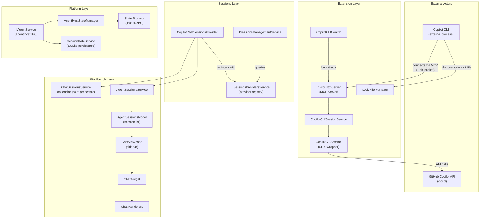

# Copilot CLI Session Integration — Architecture Documentation

> Last updated: 2026-04-21

## Purpose

This documentation describes how VS Code's Copilot Chat panel discovers, loads, renders, and continues Copilot CLI sessions. It is written so that a developer can implement the same feature in another project without reading the VS Code source code.

The system allows an external Copilot CLI process to hand off an in-progress conversation to VS Code, where it appears as a first-class chat session — resumable, renderable, and indistinguishable from sessions that originated inside the editor. The architecture is layered, protocol-driven, and deliberately provider-agnostic: the same machinery that integrates CLI sessions could integrate sessions from any conforming agent.

## High-Level Architecture

## Document Index

| Document | Description |
|----------|-------------|
| [`01-architecture.md`](01-architecture.md) | System architecture, layers, service hierarchy, and design principles |
| [`02-data-model.md`](02-data-model.md) | Types, interfaces, persistence mechanisms, and session lifecycle |
| [`03-protocol.md`](03-protocol.md) | Communication channels, MCP protocol, SDK events, and synchronization |
| [`04-ui-integration.md`](04-ui-integration.md) | Session list, loading flow, continuation, rendering, and commands |
| [`05-implementation-guide.md`](05-implementation-guide.md) | Step-by-step guide for implementing in another project |
| [`06-webapp-extraction-guide.md`](06-webapp-extraction-guide.md) | Design document for a standalone mobile-first webapp (Node.js + React 19) with full session management, MCP tool hosting, and optional remote access via cloudflared tunnel |
| [`07-ui-specification.md`](07-ui-specification.md) | Complete UI/UX specification: design tokens, component catalog, responsive layouts, animations, accessibility, and state management |
| [`08-constraints-and-requirements.md`](08-constraints-and-requirements.md) | Constraints catalog, performance architecture, degradation thresholds, and architectural decisions |
| [`09-deployment.md`](09-deployment.md) | Deployment and remote access: cloudflared tunnel setup, JWT authentication, and security controls for tunnel mode |
| [`VS_CODE_ALIGNMENT.md`](VS_CODE_ALIGNMENT.md) | Maintenance workflow: component mapping, upstream change detection, SDK upgrade procedures, documentation sync checklists, and drift detection automation |

## Key Design Principles

1. **Agent-agnostic protocol.** The state protocol that governs session lifecycle is provider-neutral. It defines a contract — state shape, action vocabulary, reconciliation rules — without reference to Copilot, CLI, or any specific agent. Any conforming provider can participate.

2. **Extension point model.** Session types are registered declaratively through an extension point mechanism. The workbench layer neither knows nor cares which session types exist at compile time; it discovers them at runtime from registered providers.

3. **Redux-like state synchronization.** Session state is an immutable tree. Mutations occur through a stream of typed actions. The agent host performs write-ahead reconciliation: actions are applied optimistically in the renderer, then confirmed or rejected by the host. This permits responsive UI without sacrificing consistency.

4. **Dual communication channels.** Two distinct channels serve different integration needs. The in-process SDK channel handles sessions that originate within the extension host. The MCP channel (Model Context Protocol over Unix domain sockets) handles sessions arriving from external processes such as the CLI.

5. **File-system-based discovery.** Cross-process coordination uses lock files on the local file system rather than a registry, broker, or network service. The CLI discovers a running VS Code instance by locating its lock file, which contains the socket path for MCP connection. This is deliberately simple, requires no daemon, and degrades gracefully when VS Code is not running.
